# EVALUACION - REVA

En la aplicación **REVA – Evaluación** evaluaremos las competencias por cada empleado. Iniciaremos ingresando a la aplicación y adicionando un nuevo registro.  

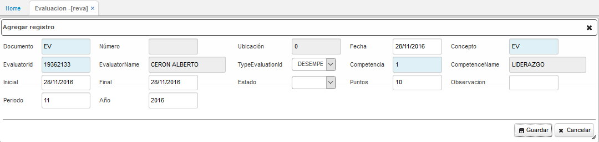

**Documento**: seleccionar del zoom el documento _EV – Evaluación_.  

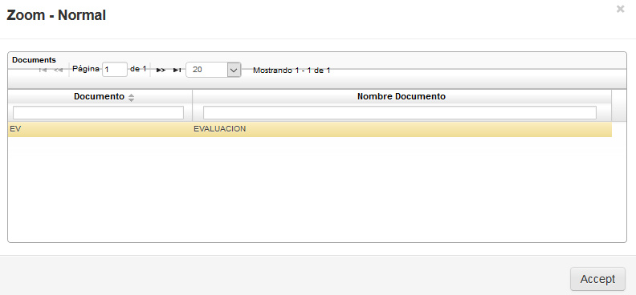

**Concepto**: seleccionar el concepto _EV – Evaluación_.  
**Evaluator Id**: diligenciar el número de identificación del evaluador. El evaluador debe estar previamente parametrizado en la aplicación **BTER – Terceros**.  
**Type Evaluation Id**: seleccionar de la lista desplegable el tipo de evaluación. Los tipos de evaluación son parametrizables en la aplicación _RBEV – Tipos de evaluación_.  

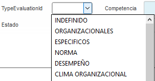

**Competencia**: seleccionar del zoom la competencia a evaluar.  

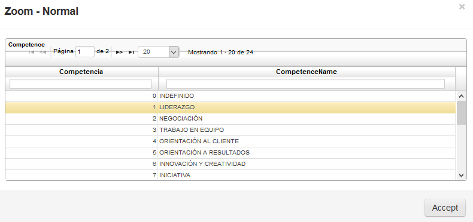

**Puntos**: diligenciar el mínimo de puntaje en el que los empleados deben tener la competencia evaluada.  
**Periodo**: ingresar el número del mes en el cual se realiza la evaluación.  
**Año**: ingresar el año en el cual se realiza la evaluación.  

Diligenciados los campos del formulario, guardamos el registro dando click en el botón **Guardar**. Seguidamente nos dirigimos al detalle y adicionamos un nuevo registro.

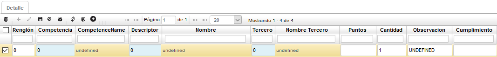

**Competencia**: seleccionar del zoom la competencia a evaluar. Las competencias se parametrizan en la aplicación **RCOM – Competencias**.

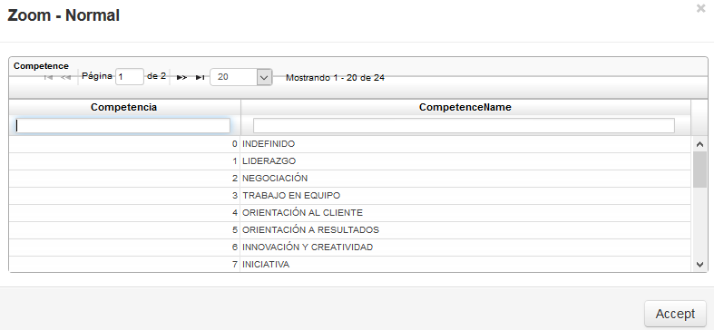

**Descriptor**: seleccionar del zoom los ítems a evaluar en la competencia. Se debe tener en cuenta que los ítems pueden variar dependiendo de la competencia y estos se parametrizan en el detalle de la aplicación **RCOM – Competencias**.  

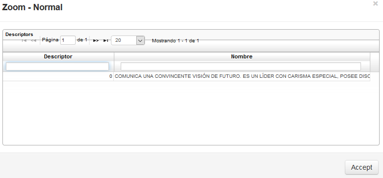

**Tercero**: digitar o seleccionar del zoom el número de identificación del evaluado. El evaluado debe estar previamente registrado en la aplicación **BTER – Terceros**.  
**Puntos**: digitar la cantidad de puntos que la evaluación tiene.  
**Cantidad**: ingresamos la cantidad de puntos esperados que debe tener el evaluado en la competencia.  
**Cumplimiento**: ingresamos el porcentaje de cumplimiento que tuvo la persona en la competencia evaluada.	

Diligenciados los campos del detalle, guardamos el registro dando click en el botón _Guardar_.

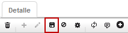

Este proceso de registro se puede repetir las veces que sean necesarias, de acuerdo a la cantidad de personas evaluadas.  

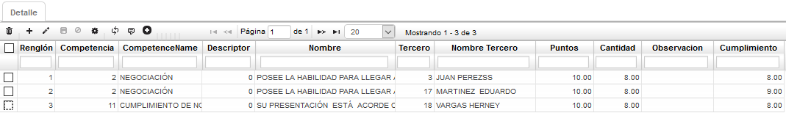

Diligenciado el detalle de la aplicación **REVA – Evaluación**, procedemos a procesar el registro en el maestro dando click en el botón _procesar_.

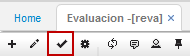

Procesado el registro, el sistema arrojará un mensaje de control confirmando el registro exitoso.

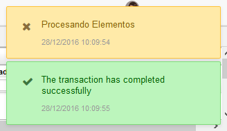

