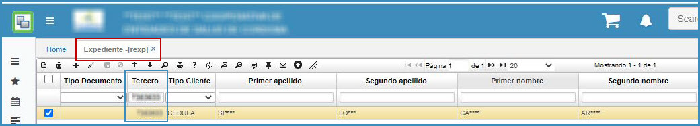
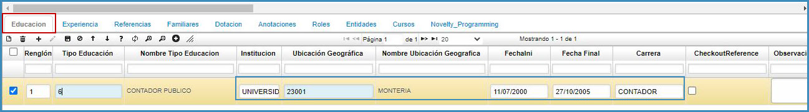
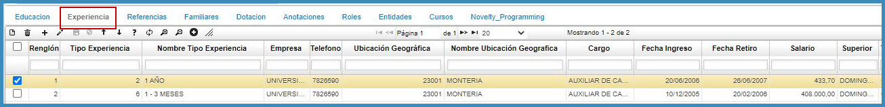

# Expediente - REXP

Para iniciar el proceso de _Expediente_, no es necesario crear un nuevo registro en el maestro de la aplicación, debido a que el tercero al cual se le creará el expediente ya se encuentra marcado como _empleado_ en la parametrización realizada anteriormente en la aplicación **BTER – Terceros**. 

En el campo _Tercero_, filtramos por el número de identificación con el cual fue registrado el tercero en la anterior aplicación **BTER**, y la información del maestro se diligenciará de manera automática.

Para diligenciar la información de cada pestaña se realiza desde el detalle.

**Pestaña Educación**

Se adiciona un nuevo registro y en el campo _tipo educación_, se selecciona el tipo de educación que corresponde al tercero al cual se esta creando el expediente. Los tipos de educación deben estar previamente parametrizados en **RBED – Tipos de educación**.

En los siguientes campos, se ingresa el nombre de donde se realizaron dichos estudios, al igual que la ubicación geográfica. Finalmente, se selecciona la fecha inicial y final en que se realizó el estudio y se da click en el botón _guardar_.

**Pestaña Experiencia**

Se adiciona un nuevo registro y en el campo _tipo experiencia_, digitamos el tipo de experiencia que se adecúe a la persona registrada en el maestro. Se recuerda que los tipos de experiencia deben estar previamente parametrizados en **RBEX – Tipos de experiencias**.  

En los siguientes campos, se diligencia el nombre de la empresa en la cual se desempeñó, el teléfono, la ubicación geográfica, el cargo el cual desempeñaba y se da click en el botón _guardar_.  

**Pestaña Referencias**

Se adiciona un nuevo registro, el campo _tipo referencia_ se diligencia con la letra inicial del tipo de referencia correspondiente, es decir, si la referencia es personal, se digita la letra P, seguidamente se registra el nombre de la persona que da la referencia, la relación, el teléfono y se da click en el botón _guardar_.

Si es necesario, se adicionan más registros.

**Pestaña Familiares**

En la pestaña _Familiares_ se registran las personas que viven con la persona contratada. Allí se diligencia el tipo de familiar y el nombre de la persona. El tipo de familiar se parametriza en la aplicación **RBTF – Tipo de familiar**. Adicional se debe diligenciar los campos: fecha cumpleaños, sexo, documento del familiar, factor RH, Ubicación geografica, profesión, telefono, celular, E-mail o correo.  

**Pestaña Dotación**

Si la empresa suministra dotación, se diligencia la información de la pestaña, de lo contrario se omite este paso.  
Los tipos de dotación se parametrizan en la aplicación **RBTD – Tipos de Dotación**. See ingresa el tipo de dotación, la talla, el color, la cantidad y se guarda el registro.

**Pestaña Anotaciones**

En la pestaña _Anotaciones_ se diligencia todo lo relacionado con la parte disciplinaria de la hoja de vida. Los tipos de anotaciones deben estar previamente parametrizados en la aplicación **RBTA – Tipos de anotación**. 

En el campo _tipo de anotación_ se diligencia el código correspondiente al tipo de anotación relacionada con la hoja de vida del contratado y se da click en _guardar_.

**Pestaña Cursos**

En esta pestaña se insertan los datos de los cursos que ha realizado el tercero, desde la aplicación **RCAP - Capacitaciones** se realiza la parametrización de la capacitaciónes realizadas y el curso desde **RCUR - Cursos**.  

Realizado el curso en el detalle del **RCAP - Capacitaciones** se inserta el número de documento del tercero, este curso se verá reflejado en la aplicación **REXP - Expediente**.  

**********

