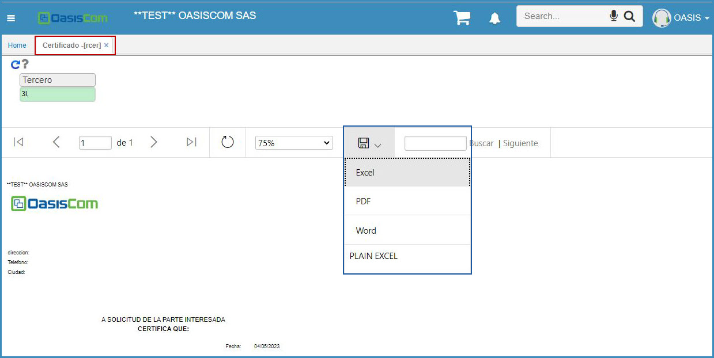

# Certificado - RCER   

Este reporte sirve para obtener la Certificación Laboral del empleado.  Para que el certificado salga con la información que debe tener un Certificado Laboral, la informaci{on debe estar cargada en la aplicación **Contratos - NCNT**.  

Esta aplicación se deja filtrar por el tercero, en este caso, sería la persona de quién se va a sacar el Certificado Laboral:  

  

  

Se da click en el botón generar:  

  

Y se puede apreciar el Certificado Laboral con datos como: _Nombre del empleado_, _Número de identificación_, _Salario_, _Tipo de Contrato_, _Cargo_ y demás información requerida en este tipo de Documento.  

  

Este formato puede ser exportado o impreso.  

  

