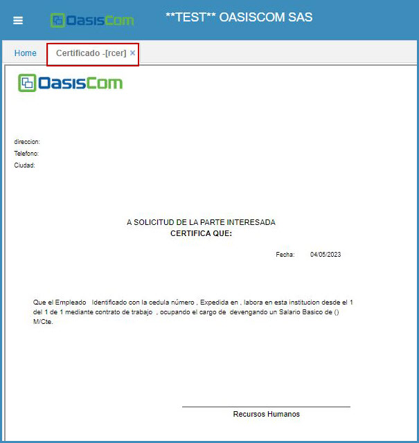

# Certificado - RCER   

Este reporte permite obtener la Certificación Laboral del empleado.  Para que el documento cuente con la información que debe tener un Certificado Laboral, esta debe estar cargada en la aplicación **NCNT - Contratos**.  

Esta aplicación permite el filtro por el tercero.  

  

  

Se da click en el botón generar:  

  

Seguidamente se puede apreciar el Certificado Laboral con datos como: _Nombre del empleado_, _Número de identificación_, _Salario_, _Tipo de Contrato_, _Cargo_ y demás información requerida en este tipo de Documento.  

  

Este formato puede ser exportado o impreso.  

  

