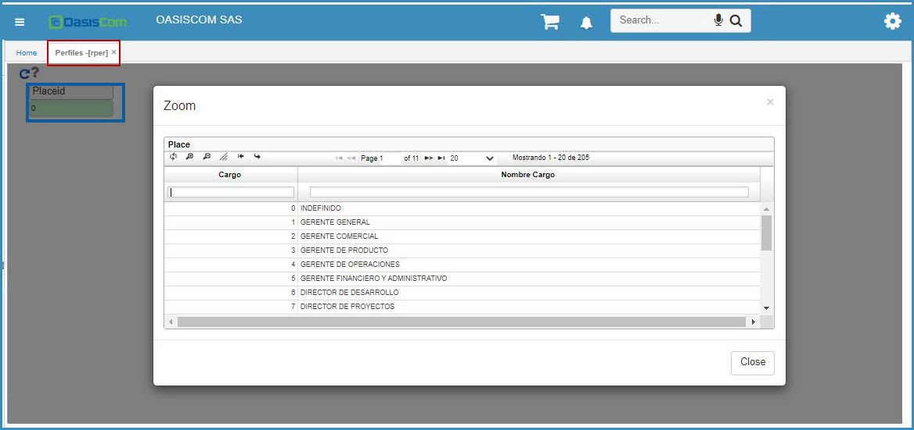
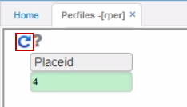
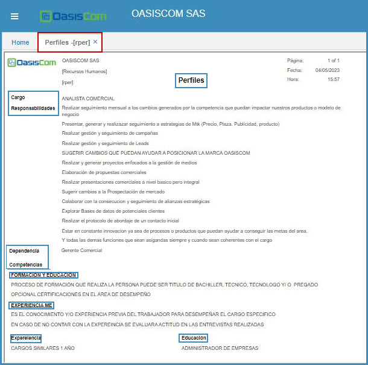
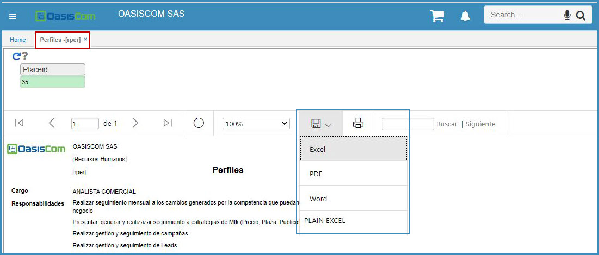

# Perfiles - RPER    

En esta aplicación se visualizan los perfiles de cargo. La información que sale en este reporte, se registra con anterioridad en la aplicación **RBPE - Tipos de perfil**.  

Se consulta por cargo de acuerdo al perfil.  

  

Se da click en el botón generar:

  

En este reporte se visualizan los siguientes datos: _Nombre del Cargo_, _Responsabilidades que debe cumplir el Cargo_, _A qué dependencia pertenece_, _Qué competencias debe cumplir el cargo_, _Experiencia_ y _Educación_ que debe tener.  

  

Este reporte se puede exportar o imprimir.  

  

------------------------------
