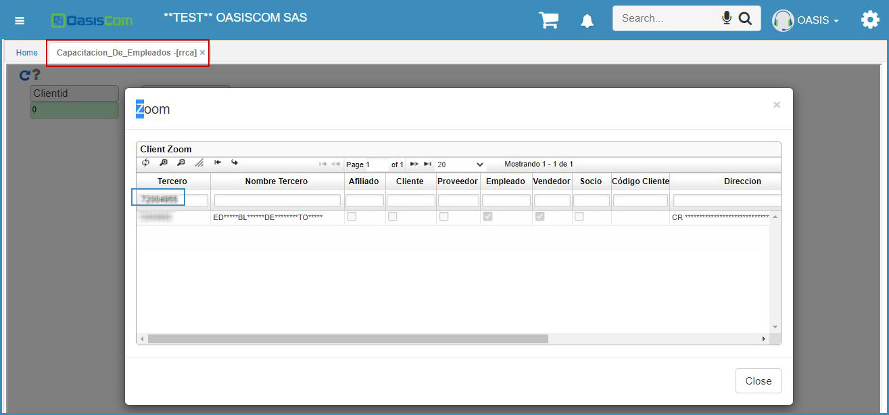
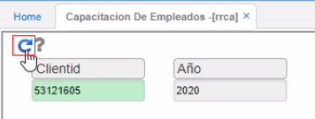
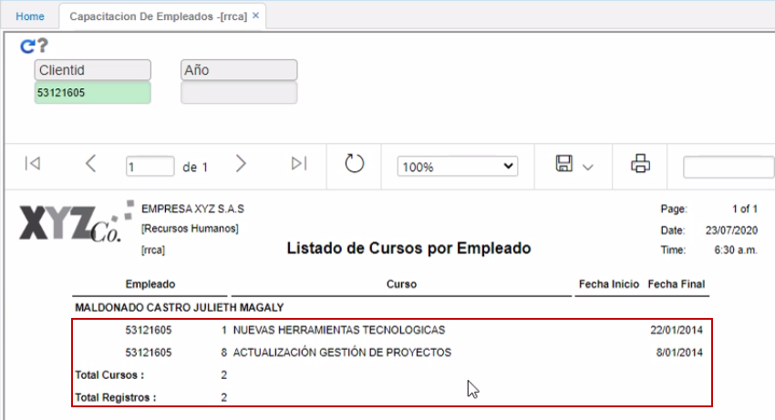

# Capacitación de empleados - RRCA  

Esta aplicación muestra el listado de cursos en los que se han capacitado los empleados con sus respectivas fechas.  

Se puede filtar por el empleado que se desee consultar  

  

Se da click en consultar  

  

Si se desea consultar todos los cursos que ha realizado el empleado desde que se encuentra en la compañía, no se realiza el filtro por el año  

  

