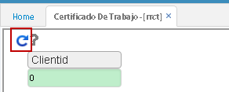
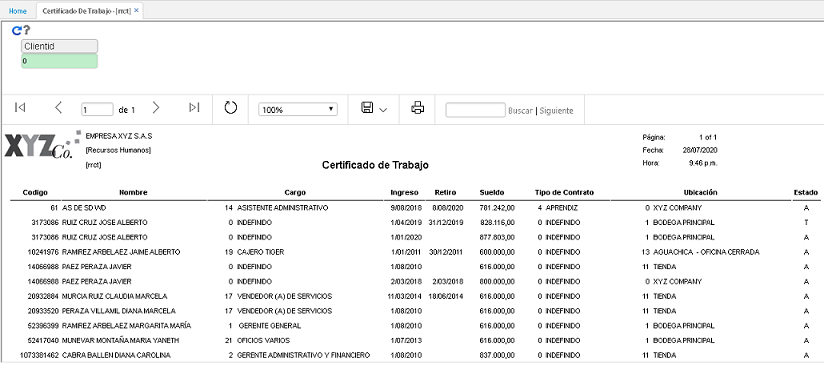
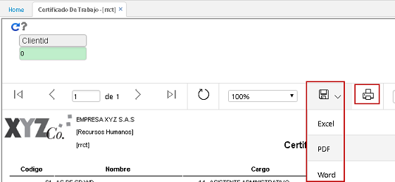

# Certificado de Trabajo - RRCT    

En este reporte se puede ver un consolidado de todas las personas que han trabajado en la empresa con _Nombre_, _Cargo_, _Fecha de ingreso_, _Fecha de retiro_, _Sueldo_, _Tipo de contrato_ y otros.  Este reporte funciona por ejemplo, cuando a la empresa llaman a pedir referencias de algún empleado.  También se puede consultar en el campo _Clientid_ por el número de identificación del empleado que se desee visualizar.

Al hacer click en _Generar_, aparece el consolidado.  

  

  

Este reporte se puede exportar o imprimir  

