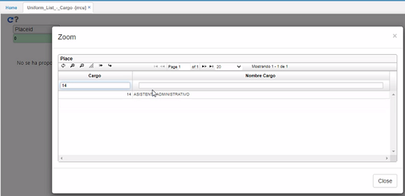
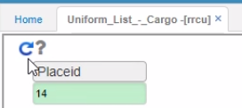
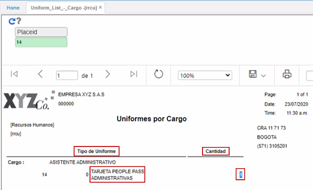
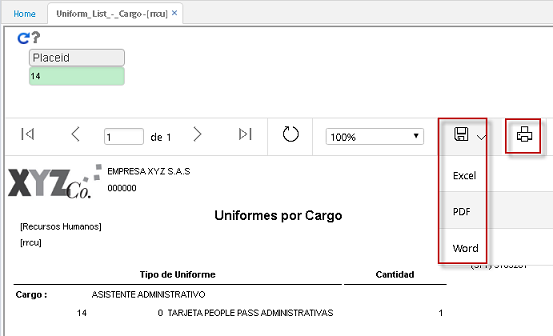

# Listado uniformes - Posición - RRCU  

En esta aplicación se puede consultar la dotación que se da por cargo.  La información debe ser parametrizada anteriormente en la aplicación **Tipo de dotación - RBTD**.  
Se consulta por cargo  

  

Se da click en _Generar_  

  

Y en la pantalla se puede observar qué se le ha entregado a ese cargo relacionado con dotación.  

  

Este reporte se puede exportar o imprimir.  

  
