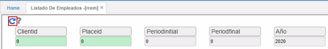

# Listado de empleados - RREM  

Como su nombre lo indica, este reporte nos arroja un listado de empleados de la compañía.  Se puede filtrar por cualquiera de los campos, ya sea por _Empleado_, _Cargo_, _Fecha Inicial_, _Fecha Final_ del contrato o _Año_.  Esta información debe estar previamente parametrizada en la aplicación **Contratos de nómina - NCNT**.  

  

Una vez especificado el filtro de búsqueda, se da click en _Generar_  

  

Se puede apreciar el consolidado de personas que trabajan en la empresa y sus respectivos datos.  

  

Este reporte se puede exportar o imprimir  

