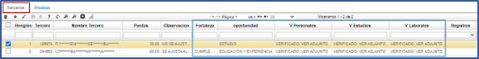

# SELECCION - RSEL

Para poder continuar con el proceso de selección, previamente se deben encontrar registrados en la aplicación **BTER – Terceros**, los aspirantes que se postularon al cargo registrado anteriormente en la aplicación **RCAR – Cargos**. 
Los registros en la aplicación **BTER** de los aspirantes al cargo, deben tener activo el flag de _Empleado_, de no ser así, se tendrán inconvenientes en el proceso de selección al momento de crear el expediente.  

Registrados los aspirantes en la aplicación **BTER**, ingresamos a la aplicación **SREL – Selección** y agregamos un nuevo registro en el maestro, diligenciamos el número de identificación de la persona que solicita la vacante y el número de identificación de la persona que la autoriza y damos click en _guardar_.

Continuamos en la pestaña _Terceros_ del detalle de la aplicación, allí se deben relacionar los nombres de los aspirantes al cargo que participaron en el proceso de selección y que fueron ingresados anteriormente en la aplicación **BTER – Terceros**.

Seguidamente, en el campo _puntos_, diligenciamos el resultado de las evaluaciones que se le aplicaron al candidato y en el campo _observaciones_, indicamos si la persona aprobó o no el proceso de selección, finalizamos dando click en el botón _guardar_.

* En el detalle del **[RSEL]** puede ingresar los antecedentes del tercero en el campo Registro; previa parametrización en características **[BCRC]**.  

* Parametrización en características **[BCRC]**  

Diligenciada la información anterior en la aplicación **RSEL – Selección**, finaliza el proceso de selección en OasisCom.

