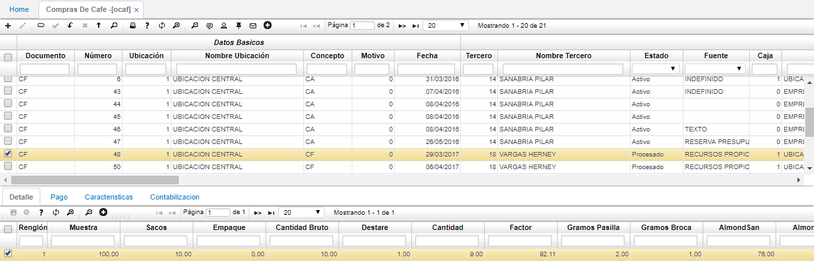

# OCAF - Compras de Café

La aplicación **OCAF** permite registrar las compras de café que se realicen y así poder ver reflejada la mercancía en los inventarios.  

**Documento:** seleccionar el documento asginado a la compra de café. Los documentos son parametrizados en la aplicación [**BDOC - Documentos**](http://docs.oasiscom.com/Operacion/common/bsistema/bdoc).  
**Número:** el número de consecutivo será asignado automáticamente por el sistema.  
**Ubicación:** Indicar la ubicación donde va a queedar almacenado el café.  
**Concepto:** Seleccionar del zoom el concepto por el cual se registra la compra del café. Los conceptos son parametrizados en la aplicación [**BCON - Conceptos**](http://docs.oasiscom.com/Operacion/common/bsistema/bcon).   
**Fecha:** fecha en la cual registra la compra del café.  
**Tercero:** número de identificación del tercero a quien se le compró el café. Si el tercero seleccionado es asociado, el sistema arrojará un mensaje de control de color verde indicando que se encuentra hábil.  
**Estado:** Estado del registro _Activo, Procesado, Anulado_.  
**Fuente:** seleccionar de la lista desplegable la fuente con que se adquirió la marcancía, ya sea recursos propios, línea de financiamiento, entre otros.  
**Caja:** seleccionar la caja por la cual se desembolsará el dinero para el pago de la marcancía.  
**Baba:** registrar el porcentaje de baba o mocilago que contiene el café en cereza.  

### Detalle

En el detalle se encuentran los datos relacionados al café, sus caracteristicas.  

**Muestra:** número de gramos obtenidos para la muestra.  
**Sacos:** cantidad de sacos de café.  
**Cantidad bruto:** cantidad en kilos.  
**Destare:** peso del costal.  
**Cantidad:** cantidad real de café.  
**Producto:** el sistema sujiere el producto luego de haber diligenciado la calidad del mismo.  
