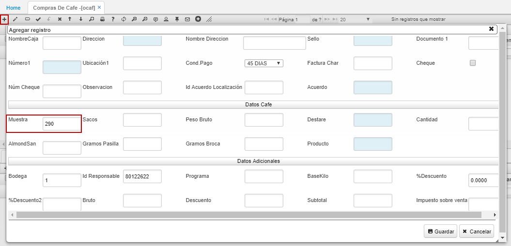
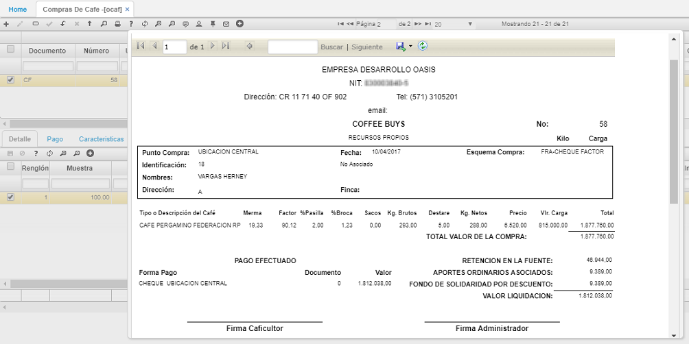
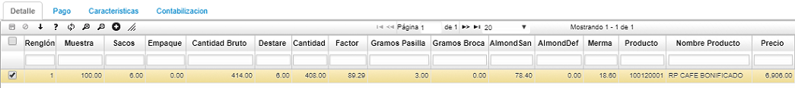
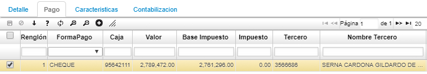
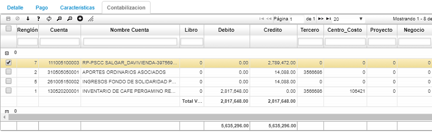

# OCAF - Compras de Café

La aplicación **OCAF** permite registrar las compras de café que se realicen y así poder ver reflejada la mercancía en los inventarios.  

**Documento:** seleccionar el documento asginado a la compra de café. Los documentos son parametrizados en la aplicación [**BDOC - Documentos**](http://docs.oasiscom.com/Operacion/common/bsistema/bdoc).  
**Número:** el número de consecutivo será asignado automáticamente por el sistema.  
**Ubicación:** Indicar la ubicación donde va a queedar almacenado el café.  
**Concepto:** Seleccionar del zoom el concepto por el cual se registra la compra del café. Los conceptos son parametrizados en la aplicación [**BCON - Conceptos**](http://docs.oasiscom.com/Operacion/common/bsistema/bcon).   
**Fecha:** fecha en la cual registra la compra del café.  
**Tercero:** número de identificación del tercero a quien se le compró el café. Si el tercero seleccionado es asociado, el sistema arrojará un mensaje de control de color verde indicando que se encuentra hábil.  

Si el cliente no se encuentra registrado en el sisitema al momento de realizar la orden de compra, OasisCom permite crear dicho cliente en la base de datos. En el campo tercero daremos click derecho y seleccionaremos _Crear cliente_.  

Para ver todos los terceros registrados es necesario oprimir la tecla _Enter_. Para crear el nuevo cliente, en el zoom agregaremos una nueva fila y diligenciaremos los datos correspondientes al nuevo cliente, igualmente, en el campo _Representante_, el usuario podrá almacenar al referido, finalmente damos click en _Aceptar_ para guardar la información.  

Cuando el usuario registre un tercero en el zoom, este se conservará de tal manera que el usuario pueda seleccionarlo para ser agregado al documento general que se está creando.  

**Estado:** Estado del registro _Activo, Procesado, Anulado_.  
**Fuente:** seleccionar de la lista desplegable la fuente con que se adquirió la marcancía, ya sea recursos propios, línea de financiamiento, entre otros.  
**Caja:** seleccionar la caja por la cual se desembolsará el dinero para el pago de la marcancía.  
**Baba:** registrar el porcentaje de baba o mocilago que contiene el café en cereza.  

#### _Detalle_

En el detalle se encuentran los datos relacionados con el café, sus caracteristicas.  

**Muestra:** número de gramos obtenidos para la muestra. Este valor es traído por defecto por el sistema al momento de crear un nuevo registro.  

 Dicho valor puede ser parametrizable en la aplicación WVAR - Variables, en esta aplicación nos ubicamos en el campo _VariableId_ y consultamos por el nombre _DefaultValueSample_ que hace referencia al campo **Muestra** de la aplicación OCAF. Ya en el registro, editamos la cantidad en el campo _Formula_ como se muestra a continuación.  

Ahora, al momento de crear otro registro en la aplicación OCAF, el campo _Muestra_ traerá el valor que acabamos de asignar.  

**Sacos:** cantidad de sacos de café.  
**Cantidad bruto:** cantidad en kilos.  
**Destare:** peso del costal.  
**Cantidad:** cantidad real de café.  
**Producto:** el sistema sugiere el producto luego de haber diligenciado la calidad del mismo.  

#### Vista Previa

La aplicación también cuenta con una vista previa que brinda soporte de compras de café.  

## [Compra de Café por Factor](http://docs.oasiscom.com/Operacion/is/cafe/cafactura/ocaf#compra-de-café-por-factor)

Para realizar compra de café por Factor, adicionamos un nuevo registro dando click en el botón  de la barra de herramientas del maestro y diligenciamos el formulario.  

##### _Datos Básicos_

**Documento:** El sistema traerá por defecto el documento CF - Compra de café.  
**Ubicación:** seleccionar la ubicación desde donde se compra el café, el sistema por defectó traerá la ubicación que se encuentre asociada al usuario que realiza el registro de compra. Las ubicaciones son parametrizables en la aplicación [**BUBI - Ubicaciones Organización**](http://docs.oasiscom.com/Operacion/common/borgan/bubi) 
**Concepto:** seleccionar el concepto por el cual se realiza la compra de café, en este caso seleccionar _Compra x Factor_. Los conceptos son parametrizables en la aplicación [**BCON - Conceptos**](http://docs.oasiscom.com/Operacion/common/bsistema/bcon).  

##### _Datos Tercero_

**Tercero:** ingresar el número de identificación del tercero que vende el café a la cooperativa. El sistema validará automáticamente si el tercero es asociado, está hábil o inhábil, este mensaje de control sólo es de manera informativa y no interrumpe el proceso.  

**Fuente:** seleccionar la fuente de donde provienen los recursos para comprar el café, ya sea por recursos propios o línea de financiamiento.  
**Caja:** el sistema por defecto asignará la caja de donde se tomarán los recursos para la compra del café, si se desea cambiar, damos doble click sobre el campo y seleccionamos la caja desde el zoom.  
**Dirección:** seleccionamos del zoom el nombre de la finca que vende el café. Las direcciones son parametrizables en la aplicación **BDIR - Direcciones**.  
**Sello:** seleccionamos del zoom el sello de certificación de calidad de la finca del cual proviene el café a comprar en caso tal que lo tenga. El sistema valida automáticamente con el nombre de la finca los sellos que esta posee. Los sellos son parametrizables en la aplicación **BDIR - Direcciones**.  
**Condición de pago:** seleccionar la condición de pago del café. Al seleccionar _Cheque_ el sistema activará el flag de _Cheque_ y arrojará el número de cheque.  

##### _Datos Café_

**Muestra:** indicar el mínimo de muestra de café en gramos que se debe tomar para analizar.  
**Sacos:** ingresar el número de sacos que lleva el caficultor para la venta.  
**Peso Bruto:** peso de los sacos de café en kilos.  
**Destare:** peso promedio de los sacos vacíos en total.  
**Cantidad:** el sistema automáticamente arroja la diferencia entre el peso bruto y el destare indicando la cantidad real de café.  
**AlmendraSan:** cantidad en gramos de almendra (café )sana de acuerdo a la muestra.  
**Gramos pasilla:** cantidad en gramos de la almendra (café) defectuosa de acuerdo a la muestra.  
**Gramos broca:** cantidad en gramos de la almendra (café) brocada de acuerdo a la muestra.  
**Producto:** al dar doble click en el campo, el sistema analizará la muestra de café ingresada y arrojará los productos que aplican de acuerdo al rango de factor.  

Diligenciado el formulario, damos click en el botón _Guardar_ y la aplicación arrojará automáticamente un renglón en la pestaña _Detalle_ con los datos de la compra, el factor asignado al producto y el precio.  

Al trasladarnos a la pestaña _**Pago**_, veremos un renglón con la condición de pago definida en el maestro de la aplicación, se permite adicionar otra condición de pago a la misma compra siempre y cuando el documento se encuentre en estado _Activo_.  

Finalmente, procesamos la factura dando click en el botón _Procesar_ ubicado en la barra de herramientas del maestro y revisamos la pestaña del detalle _Contabilización_ para ver las cuentas contables afectadas.  

Para acceder a la vista previa del documento, damos click en el botón _Imprimir_  ubicado en la barra de herramientas, el cual nos permitirá ver el documento e imprimirlo.  

  

