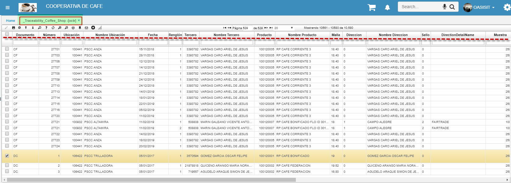
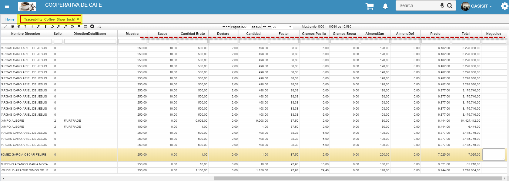

# OCTR - Trazabilidad de Café - SHOP

La aplicación **OCTR** permite visulizar las compras de café que se realicen; refleja la mercancía e inventarios.  Sus datos son emanados del detalle de las compras de cafe.

**Documento:** seleccionar el documento asignado a la compra de café. Los documentos son parametrizados en la aplicación [**BDOC - Documentos**](http://docs.oasiscom.com/Operacion/common/bsistema/bdoc).  
**Número:** el número de consecutivo será asignado automáticamente por el sistema.  
**Ubicación:** Indicar la ubicación donde va a queedar almacenado el café.  
**Fecha:** fecha registrada la compra del café.  
**Renglon:** lo toma del detalle de la compra de cafe.
**Tercero:** número de identificación del tercero a quien se le compró el café.  
**Producto:** básico de producto parametrizado en BPRO.  
**Malla:**  determina la calidad del cafe.  
**Dirección:** dirección del tercero pestaña parametrizada básico de direcciones.  
**Sello:** certificación de calidad de la finca del cual proviene el café a comprar en caso tal que lo tenga. El sistema valida automáticamente con el nombre de la finca los sellos que esta posee. Los sellos son parametrizables en la aplicación **BDIR - Direcciones**.  
**DirectiondetailName:**  
**Muestra:** número de gramos obtenidos para la muestra. Este valor es traído por defecto por el sistema al momento de crear un nuevo registro.  

  

**Sacos:** unidad de medida según BMED.  
**Cantidad Bruto: **  
**Destare:** peso del costal; para calcular el peso de lo que se ha pesado con ella.  
**Cantidad:** número según unidad de medida.  
**Factor:** El factor de rendimiento es la cantidad de café.  
**Gramos Pasilla:**.   cantidad en gramos de la almendra (café) defectuosa de acuerdo a la muestra.  
**Gramos Broca:**  cantidad en gramos de la almendra (café) brocada de acuerdo a la muestra.  
**AlmondSan:**  almendra sana. cantidad en gramos de almendra (café )sana de acuerdo a la muestra.  
**AlmondDef:**  almendra defectuosa.  
**Precio:**  valor, monto, coste.  
**Total:**  valor absoluto.  
**Negocios:** valor operaciones comerciales.  campo texto de la compra de cafe.

 