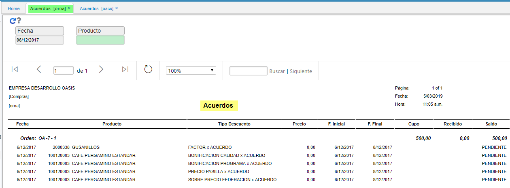

# OROA - Acuerdos

En esta reporte **OROA** - Acuerdos - refleja los acuerdos que se obtienen entre los caficultores y las correspondientes cooperativas de café, para hacer uso de esta aplicación se debe crear un registro en OACU. 

El agrupamiento del reporte se realiza por ORDEN:

**Fecha:** Fecha del acuerdo.  
**Producto:** Producto asociado al acuerdo.  
**Tipo Descuento:**  Types Of Discount parametrizacion de **FBTD**.  
**Precio:**   Valor asociado al producto.  
**Fecha inicial:** Fecha inicial del acuerdo.  
**Fecha final:** Fecha final del acuerdo.  
**Cupo:** Cantidad en kilogramos pactada en el acuerdo.  
**Recibido:** Cantidad en kilogramos recibida.  
**Saldo:** Cantidad, establece el status.  

