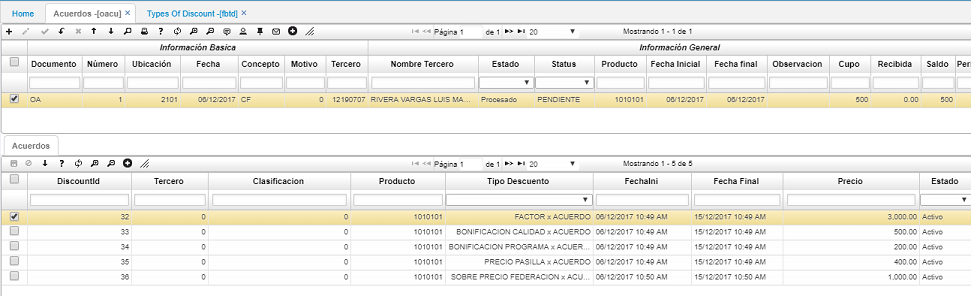

# OROA - Acuerdos

En esta reporte **OROA** - Acuerdos - refleja los acuerdos que se obtienen entre los caficultores y las correspondientes cooperativas de café, para hacer uso de esta aplicación se debe crear un registro en OACU, 

**Fecha:** Fecha del acuerdo  
**Producto:** Producto asociado al acuerdo  
**Tipo Descuento:**   
**Concepto:** Se utilizan los mismos conceptos de compra de café  
**Precio:**   
**Tercero:** Si se deiligencia 0 es porque el acuerdo aplica a todos los caficultores, en caso contrario se debe indicar una cédula correspondiente  
**Producto:** Producto asociado al acuerdo  
**Fecha inicial:** Fecha inicial del acuerdo  
**Fecha final:** Fecha final del acuerdo  
**Cupo:** Cantidad en kilogramos pactada en el acuerdo

Con este registro el sistema crea automáticamente el detalle de acuerdo a los descuentos que se parametrizan en la aplicación FBTD - Tipos de descuento. Posterior a su creación, se deben editar los campos de fecha inicial, fecha final y el precio correspondiente.

Validada la información se debe procesar el registro. Una vez procesado se debe asociar este acuerdo registrado en la aplicación OCAF de compra de café.
