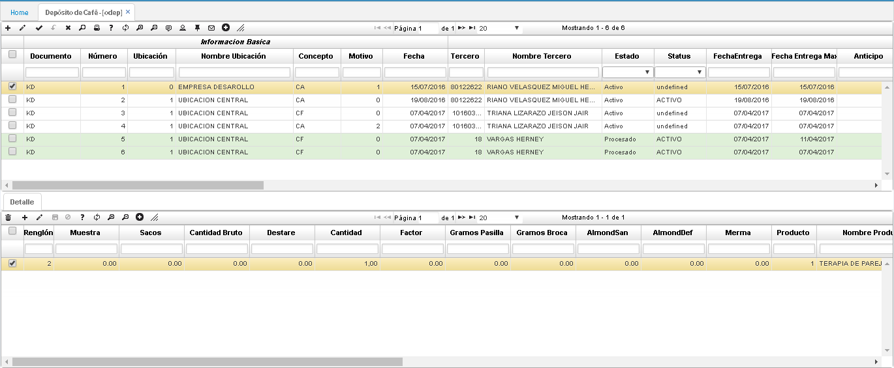

# ODEP - Café en depósito

Esta aplicación permite la creación de Maestro y Detalle para los productos que el caficultor deja en calidad de depósito y que posteriormente se liquidará mediante factura de compra **OCAF** para el depósito total o parcial en más de una factura. 
A diferencia de la compra inmediata, el detalle de esta operación solo captura y no realiza el cálculo automático del monto del producto, siendo este no definitivo ya que al momento de su liquidación, podría aumentar o disminuir de manera proporcional la calidad del producto.  
Una particularidad de esta aplicación es que permite entregar al tercero un anticipo por ese producto en depósito no superior a las condiciones y políticas definidas para tal fin, tarea ejecutada con la aplicación **TMOV**.  
Una vez se cuente con el depósito confirmado o procesado, se tendrá que llevar a cabo la entrada a inventario del producto recibido, tarea ejecutada con la aplicación **IMOV**.

#### Maestro

**Documento:** seleccionar el documento asignado a la compra de café. Los documentos son parametrizados en la aplicación [**BDOC - Documentos**  
**Número:** el número de consecutivo será asignado automáticamente por el sistema.  
**Ubicación:** Indicar la ubicación donde va a quedar almacenado el café.  
**Concepto:** Seleccionar del zoom el concepto por el cual se registra la compra del café. Los conceptos son parametrizados en la aplicación [**BCON - Conceptos**]
**Fecha:** fecha en la cual registra la compra del café.  
**Tercero:** número de identificación del tercero a quien se le compró el café. Si el tercero seleccionado es asociado, el sistema arrojará un mensaje de control de color verde indicando que se encuentra hábil.  
Si el cliente no se encuentra registrado en el sistema al momento de realizar la orden de compra, OasisCom permite crear dicho cliente en la base de datos. En el campo tercero daremos click derecho y seleccionaremos _Crear cliente_.  
Para ver todos los terceros registrados es necesario oprimir la tecla _Enter_. Para crear el nuevo cliente, en el zoom agregaremos una nueva fila y diligenciaremos los datos correspondientes al nuevo cliente; igualmente, en el campo _Representante_, el usuario podrá almacenar al referido, finalmente damos click en _Aceptar_ para guardar la información.  
Cuando el usuario registre un tercero en el zoom, este se conservará de tal manera que el usuario pueda seleccionarlo para ser agregado al documento general que se está creando.  
**Estado:** Estado del registro _Activo, Procesado, Anulado_.  
**Baba:** registrar el porcentaje de baba o mucílago que contiene el café en cereza.  

#### Detalle

En el detalle se encuentran los datos relacionados con el café, sus características.  

**Muestra:** número de gramos obtenidos para la muestra.  
**Sacos:** cantidad de sacos de café.  
**Cantidad bruto:** cantidad en kilos.  
**Destare:** peso del costal.  
**Cantidad:** cantidad real de café.  
**Producto:** el sistema sugiere el producto luego de haber diligenciado la calidad del mismo.  