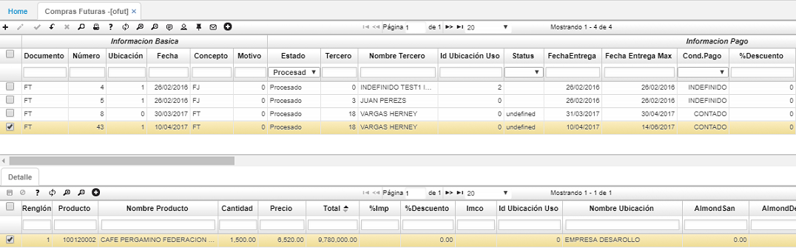

# OFUT - Compras futuras

La aplicación _OFUT - Compras Futuras_ muestra las condiciones del contrato, oferta y los datos generales del contrato a realizar.  

Para ingresar un nuevo registro, damos click en el botón  de la barra de herramientas y diligenciamos el formulario con la información básica, información de pago, información del proveedor, la información de la orden y damos click en el botón inferior _Guardar_.  

En el detalle procedemos a ingresar los productos por los cuales se realizará el contrato.  

Registrados los productos es necesario procesar el documento de _Compras futuras_ dando click en el botón  ubicado en la barra de herramientas del maestro.  

