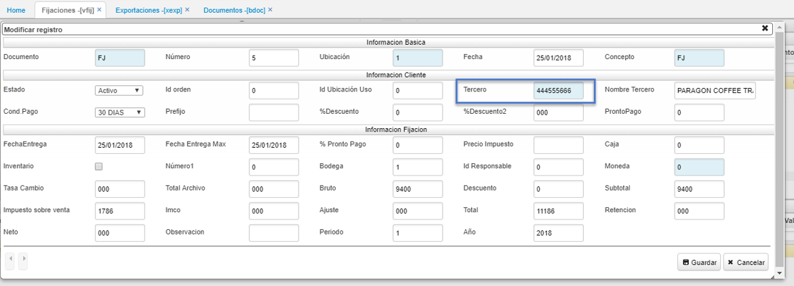
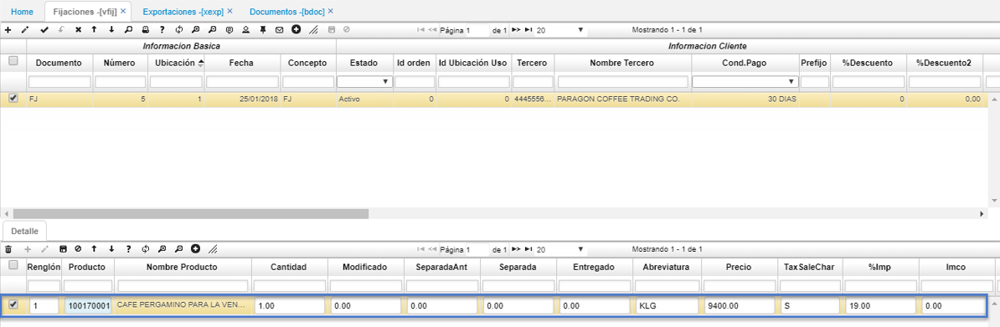
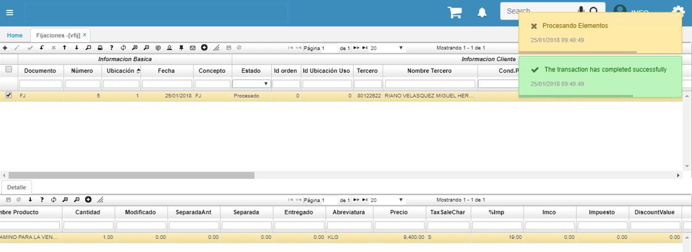

# VFIJ - Fijaciones

### Proceso de Exportaciones

En la aplicación **VFIJ** o **VPED** se deberá crear el documento de inicio con las condiciones del cliente, con las solicitudes comerciales correspondientes pactadas previamente para el tipo de exportación, así:  

En este caso, se inicia el proceso por medio de la aplicación **VFIJ**.  

En el maestro, se debe crear un registro con documento _FJ (Fijaciones)_ con concepto _FJ_ e ingresar datos primordiales como el tercero:  

En el detalle, se deben diligenciar los datos correspondientes al producto (Café).  

Luego de esto, se debe confirmar el registro. Esto con el fin de poder realizar la referencia del documento en la opción [**XEXP - Exportaciones**](http://docs.oasiscom.com/Operacion/scm/exportaciones/xexportaciones/xexp):

Continuamos el proceso de exportaciones en la aplicación [**XEXP - Exportaciones**](http://docs.oasiscom.com/Operacion/scm/exportaciones/xexportaciones/xexp). (_Ver aplicación_)