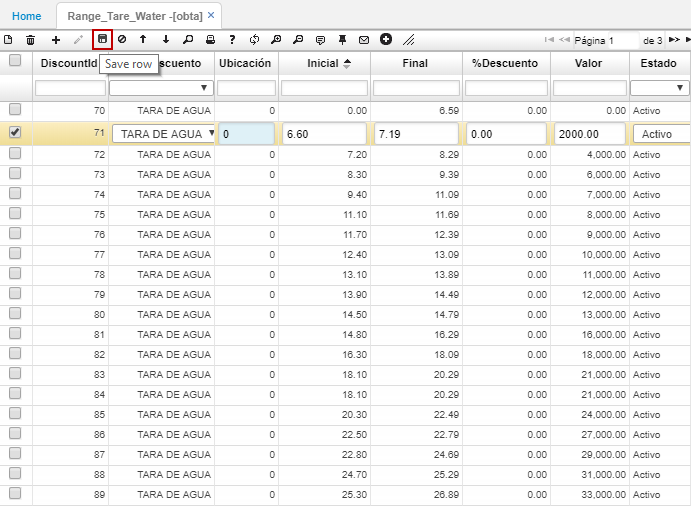

---
layout: default
title: Rango de Tara y Agua
permalink: /Operacion/is/cafe/caprecio/obta
editable: si
---

# OBTA - Rango de Tara y Agua

La aplicación OBTA permite registrar un porcentaje de humedad según la almendra sana del café húmedo.  

Seleccionamos la opción _Tara Agua_, seguidamente la ubicación y en los campos _Inicial y Final_, ingresamos el rango de factor de rendimiento.




En el campo _%Descuento_, indicaremos el porcentaje de Tara de Agua de acuerdo al rango de factor de rendimiento ingresado anteriormente y damos click en el botón _Guardar_.  



