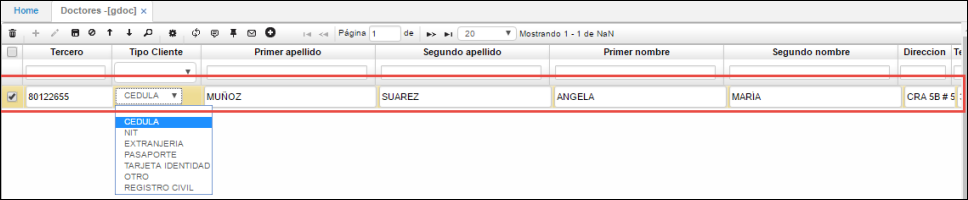
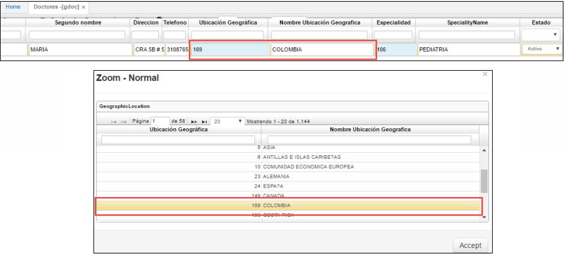
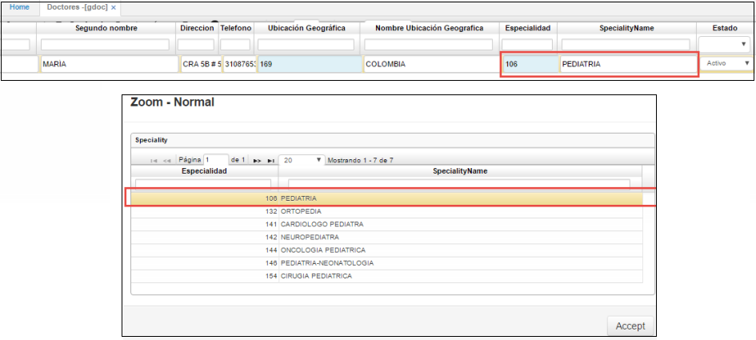
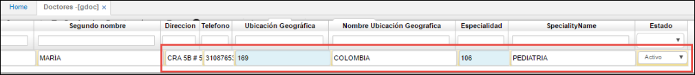

# DOCTORES - GDOC

Esta opción es utilizada para realizar la gestión de los doctores que prestarán servicios de salud y brindarán consultas médicas a los pacientes de acuerdo a su especialidad. En la aplicación **GDOC – Doctores**, se realiza la creación de los mismos, así:

**Tercero**: se debe ingresar el número de identificación del doctor.  
**Tipo Cliente**: se podrá seleccionar entre las opciones el tipo de identificación del doctor: (cédula, Nit, extranjería, tarjeta de identidad, otro, registro civil).  

En los campos _Primer Apellido_, _Segundo Apellido_, _Primer Nombre_ y _Segundo Nombre_ se ingresan los nombres del doctor como corresponda.  

**Dirección**: se debe ingresar la dirección de residencia del doctor.  
**Teléfono**: se deberá ingresar el número de contacto del doctor.  
**Ubicación Geográfica**: se debe ingresar el país donde se encuentra residiendo actualmente el doctor. Puede ser seleccionado desde el zoom como se enseña en la imagen, o bien, ingresándolo de manera manual. Las ubicaciones geográficas se parametrizan previamente en la aplicación **BUBG – Ubicaciones geográficas**.  
**Nombre Ubicación Geográfica**: se diligencia automáticamente una vez es diligenciado el campo anteriormente descrito.  

**Especialidad**: se debe seleccionar el campo en el cual se desempeña el doctor. Este campo puede ser diligenciado manualmente o bien, seleccionado desde el zoom como se muestra en la imagen. Las especialidades son parametrizadas en la aplicación **BBES – Especialidades**.  
**Nombre especialidad**: indica el nombre de la especialidad, este se diligencia automáticamente una vez el registro es guardado.

**Estado**: pueden ser seleccionado uno de los siguientes:  

_Activo_: Permite la edición y modificación del registro.
_Inactivo_: El registro no permite la edición del registro ni ser referenciado desde otras aplicaciones.
_Retirado_: Este estado indica que el doctor ya no realiza ningún tipo de función.

Cabe aclarar que esta opción también permite la _edición_ y _eliminación_ de registros. Esta última función solamente podrá ser efectuada únicamente si el doctor a eliminar no se encuentra referenciado en ningún proceso de otra opción, es decir, que no esté siendo utilizado.

