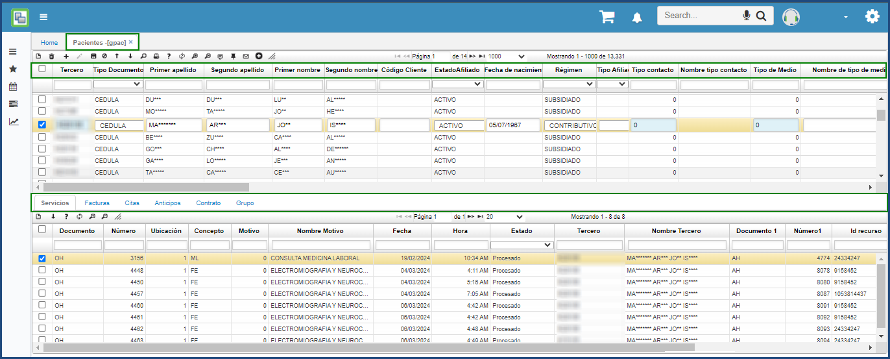
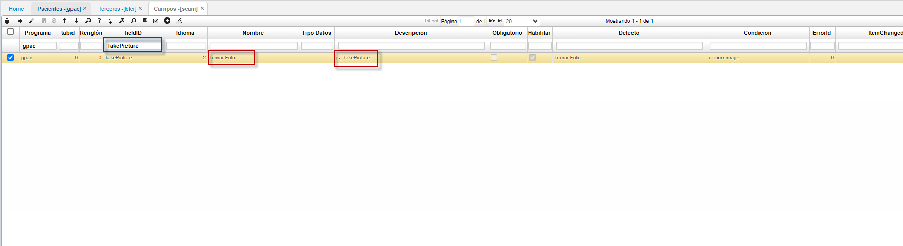
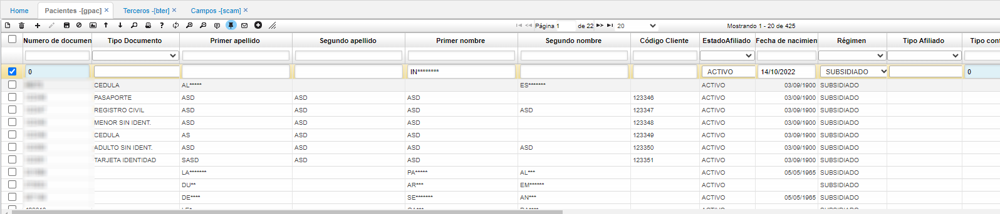
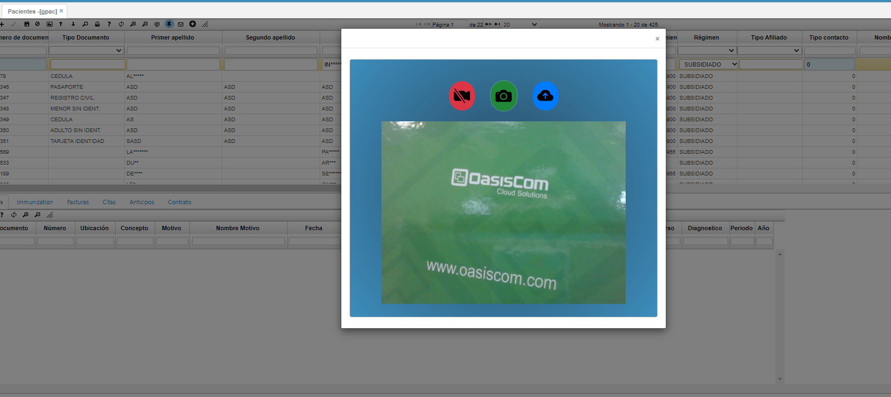
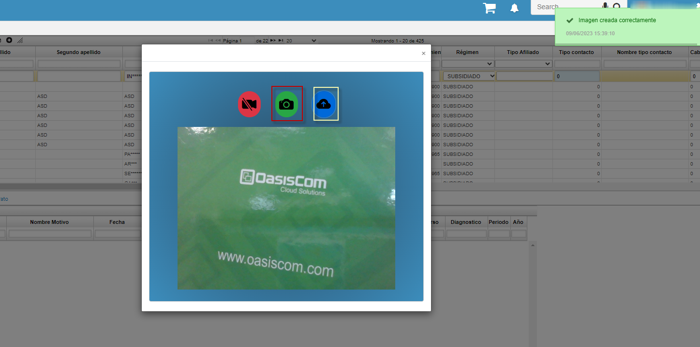
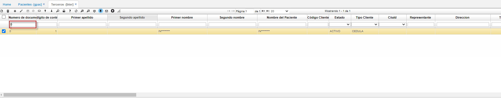
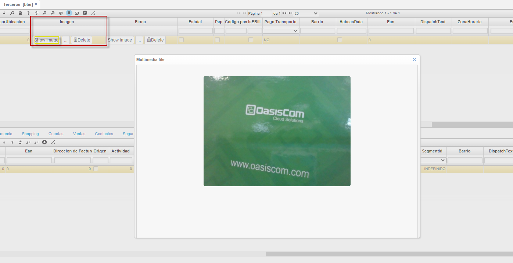

---

layout: default
title: Pacientes
permalink: /Operacion/is/hospital/gbasica/gpac
editable: si

---

# Pacientes - GPAC

Esta aplicación permite es el almacenamiento de los terceros tipo paciente que cuenta la EPS o IPS, se consolida la información básica del paciente, Servicios prestados por la entidad, Histórico de Facturaciones, Citas, Información de beneficiarios entre otros.

# Captura de la imagen del paciente

Esta opción permite tener el registro fotográfico de un paciente que se registre nuevo en el sistema o ya registrado
para activar esta funcionalidad, esta se debe parametrizar en la aplicación **SCAM - Campos**

Luego de realzar esta parametrización, ingresamos a la aplicación **GPAC - Pacientes**, donde se puede visualizar el siguiente botón, en cual, se puede capturar la fotografía del paciente

al darle click a botón y darle click al botón rojo, este nos activa la Cámara y con esta se puede tomar la foto

Luego de darle click al botón verde, este automáticamente toma la foto, y luego de esto, se debe dar click al botón azul, para que el sistema guarde la imagen en la aplicación **BTER - Terceros**

luego de esto se visualiza la imagen en la aplicación **BTER - Terceros** y consultando al tercero al cual se le tomo la foto

se busca el campo "Imagen" en el **BTER - Terceros**, dar clic al botón "Show image" en esta se puede visualizar la imagen tomada desde el **GPAC - Pacientes** 

