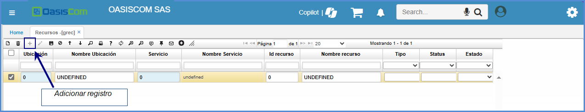
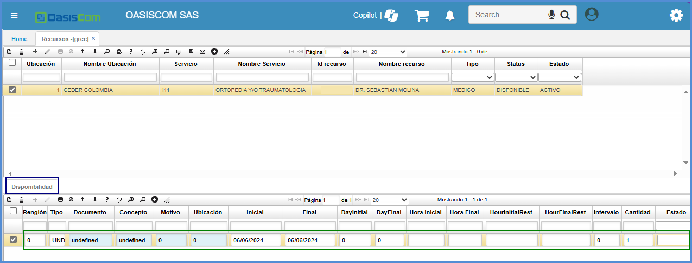

# RECURSOS - GREC

Esta aplicación funciona para realizar la administración de recursos tanto físicos como humanos de empresas tipo IPS. En la aplicación **GREC – Recursos**, se realiza la creación de los mismos, así:  

A partir del maestro:

**Id recurso**: se debe ingresar el código del recurso, teniendo en cuenta que este número no es un consecutivo pero que debe ser exclusivo para cada recurso creado.  
**Nombre recurso**: se ingresa el nombre del recurso.  
**Tercero**: se deberá ingresar el código del tercero (cliente) al que aplicará el recurso, se puede seleccionar desde el zoom, o bien, insertarlo manualmente. Si el tercero es ‘0’ quiere decir que el recurso que se está creando puede ser usado por todos los terceros existentes.  
**Descripción**: puede ingresarse una observación del recurso si se desea.  
**Estado**: se deberá ingresar **A** que corresponde a **activo** o **I** que corresponde a **inactivo**. Si el estado del recurso es **I**, este no podrá ser utilizado.  

Luego de diligenciar estos campos, se procede a guardar el registro:

El sistema arrojará un mensaje de control.  

Luego de haber diligenciado el registro del maestro, se pasa al detalle en donde el registro debe ser creado de la siguiente manera:  

**Renglón**: se diligencia de manera automática al momento de guardar el registro.  
**Documento**: digitamos o seleccionamos del zoom el documento _AH_ correspondiente a _CITAS MÉDICAS_. Los documentos se parametrizan en la aplicación **BDOC**.  
**Concepto**: digitamos o seleccionamos del zoom el concepto _AH_ correspondiente a _CITAS_. Los conceptos son parametrizables en la aplicación **BDOC – Documentos en el Detalle**.  
**Motivo**: digitamos el motivo 0, los motivos son parametrizables en la aplicación **BMOT – Motivos**.  
**Ubicación**: hace referencia a la sede en la que el recurso labora o se encuentra disponible. Damos doble click en el zoom, seleccionamos la ubicación y damos click en Aceptar. La ubicación se parametriza previamente en la aplicación **BUBI – ubicaciones organizacionales**.  

**Inicial y Final**: indican el rango de fechas en las que el recurso trabajará, en este caso, el recurso creado laborará desde el día 10 de diciembre hasta el día 31 de diciembre.  
**Hora Inicial y Hora Final**: indican el horario de trabajo del recurso, en este caso, este trabajará desde las 07:00 hasta las 18:00.  
**Intervalo**: indica cada cuanto el recurso atenderá pacientes (en caso de que sea un doctor), entonces en este caso, será cada 30 minutos.  

Posteriormente se guarda el registro correspondiente dando click en el botón indicado en la imagen:  

