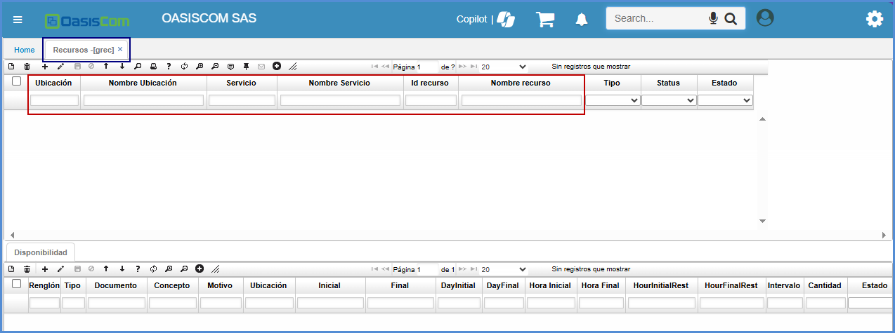
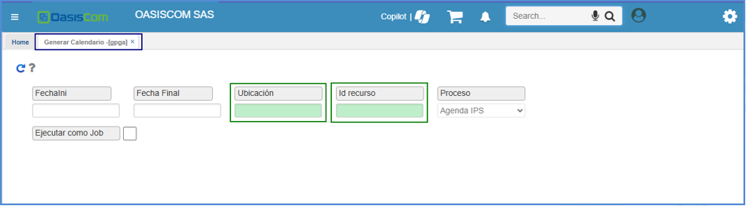

# Recursos - GREC

Esta aplicación es para realizar la administración de recursos de las empresas tipo IPS. En la aplicación **GREC – Recursos**, se realiza la creación de los mismos, así:  

A partir del maestro:

Se adiciona un nuevo registro con el botón   

| Campo | Descripción |
| --- | ----------- |
| Ubicación | Se debe ingresar el código de la ubicación donde se va a prestar el servicio. |
| Nombre Ubicación | Se ingresa el nombre de la ubicación del código anterior. |
| Servicio| Se ingresa el código del servicio que se va a prestar.  |
| Nombre servicio| Se ingresa el nombre del servicio de acuerdo con el código.|
| Id recurso| Se ingresa el nombre del servicio de acuerdo con el código.|
| Id recurso| Se debe ingresar el código del recurso, teniendo en cuenta que este número no es un consecutivo pero que debe ser exclusivo para cada recurso creado.  |
| Nombre recurso| se ingresa el nombre del recurso.|
| Tercero| Se ingresa el código del tercero (cliente) al que aplicará el recurso. Se puede seleccionar desde el zoom, o bien, insertarlo manualmente. Si el tercero es ‘0’ quiere decir que el recurso que se está creando puede ser usado por todos los terceros existentes.  |
| Descripción| Puede ingresarse una observación del recurso si se desea. |
| Estado| Se ingresa el estado **Activo** o con el estado **Inactivo**. |

Luego de diligenciar estos campos, se procede a guardar el registro.

Luego de haber diligenciado el registro del maestro, se pasa al detalle en donde el registro debe ser creado de la siguiente manera:  

| Campo | Descripción |
| --- | ----------- |
| Renglón| Se diligencia de manera automática al momento de guardar el registro.|
| Tipo| No modificar, se diligencia automáticamente por el sistema.|
| Documento| Se digita o se selecciona del zoom el documento _AH_ correspondiente a _CITAS MÉDICAS_. Los documentos se parametrizan en la aplicación **BDOC** .  |
| Concepto| Se digita o se selecciona del zoom el concepto **_AH_** correspondiente a **_CITAS MEDICAS_**. Los conceptos son parametrizables en la aplicación [**BDOC - Documento**](https://docs.oasiscom.com/Operacion/common/bsistema/bdoc).|
| Motivo| Se digita el motivo 0. Los motivos son parametrizables en la aplicación [**BMOT - Motivos**](https://docs.oasiscom.com/Operacion/common/bsistema/bmot).|
| Ubicación| Hace referencia a la sede en la que el recurso labora o se encuentra disponible. Se ejecuta doble click en el zoom y se selecciona la ubicación. Se da click en Aceptar. La ubicación se parametriza previamente en la aplicación **BUBI – ubicaciones organizacionales**. |
| Inicial y Final| Se indica el rango de fechas en las que el recurso trabajará. |   
| Intervalo| Se indica cada cuanto el recurso atenderá pacientes. | 
| Día Inicial| Se indica numeración del 1 al 7. Siendo lunes (1), martes (2), miércoles (3), jueves (4), viernes (5), sábado (6) y Domingo (7). Ejemplo: Si se desea generar el calendario desde el martes se debe colocar en el campo el número 2.|
| Día final| Se indica numeración del 1 al 7, siendo lunes (1), martes (2), miércoles (3), jueves (4), viernes (5), sábado (6) y Domingo (7). Ejemplo: Si se desea generar el calendario hasta el jueves se debe colocar en el campo el número 4.|
| Hora Inicial| Se indica al sistema desde que hora se abrirá el calendario. |
| Hora Final| Se indica al sistema hasta que hora se finalizará el calendario|
| Hora Inicial de almuerzo| Se indica la hora en que inicia el tiempo de almuerzo del profesional. Una vez se indique no se verá reflejada en el calendario.|
| Hora Final de Almuerzo| En este campo se indica la hora en que finaliza el tiempo de almuerzo del profesional. Tener en cuenta en este campo se debe colocar la hora de finalización 1 minuto antes, es decir 12:59 pm, debido al minuto de diferencia para que este no presente conflicto con la agenda generada.|
| Intervalo| Este campo se refiere al tiempo que tendrá cada cita, en el tiempo de una hora, la cita puede tomar una duración entre 10, 15, 20, 40 o 60 minutos (Tener en cuenta que se debe registrar en minutos). |
| Cantidad| Es la cantidad de citas que tendrá el profesional de acuerdo con el intervalo que se configure. **Ejemplo:** Se tiene un intervalo de 40 minutos y se tiene en cantidad 2, se asignan dos citas dentro de los 40 minutos. |
| Estado| Este estado antes de generar el calendario debe estar activo y en el momento de generar el calendario y lo que va a realizar el sistema es que va a cambiar el estado a inactivo ya que se encontraría en asignación.|

>**Nota:** Para que el sistema no quede atado a un único procedimiento, se tiene esta configuración asignada: Documento AH y Concepto AH. Ya que permite que se pueda generar cualquier tipo de cita y así mismo si se requiere controlar o restringir se puede realizar la configuración del procedimiento especifico que pueda generar un profesional generando el cambio del Documento y el concepto. 

Luego de diligenciar los anteriores campos se guarda el registro, dando clic en el icono de guardar . 

Para finalizar y generar el calendario, se ingresa a la aplicación [**GPGA - Generar Calendario**](https://docs.oasiscom.com/Operacion/is/hospital/gproceso/gpga). y diligenciar los siguientes datos: 

- Fecha Inicial
- Fecha Final
- Ubicación
- Id recurso 

Y luego se selecciona el icono de ejecutar  

En el campo Ubicación, se ingresa el mismo que se diligencio en la creación del Profesional y el campo Id Recurso, se diligencia el numero del documento del Profesional. (Deben ser los mismos datos que se registró en la aplicación **GREC - Recursos**).

>**Nota:** Si se tuvo un error en la generación del calendario por fecha, intervalo u horas y en el momento de generarlo desde la aplicación [**GPGA- Generar Calendario**](https://docs.oasiscom.com/Operacion/is/hospital/gproceso/gpga)., no se ha realizado la asignación ninguna cita al calendario generado, se puede realizar la corrección en la aplicación GREC-Recursos y nuevamente ejecutar la generación del calendario y el sistema lo que hará es borrar el calendario anteriormente creado y crear un calendario uno nuevo. 

