# Calendario - GCAL

La opción **GCAL - Calendario**, muestra la planeación actual de los recursos. 

* [Agendamiento de citas por rango de fechas](http://docs.oasiscom.com/Operacion/is/hospital/gcita/gcal#agendamiento-de-citas-por-rango-de-fechas)
* [Creación de citas Médicas](http://docs.oasiscom.com/Operacion/is/hospital/gcita/gcal#creación-de-citas-médicas)
* [Creación de pacientes](http://docs.oasiscom.com/Operacion/is/hospital/gcita/gcal#creación-de-pacientes)
* [Cancelación de Citas Médicas](http://docs.oasiscom.com/Operacion/is/hospital/gcita/gcal#cancelación-de-citas-médicas)
* [Pagar Cita](http://docs.oasiscom.com/Operacion/is/hospital/gcita/gcal#pagar-cita)
* [Generación de producto facturado](http://docs.oasiscom.com/Operacion/is/hospital/gcita/gcal#generación-de-producto-facturado)
* [Generación de Encuestas](http://docs.oasiscom.com/Operacion/is/hospital/gcita/gcal#generación-de-encuestas)
* [MICROSOFT GRAPH INTEGRACION OASISCOM](http://docs.oasiscom.com/Operacion/is/hospital/gcita/gcal#microsoft-graph-integración-oasiscom)

## [Agendamiento de citas por rango de fechas](http://docs.oasiscom.com/Operacion/is/hospital/gcita/gcal#agendamiento-de-citas-por-rango-de-fechas)

Este proceso permite tener la posibilidad de agendar múltiples espacios para un rango de fechas y tiempos.
Para esto se debe ingresar a la aplicación **Calendario – GCAL**, buscar por fecha agenda deseada o previamente generada **Generar Calendario – GPGA**.

Luego se debe tomar una de las opciones y se debe dar clic al botón con el nombre de **‘Crear Fecha’**.

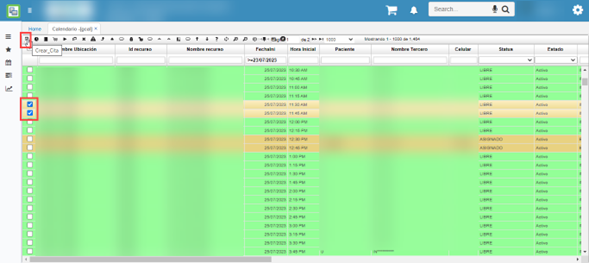

Al realizar este procedimiento se encontrará un cuadro en el cual se debe ingresar la fecha final, dar clic en el recuadro con el nombre de **‘Recurrente’**, ingresar la información entidad, tipo de consulta y motivo consulta.

Por último, ingresar el Id del Afiliado y dar clic al botón de **‘Guardar’**.

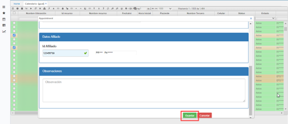

## [Creación de citas Médicas](http://docs.oasiscom.com/Operacion/is/hospital/gcita/gcal#creación-de-citas-médicas)

Cada registro corresponde a la disponibilidad del doctor, dependiendo la hora y el día. 

Cada registro corresponde a la disponibilidad en una hora y fecha determinada para un recurso. Estos registros pueden estar en cuatro diferentes status:  

* Libre  
* Asignado  
* Paciente en sala  
* En atención  

Estos estados van cambiando, dependiendo de la acción realizada por un usuario para asignar una cita a un paciente, indicar la llegada de un paciente o indicar que ya se está atendiendo al mismo. A continuación, se describen las acciones para el respectivo proceso de asignación y consulta de citas:  

En la botonera de esta opción, se encuentran los siguientes botones:  

El primer botón  (Crear Cita) permite asignar una cita a un paciente y crear un registro en la aplicación **GCIT - Citas**. Es importante recalcar que la función de este botón se efectuará únicamente con aquellos registros que se encuentren en status _Libre_, de lo contrario enseñará un mensaje de control. Al dar clic en dicho botón, se desplegará la siguiente ventana en donde se puede visualizar los datos del doctor, los datos de la cita tales como fecha, hora, y lugar de Consulta.  

**Tipo Consulta**: se deberá seleccionar la opción que corresponda de las mostradas en la lista desplegable:  

  
Este **tipo de consultas** pueden ser parametrizadas desde el BDOC (básico de documentos) de la siguiente forma:  
  
En **BDOC:** tomamos ejemplo RX -Exámenes. Ingresamos en el maestro el documento y en detalle el concepto, como se ilustra.  
  
Aca se finaliza la parametrización de los tipo de consulta.  
Dado el escenario (1) si se ejecuta el botón de crear consulta en **GCAL**.  
El sistema crea un registro en la opción: **GCON** **GIMA (imágenes)** y refresca los datos.   

  

Si es diferente al escenario (1), se sigue el proceso:  
**Motivo Consulta**: al igual que el campo anterior, se debe seleccionar de una lista desplegable.  
**Id Afiliado**: se deberá ingresar el documento de identificación del paciente.  

El paciente debe estar previamente creado en la aplicación **BTER - Terceros**, es decir, se debe crear un registro diligenciando los campos correspondientes. 

### [Creación de pacientes](http://docs.oasiscom.com/Operacion/is/hospital/gcita/gcal#creación-de-pacientes)

Dado el caso que el afiliado no se encuentre se creara el tercero dando clic en crear tercero.

Dando clic en agregar nuevo registro (paciente, diligenciamos los datos básicos requeridos. 
Se adiciono el campo zona: para diferenciar el tipo poblacional y presentacion de RIPS.  

Luego de diligenciar los campos, se procede a guardar el registro dando clic en el botón _guardar_.   

**Observaciones:** Se diligencia en caso de ser necesario. 

Al momento de guardar el registro, la cita se generará y confirmará en la aplicación **GCIT – Citas**, para consultar dicha cita en la aplicación **GCAL**. Sobre el registro de la cita anteriormente asignada, se da clic derecho sobre el campo _Id Recurso_ y se pueden visualizar dos opciones:  

Se deberá dar clic en la opción Ir a ”_Citas_", en donde se abrirá esta opción enseñando el registro creado  

Nótese que al momento de crear la cita el estatus del registro de la opción **GCAL – Calendario**, pasa de ser *LIBRE a ASIGNADO.*  

Este campo nos valida si la cita es por la **EPS** o **Particular**.  
  

Creada la cita se debe actualizar la hora de llegada, cabe aclarar que este botón se utiliza únicamente cuando el *Status* del registro es asignado, donde se indica que el paciente se encuentra en sala, listo para ser atendido. Para actualizar la hora de llegada damos clic en el botón . 

Como se puede observar cambio de *Status Asignado a Paciente en Sala.*

Para validar que la cita se creó correctamente, en el campo *Id recurso* damos clic derecho, se despliegan dos opciones, seleccionamos *Ir a citas.* 

Lo anterior nos abre la aplicación llamada **GCIT,** donde se puede ver el registro de la cita como el día, la hora, el afiliado y el doctor. 
Desde el GCIT (Citas) es posible realizar vel cambio de fecha de la cita y luego hora de la cita.  

Cuando sea la hora de la cita asignada, en la aplicación **GCAL** se deberá crear una consulta dando clic en el botón . 

Se abre una aplicación llamada **GCON** de Consultas. Donde el sistema crea un registro con los mismos datos en la aplicación **GCAL**. 

En la parte del Detalle de Formulario se encuentra un formulario el cual el doctor diligencia con los aspectos principales de la consulta, como el nombre del acompañante, el motivo de la consulta, la enfermedad actual, antecedentes clínicos del paciente, examen físico realizado y peso. 

Diligenciados estos campos guardamos el formulado diligenciado. 

En la pestaña Detalle, donde se realizará la formula médica, es decir se relacionará los medicamentos que se van a recetar al paciente o los exámenes físicos, en caso de ser necesario. 

Adicionamos un nuevo registro y en el campo **Producto** se selecciona el medicamento o examen físico que se requiera recetar. Damos clic en el botón  guardar y procesamos la consulta. 

Regresamos a la aplicación **GCAL** damos clic en el botón  y refrescamos los datos y verificamos el *Status,* el cual cambio de *En atención a Consulta Terminada. 

## [Cancelación de Citas Médicas](http://docs.oasiscom.com/Operacion/is/hospital/gcita/gcal#cancelación-de-citas-médicas)

En caso de que un paciente cancele una cita médica seleccionamos el paciente que va a cancelar la cita y luego damos clic 

**Nota:** Para cancelar la cita correctamente, el Status del registro debe estar en *Asignado.* 

El status paso de ser *Asignado* a *Libre.* 

Para validar que la cita se canceló correctamente, en el campo *Id recurso* damos clic derecho, se despliegan dos opciones, seleccionamos *Ir a citas.* 

Nos dirigimos a la aplicación **GCIT** consultamos por número de documento del paciente, este estado debe aparecer *Anulado*. 

 

## [Pagar Cita](http://docs.oasiscom.com/Operacion/is/hospital/gcita/gcal#pagar-cita)

### Opcion 1.  

El botón **Pagar Cita** , permite que cuando el status de un registro sea _PACIENTE EN SALA_, se pueda realizar el pago de la cita (cuota moderadora). Se generará un documento en la aplicación [**GFAC - Facturas**](http://docs.oasiscom.com/Operacion/is/hospital/gfacturacion/gfac) en estado _Activo_ con el producto asociado a la cita parametrizado en la aplicación [**BMOT - Motivos**](http://docs.oasiscom.com/Operacion/common/bsistema/bmot).  

Al dar clic, se generará un documento en la aplicación [**GFAC - Facturas**](http://docs.oasiscom.com/Operacion/is/hospital/gfacturacion/gfac) en estado _Activo_.  

La factura estará lista para ser validada, procesada y pagada.  

### Opcion 2.  

Este proceso aplica cuando el evento es COPAGO.  
Se ejecuta el botón **Copago**, permitiendo que cuando el status de un registro sea _PACIENTE EN SALA_, se pueda realizar el pago de la cita (cuota moderadora). Se generará un documento en la aplicación [**GFAC - Facturas**](http://docs.oasiscom.com/Operacion/is/hospital/gfacturacion/gfac) en estado _Activo_ con el producto asociado a la cita, parametrizado en la aplicación.  

Al ejecutar el botón **Copago** desplegar una ventana, donde editara el **Valor** a pagar y el numero de la **autorización** y el proceso finaliza al guardar, donde se emite la factura.   

## [Generación de producto facturado](http://docs.oasiscom.com/Operacion/is/hospital/gcita/gcal#generación-de-producto-facturado)

En la aplicación **GCAL** al momento de crear una nueva consulta mediante el botón , el sistema validará si dicho registro tiene una factura procesada por concepto del pago de la cita (cuota moredadora) en la aplicación [**GFAC - Facturas**](http://docs.oasiscom.com/Operacion/is/hospital/gfacturacion/gfac) para posteriormente, crear la consulta en la aplicación [**GCON - Consultas**](http://docs.oasiscom.com/Operacion/is/hospital/gconsulta/gcon#generación-de-producto-facturado).  

En GCAL damos clic en el botón  para crear la nueva consulta, el registro se debe encontrar en status _Ingreso Paciente_.  

El sistema arrojará un mensaje de control indicando que la consulta fue creada exitosamente. Inmediatamente, se abrirá la aplicación [**GCON - Consultas**](http://docs.oasiscom.com/Operacion/is/hospital/gconsulta/gcon#generación-de-producto-facturado). (_Ver aplicación_)  

  

### Procedimiento no realizado (boton) en GCAL.  

Para indicar que el procedimiento no se puede realizar por algún prerrequisito no cumplido por parte del usuario.  

Se crea botón en el **GCAL** (calendario) para el escenario, cuando no se puede tomar el examen porque el paciente no viene con la preparación necesaria para la toma y guardar esta información en el campo “observación” de la opción **GCAL**.  

  

Se da clic sobre el botón indicado el cual permite abrir una nueva ventana emergente, la cual recibe la información del porque NO se pudo realizar el procedimiento.  

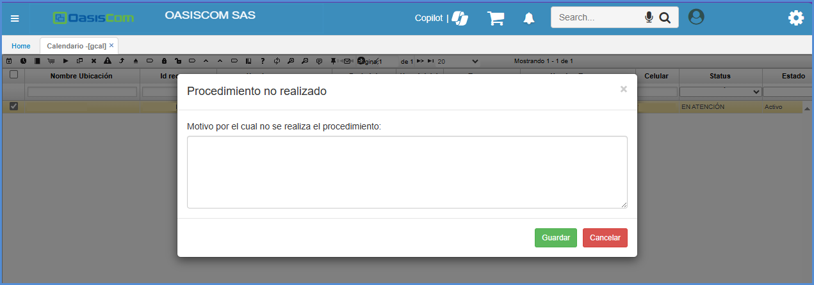  

Se diligencia la información necesaria y se da guardar.  

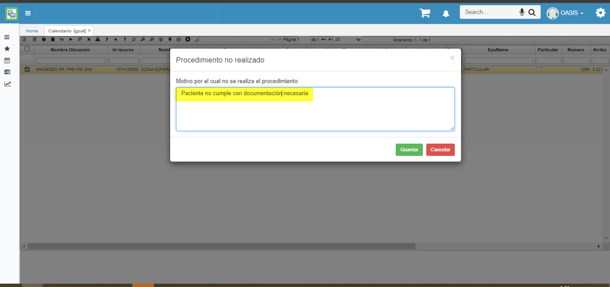  

El texto se guarda en el campo:  **observación**.  

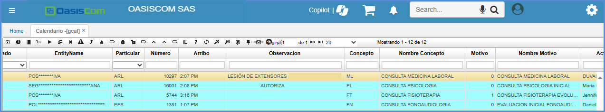  

* Aca finaliza la funcionalidad del boton: **Procedimiento no realizado**   

## [Generación de Encuestas](http://docs.oasiscom.com/Operacion/is/hospital/gcita/gcal#generación-de-encuestas)

Se crea botón **Generar Encuesta** desde la parametrización del aplicativo [**SCAM - Campos**](https://docs.oasiscom.com/Operacion/system/sconfig/scam). Para realizar el proceso de generación de encuestas se ingresa al **GCAL – Calendario** consultando por status **asignado o paciente en sala**. 

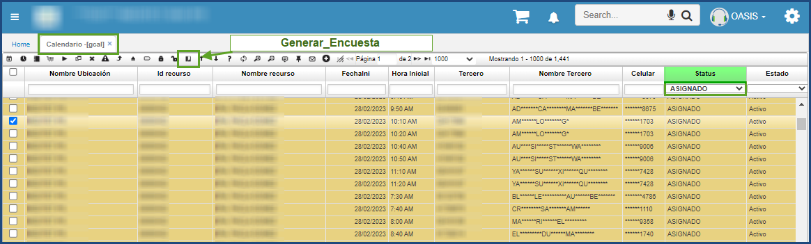

Se debe seleccionar la cita o registro al cual se quiere general la encuesta dando **clic** sobre el botón **Generar Encuesta**, se despliega una ventana emergente la cual muestra los conceptos y motivos existentes para el documento de encuesta de acuerdo con la configuración realizada desde el [**SCAM - Campos**](https://docs.oasiscom.com/Operacion/system/sconfig/scam) por ejemplo, como se muestra en la siguiente en la imagen.

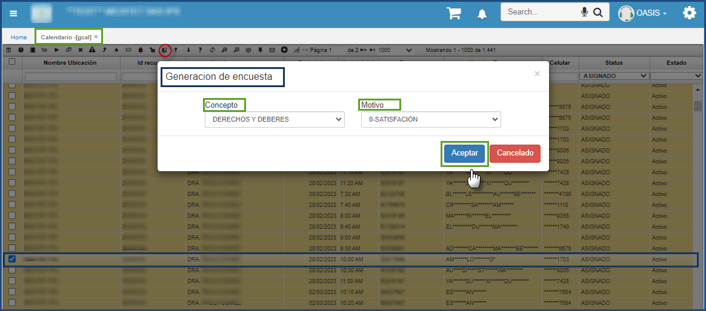

Se debe seleccionar el concepto y el motivo según corresponda y dar clic en Aceptar se muestra un mensaje *Proceso realizado correctamente*. Automáticamente se crea un registro de la encuesta en la aplicación **GENC – Encuestas** con estado **Procesado** y status **Generado** tal como se muestra en la imagen, en el detalle se visualiza la encuesta que se enviará al paciente.

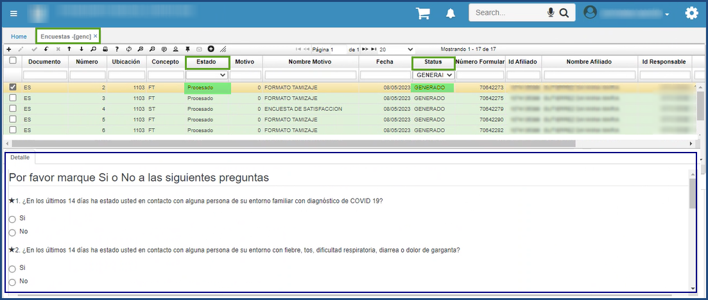

Así mismo se crea un registro automático en **STRA – Trabajos** dejándolo en cola, OasisCom en segundo plano realiza él envió del formulario de la encuesta al paciente a través de correo electrónico registrado.

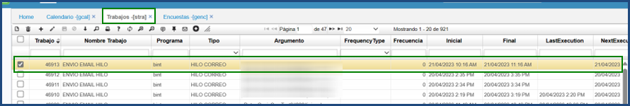

Al correo registrado del paciente llega el enlace para diligenciar la encuesta de la siguiente manera.

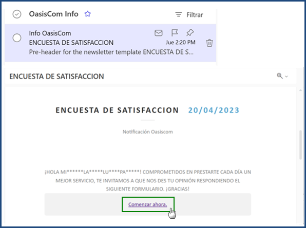

Cuando el paciente diligencia la encuesta enviada al correo electrónico, esta queda actualizada en el aplicativo **GENC – Encuestas** con status **Recibido** en el detalle se observan las respuestas indicadas por el paciente.

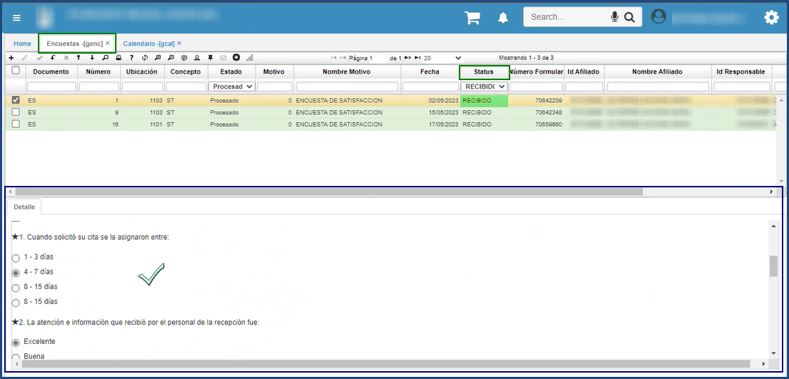

## [MICROSOFT GRAPH INTEGRACION OASISCOM](http://docs.oasiscom.com/Operacion/is/hospital/gcita/gcal#microsoft-graph-integración-oasiscom)

Es una API de Microsoft, la cual realiza todos los procesos de sincronización de :

*    TEAMS
*    CALENDARIO
*    MENSAJERIAS 
*    CORREOS

Que incluye la tienda de Microsoft, así que se realizo el proceso de integración de la API, directamente con Oasis, desde la aplicación [GCAL – Calendario](https://docs.oasiscom.com/Operacion/is/hospital/gcita/gcal) ya que, a la hora de tener una cita para la fecha asignada, directamente se sincronice y se evidencia con una de las aplicaciones propias de Microsoft.

Ingresamos a la aplicación [GCAL – Calendario](https://docs.oasiscom.com/Operacion/is/hospital/gcita/gcal), donde se evidenciará a la hora de consultar un punto de venta, el botón Sincronizar Calendario. 

Una vez se da click en el botón, se sincronizará con la aplicación TEAMS, la cita que se tiene programada para la fecha indicada, y así llevar un mejor control.

