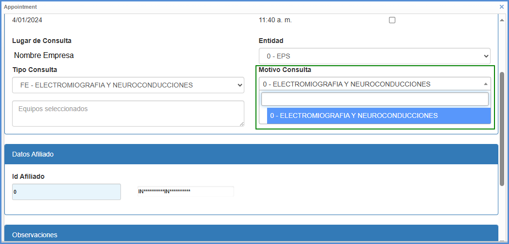
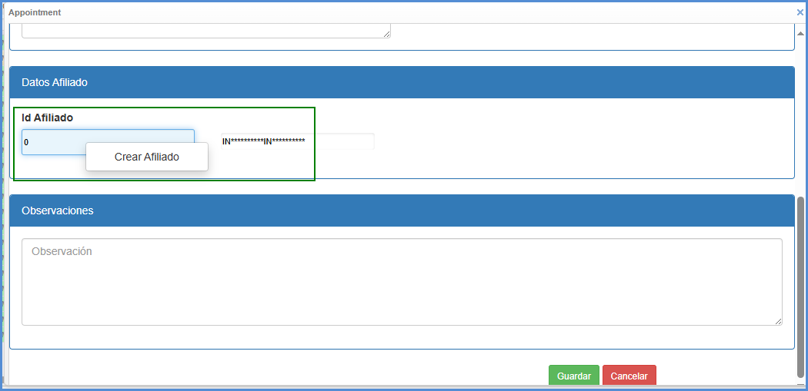
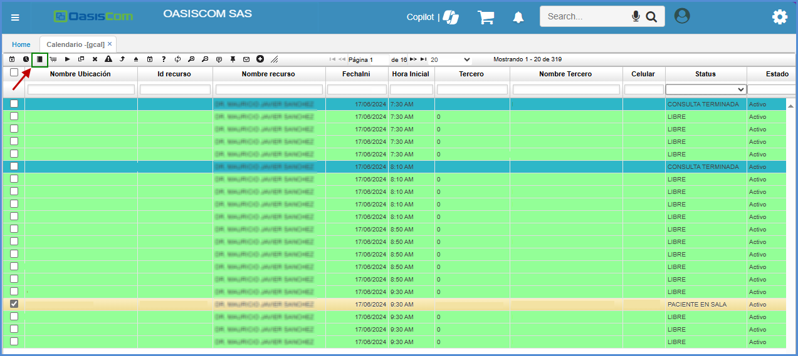
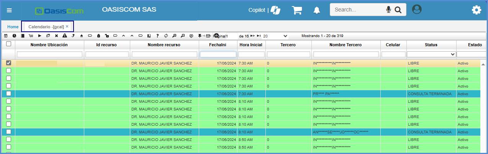
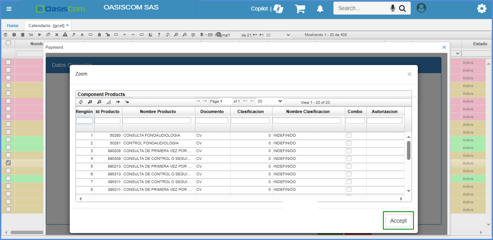
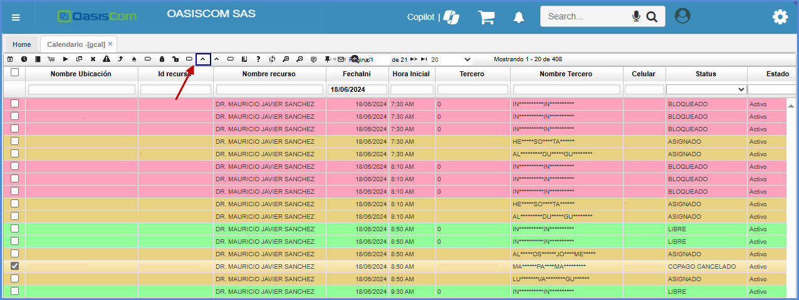
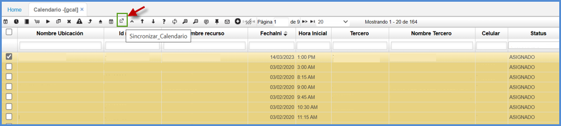

# GCAL - Calendario

La opción **GCAL - Calendario**, muestra la planeación actual de los recursos. 

* [Paleta de Colores del GCAL en Oasiscom](#paleta-de-colores-del-gcal-en-oasiscom)
* [Botones de Gcal](#botones-de-gcal)
* [Agendamiento de Citas](#agendamiento-de-citas)
* [Creación de pacientes](#creación-de-pacientes)
* [Agendamiento de citas por rango de fechas forma Recurrente](#agendamiento-de-citas-por-rango-de-fechas-forma-recurrente)
* [Procedimiento de Botones](#procedimiento-de-botones)
    *  [Pagar Cita](#pagar-cita)
    *  [Generación de producto facturado](#generación-de-producto-facturado)
    * [Generación de producto mediante COPAGO](#generación-de-producto-mediante-copago)
    * [Actualización Campos de Sesiones](#actualización-campos-de-sesiones)
    * [Creación de Consentimientos Informados](#creación-de-consentimientos-informados)
    * [Procedimiento no Realizado](#procedimiento-no-realizado)
    * [Generar Encuesta](#generar-encuesta)
* [MICROSOFT GRAPH INTEGRACION OASISCOM](#microsoft-graph-integracion-oasiscom)

## [Paleta de Colores del GCAL en OasisCom](#paleta-de-colores-del-gcal-en-oasiscom)

| Estado | Color |
| --- | ----------- |
| Libre            | |
| Asignado         | |
| Cita Reprogramada| |
| Paciente en Sala | |
| Cancelado        | |
| Factura Cancelada| |
| Ingreso Paciente | |
| En Atención      | |
| Terminada        | |
| Inasistencia     | |
| Procedimiento no realizado | |
| Bloqueado        | |

## [Botones de Gcal](#botones-de-gcal)

| Botón | Descripción |
| --- | ----------- |
|  | Crear Consulta |
|  | Cancelar Cita |
|  | Inasistencia|
|  | Reprogramar|
|  | Procedimiento no realizado|
|  | Bloquear Agenda|
|  | Desbloquear Agenda|
|  |Ajustar Observación |
|  | Actualizar Campos|
| | Crear Admisión|
| | Generar Encuesta|
| | Ayuda|
| | Refrescar Datos|
| | Filtro Avanzado|
| | Limpiar Filtros|
| | Comentarios|
| | Opciones de Columna|
| | Pagar Cita|
| | Adjuntos|
| | Marca Todo|

## [Creación para citas](#creación-para-citas)

Se ingresa a la aplicación **GCAL - Calendario** y en el maestro, en los campos de consulta se debe relacionar el **Id medico** (número de identificación del profesional) o el nombre del profesional y la fecha en que se asignará la cita al paciente, el sistema por defecto traerá la fecha del día, pero se puede modificar como se requiera.

Se debe buscar por fecha en que  o previamente generada [**GPGA- Generar Calendario**](https://docs.oasiscom.com/Operacion/is/hospital/gproceso/gpga).

Luego se debe tomar una de las opciones y se debe dar clic al botón con el nombre de **‘Crear Cita’**.

>**Nota:** Para poder asignar la cita, la opción seleccionada debe estar con el campo status **Libre**.

Al realizar este procedimiento se encontrará un cuadro en el cual se debe ingresar la información:

En el campo **Entidad**, se indica la entidad por la cual se prestara el servicio al paciente:  

Tipo de Consulta: se selecciona la opción según corresponda. 

- Control
- Consulta
- Tipo de procedimiento que requiere el paciente

**Motivo de Consulta:** se selecciona la información según corresponda de acuerdo con el tipo de consulta seleccionado.

Datos Afiliado: se debe indicar el número de documento del paciente.

### Ingresar Información Extra del Paciente

Cuando llega el paciente a su cita programada, se debe completar los datos básicos faltantes. Para esto se da clic derecho en el número del documento del paciente que se tiene en la agenda programada, se mostrará una ventana llamada **ir a documento:**

Para validar ingrese a la aplicación [**GPAC - Pacientes**](https://docs.oasiscom.com/Operacion/is/hospital/gbasica/gpac)

En la aplicación **GCIT - Citas**, se puede consultar las citas que se han programado en el día, por paciente, procedimiento y nombre de profesional ya que esto se va alimentando desde la aplicación **GCAL- Calendario** Esta aplicación es netamente de información ya que es de verificación.

Una vez el paciente llega a su cita, en la aplicación **GCAL - Calendario**, se dirige al espacio en donde esta asignada la consulta y marca la llegada con el icono nombrado **Llegada**.

### [Creación de pacientes](#creación-de-pacientes)

En caso de que el paciente no se encuentre creado en la base de datos de la aplicación, se puede generar la creación dentro de la opción Id Afiliado, clic derecho y selecciona la opción **“Crear Afiliado”**

El sistema mostrara una ventana emergente. 

En el primer campo de consulta se puede buscar al paciente para confirmar si está creado o no. Se puede realizar digitando nombre del paciente o número de documento.

Si el paciente no se está creado, en la ventana que se visualiza se encuentra un botón verde nombrado **Nuevo Cliente**   que al seleccionarlo se habilitan todos los campos, donde se debe ingresar la información correspondiente.

**Campos:** Tipo de cliente, código cliente, tercero, Primer nombre, celular y correo electrónico son campos obligatorios, ya que es información que solicita el sistema que deben tener los pacientes.

>**Nota:** Se adiciono el campo zona: para diferenciar el tipo poblacional y presentacion de RIPS.

 Una vez diligenciada la información se selecciona la opción “Guardar cliente”.

Una vez realizado este proceso, le dan en el botón cerrar y volverán a la ventana anterior. 

>**Nota:** Se tiene la opción de indicar una observación en el campo correspondiente (si se requiere).

Luego de diligenciar los campos, se procede a guardar el registro dando clic en el botón **_guardar_.**  

Este campo valida si la cita es por la **EPS** o **Particular**.  

  

## [Agendamiento de citas por rango de fechas forma Recurrente](#agendamiento-de-citas-por-rango-de-fechas-forma-recurrente)

Este proceso permite tener la posibilidad de agendar múltiples espacios para un rango de fechas y tiempos.
Para esto se debe ingresar a la aplicación **Calendario – GCAL**, buscar por fecha agenda deseada o previamente generada [**GPGA- Generar Calendario**](https://docs.oasiscom.com/Operacion/is/hospital/gproceso/gpga).

Luego se debe tomar una de las opciones y se debe dar clic al botón con el nombre de **‘Crear Cita’**.

Al realizar este procedimiento se encontrará un cuadro en el cual se debe ingresar la fecha final, dar clic en el recuadro con el nombre de **‘Recurrente’**, ingresar la información entidad, tipo de consulta y motivo consulta.

En el campo **Entidad**, se indica la entidad por la cual se prestara el servicio al paciente:  

Tipo de Consulta: se selecciona la opción según corresponda. 

- Control
- Consulta
- Tipo de procedimiento que requiere el paciente

**Motivo de Consulta:** se selecciona la información según corresponda de acuerdo con el tipo de consulta seleccionado.

Datos Afiliado: se debe indicar el número de documento del paciente.

## [Procedimiento de Botones](#procedimiento-de-botones)

Para esta sección, se explicara paso a paso la forma correcto en la que se debe realizar el proceso.

   ### [Pagar Cita](#pagar-cita)

Para facturar la cita programa, se tienen dos opciones configuradas para realizar este proceso.

### Opcion 1.  

El botón **Pagar Cita** 

 

Permite ejecutar cuando el status de un registro sea **_PACIENTE EN SALA_**, se pueda realizar el pago de la cita (cuota moderadora). Se generará un documento en la aplicación [**GFAC - Facturas**](http://docs.oasiscom.com/Operacion/is/hospital/gfacturacion/gfac) en estado _Activo_ con el producto asociado a la cita parametrizado en la aplicación [**BMOT - Motivos**](http://docs.oasiscom.com/Operacion/common/bsistema/bmot).  

Al dar clic, se generará un documento en la aplicación [**GFAC - Facturas**](http://docs.oasiscom.com/Operacion/is/hospital/gfacturacion/gfac) en estado _Activo_.  

Una vez realizada esto la factura estará lista para ser validada, procesada y pagada.  

### Opcion 2.  

Este proceso aplica cuando el evento es **COPAGO.**  
Se ejecuta el botón **Copago**

Lo cual permite que cuando el status de un registro sea **_PACIENTE EN SALA_**, se pueda realizar el pago de la cita (cuota moderadora). Se generará un documento en la aplicación [**GFAC - Facturas**](http://docs.oasiscom.com/Operacion/is/hospital/gfacturacion/gfac) en estado **_Activo_** con el producto asociado a la cita, parametrizado en la aplicación.  

Al ejecutar el botón **Copago** desplegar una ventana, donde editara el **Valor** a pagar y el número de la **autorización** y el proceso finaliza al guardar, donde se emite la factura.   

### [Generación de Producto Facturado](#generación-de-producto-facturado)

En la aplicación **GCAL** al momento de crear una nueva consulta mediante el botón  , el sistema validará si dicho registro tiene una factura procesada por concepto del pago de la cita (cuota moredadora) en la aplicación [**GFAC - Facturas**](http://docs.oasiscom.com/Operacion/is/hospital/gfacturacion/gfac) para posteriormente, crear la consulta en la aplicación [**GCON - Consultas**](http://docs.oasiscom.com/Operacion/is/hospital/gconsulta/gcon#generación-de-producto-facturado).  

Se ejecuta clic en el botón Crear Consulta  para crearla y el registro se debe encontrar en status **_Ingreso Paciente_**.  

>**Nota:** El sistema de acuerdo a la parametrización que se tenga, abrira la aplicación [**GIMA - Imágenes**](https://docs.oasiscom.com/Operacion/is/hospital/gconsulta/gima), [**GCON - Consultas**](https://docs.oasiscom.com/Operacion/is/hospital/gconsulta/gcon) o [**FGCON - Formulario Salud**](https://docs.oasiscom.com/Operacion/is/hospital/gconsulta/fgcon) de acuerdo a lo que se este solicitando. 

El sistema arrojará un mensaje de control indicando que la consulta fue creada exitosamente. 

Al momento del proceso exitoso, se abrira la aplicación [**FGCON - Formulario Salud**](https://docs.oasiscom.com/Operacion/is/hospital/gconsulta/fgcon)

 

### [Generación de producto mediante COPAGO](#generación-de-producto-mediante-copago)

Por medio de este ZOOM se podrá seleccionar el CUPS del producto de acuerdo al contrato seleccionado, para esto es necesario:

-	Ingresar al aplicativo GCAL.

-	Al dar click al botón con el nombre de COPAGO se abrirá una ventana.

- En la ventana aparecerá un campo con el nombre de código de servicio (CUPS)’.
    

- Sobre el campo **código de servicio (CUPS)** se da doble click para que el ZOOM se abra y puedan escoger el producto que necesiten.

### [Actualización Campos de Sesiones](#actualización-campos-de-sesiones)

Se selecciona un registro y al dar click en el botón **Actualizar_campos** genera un zoom donde permite modificar la Fecha de sesión y Cantidad de sesión de acuerdo a la indicación del profesional.

Estos campos son usados en los procesos de generación de facturas, generación de admisiones, generación de consultas entre otros.

### [Creación de consentimientos Informados](#creación-de-consentimientos-informados)

Para la creación de los consentimientos informados, se debe realizar la ejecución del botón **Generar Certificados**   en la aplicación **GCAL - Calendario**. Al realizar la ejecución del botón, el sistema les mostrara una nueva ventana en la cual aparecerán todos los conceptos asociados al documento asociado en la aplicación programa [GCER - Certificados de Hospital](https://docs.oasiscom.com/Operacion/is/hospital/gconsulta/gcer). Es importante tener en cuenta en que estado se encuentra el paciente, ya que ese botón no permite ejecutarse, hasta que el paciente se encuentre “Asignado”. 

Al momento de que se abre la ventana emergente, aparece una lista de despliegue el cual corresponde a los consentimientos que tomara el paciente.

 

Se debe seleccionar los Consentimientos a generar para el paciente y luego dar clic al botón **GUARDAR** lo cual activara el botón **ACEPTAR**. 

 

Si se presenta el caso que falto seleccionar un consentimiento a generar o se seleccionó uno que no corresponde, se puede seleccionar otros consentimientos y esto lo que hara es que inactivara el botón **ACEPTAR** y activara el botón **GUARDAR** y dar nuevamente el Botón **GUARDAR**. 

Se debe tener en cuenta que sobre el [GCER - Certificados de Hospital](https://docs.oasiscom.com/Operacion/is/hospital/gconsulta/gcer) se podrá buscar ya sea por el concepto del consentimiento seleccionado, por la fecha, el número del paciente, o por los campos que hacen referencia a la cita. 

 

Acceder al [GCER - Certificados de Hospital](https://docs.oasiscom.com/Operacion/is/hospital/gconsulta/gcer) en el registro se observa el campo Número el cual cuenta con el número que genero al crear el consentimiento.

 

Con este número de referencia se puede consultar en la aplicación [GCER - Certificados de Hospital](https://docs.oasiscom.com/Operacion/is/hospital/gconsulta/gcer).

 

### [Procedimiento no Realizado](#procedimiento-no-realizado)

Para indicar que el procedimiento no se puede realizar por algún prerrequisito no cumplido por parte del usuario.  

Se crea botón en el **GCAL** (calendario) para el escenario, cuando no se puede tomar el examen porque el paciente no viene con la preparación necesaria para la toma y guardar esta información en el campo “observación” de la opción **GCAL -Calendario**.  
 
 

Se da clic sobre el botón indicado el cual permite abrir una nueva ventana emergente, la cual recibe la información del porque NO se pudo realizar el procedimiento.  

  

Se diligencia la información necesaria y se ejecuta el botón guardar 

El texto se guarda en el campo **Observación** 

  

### [Generar Encuesta](#generar-encuesta)
 
Para poder visualizar el botón de Generar Encuesta en la aplicación **GCAL - Calendario**, se debe llevar a cabo la parametrización desde la aplicación [GCER - Certificados de Hospital](https://docs.oasiscom.com/Operacion/is/hospital/gconsulta/gcer). Para ejecutar el proceso de generación de encuestas se ingresa al **GCAL – Calendario** donde el sistema permite la generación, es importante que la cita se encuentre es estatus diferente a **libre**.

Para observar el proceso que se tiene asignado en la aplicación ingrese al link **GENC - Encuestas**.

## [MICROSOFT GRAPH INTEGRACION OASISCOM](#microsoft-graph-integracion-oasiscom)

Es una API de Microsoft, la cual realiza todos los procesos de sincronización de :

*    TEAMS
*    CALENDARIO
*    MENSAJERIAS 
*    CORREOS

Que incluye la tienda de Microsoft, así que se realizo el proceso de integración de la API, directamente con Oasis, desde la aplicación [GCAL – Calendario](https://docs.oasiscom.com/Operacion/is/hospital/gcita/gcal) ya que, a la hora de tener una cita para la fecha asignada, directamente se sincronice y se evidencia con una de las aplicaciones propias de Microsoft.

Ingresamos a la aplicación [GCAL – Calendario](https://docs.oasiscom.com/Operacion/is/hospital/gcita/gcal), donde se evidenciará a la hora de consultar un punto de venta, el botón Sincronizar Calendario. 

Una vez se da click en el botón, se sincronizará con la aplicación TEAMS, la cita que se tiene programada para la fecha indicada, y así llevar un mejor control.

