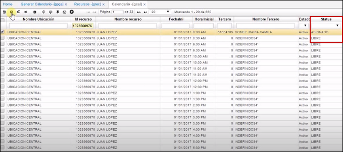

# CALENDARIO - GCAL

La opción **GCAL - Calendario**, muestra la planeación actual de los recursos (Doctores) que se encuentran asociados a la entidad.  

Cada registro corresponde a la disponibilidad en una hora y fecha determinada para un recurso. Estos registros pueden estar en cuatro diferentes status:  

•	Libre  
•	Asignado  
•	Paciente en sala  
•	En atención  

Estos estados van cambiando dependiendo de la acción realizada por un usuario para asignar una cita a un paciente, indicar la llegada de un paciente o indicar que ya se está atendiendo al mismo. A continuación, se describen las acciones para el respectivo proceso de asignación y consulta de citas:  

En la botonera de esta opción, se encuentran los siguientes botones:  

El primer botón  (Crear Cita) permite asignar una cita a un paciente y crear un registro en la aplicación **GCIT - Citas**. Es importante recalcar que la función de este botón se efectuará únicamente con aquellos registros que se encuentren en status _Libre_, de lo contrario enseñará un mensaje de control. Al dar clic en dicho botón, se desplegará la siguiente ventana en donde se puede visualizar los datos del doctor, los datos de la cita tales como fecha, hora, y lugar de Consulta.  

**Tipo Consulta**: se deberá seleccionar la opción que corresponda de las mostradas en la lista desplegable:  

**Motivo Consulta**: al igual que el campo anterior, se debe seleccionar de una lista desplegable.  
**Id Afiliado**: se deberá ingresar el documento de identificación del paciente.  

El paciente debe estar previamente creado en la aplicación **BTER - Terceros**, es decir, se debe crear un registro diligenciando los campos correspondientes. 

Luego de diligenciar los campos, se procede a guardar el registro dando click en el botón _guardar_.  

Al momento de guardar el registro, la cita se generará y confirmará en la aplicación **GCIT – Citas**, para consultar dicha cita en la aplicación **GCAL**. Sobre el registro de la cita anteriormente asignada, se da clic derecho sobre el campo _Id Recurso_ y se pueden visualizar dos opciones:  

Se deberá dar clic en la opción Ir a ”_Citas_", en donde se abrirá esta opción enseñando el registro creado  

Nótese que al momento de crear la cita el estatus del registro de la opción **GCAL – Calendario**, pasa de ser LIBRE a ASIGNADO:  

El siguiente botón   (Llegada) realiza la actualización de los campos **Status** a _paciente en sala_ y **Arribo**, el cual muestra la hora de llegada, indicando que el paciente se encuentra en sala listo para ser atendido. Se debe tener en cuenta que este botón cumple con su funcionamiento únicamente cuando el campo **Status** del registro de la aplicación **GCAL - Calendario** es **ASIGNADO**, de lo contrario enseñará un mensaje de control.  

El botón  (Crear Consulta), crea un nuevo registro en la opción **GCON - Consultas** con los datos del registro de la opción **GCAL - Calendario** y cambia su status a _EN ATENCIÓN_, el cual indica que el paciente ya se encuentra en consulta con el doctor asignado. Al crear la consulta, se abre automáticamente la opción **GCON - Consultas**, mostrando el registro creado.  

Se debe tener en cuenta que el funcionamiento de este botón se cumple únicamente cuando el status del registro del **GCAL - Calendario** corresponde a **PACIENTE EN SALA**, de lo contrario, el sistema enseñará un mensaje de control.  

El último botón  (Cancelar_Cita) cumple la función de reversar un registro que se encuentre en status **ASIGNADO** al status **LIBRE** y adicionalmente, reversa y anula el registro correspondiente creado en la opción **GCIT - Citas**.

### [Pagar Cita](http://docs.oasiscom.com/Operacion/is/hospital/gcita/gcal#pagar-cita)
* Opcion-1.
El botón **Pagar Cita** , permite que cuando el status de un registro sea _PACIENTE EN SALA_, se pueda realizar el pago de la cita (cuota moderadora). Se generará un documento en la aplicación [**GFAC - Facturas**](http://docs.oasiscom.com/Operacion/is/hospital/gfacturacion/gfac) en estado _Activo_ con el producto asociado a la cita parametrizado en la aplicación [**BMOT - Motivos**](http://docs.oasiscom.com/Operacion/common/bsistema/bmot).  

Al dar click, se generará un documento en la aplicación [**GFAC - Facturas**](http://docs.oasiscom.com/Operacion/is/hospital/gfacturacion/gfac) en estado _Activo_.  

En GFAC

La factura estará lista para ser validada, procesada y pagada.  

* Opcion-2.

El botón **Copago**, permite que cuando el status de un registro sea _PACIENTE EN SALA_, se pueda realizar el pago de la cita (cuota moderadora). Se generará un documento en la aplicación [**GFAC - Facturas**](http://docs.oasiscom.com/Operacion/is/hospital/gfacturacion/gfac) en estado _Activo_ con el producto asociado a la cita, parametrizado en la aplicación.  

Al ejecutar el boton **Copago** desplega una ventana donde editara el **Valor** a pagar y el numero de la **autorizacion  ** y el proceso finaliza al guardar, donde se emite la factura.  

## [Generación de producto facturado](http://docs.oasiscom.com/Operacion/is/hospital/gcita/gcal#generación-de-producto-facturado)

En la aplicación **GCAL** al momento de crear una nueva consulta mediante el botón , el sistema validará si dicho registro tiene una factura procesada por concepto del pago de la cita (cuota moredadora) en la aplicación [**GFAC - Facturas**](http://docs.oasiscom.com/Operacion/is/hospital/gfacturacion/gfac) para posteriormente, crear la consulta en la aplicación [**GCON - Consultas**](http://docs.oasiscom.com/Operacion/is/hospital/gconsulta/gcon#generación-de-producto-facturado).  

En GCAL damos click en el botón  para crear la nueva consulta, el registro se debe encontrar en status _Ingreso Paciente_.  

El sistema arrojará un mensaje de control indicando que la consulta fue creada exitosamente. Inmediatamente, se abrirá la aplicación [**GCON - Consultas**](http://docs.oasiscom.com/Operacion/is/hospital/gconsulta/gcon#generación-de-producto-facturado). (_Ver aplicación_)  

