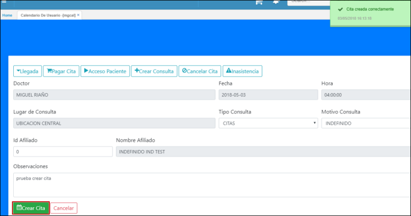
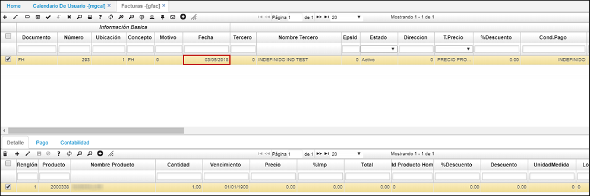
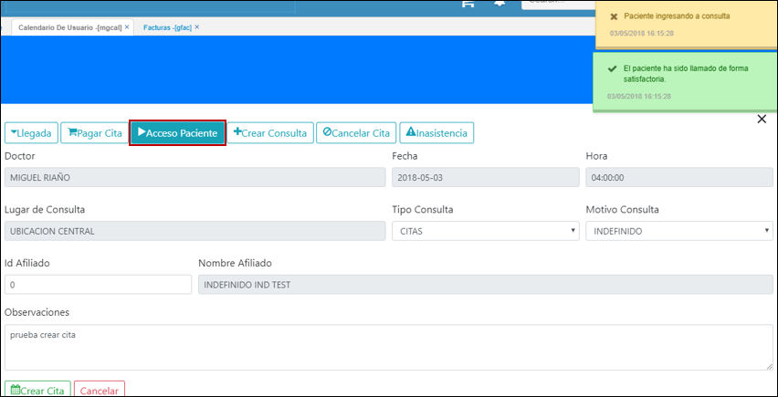
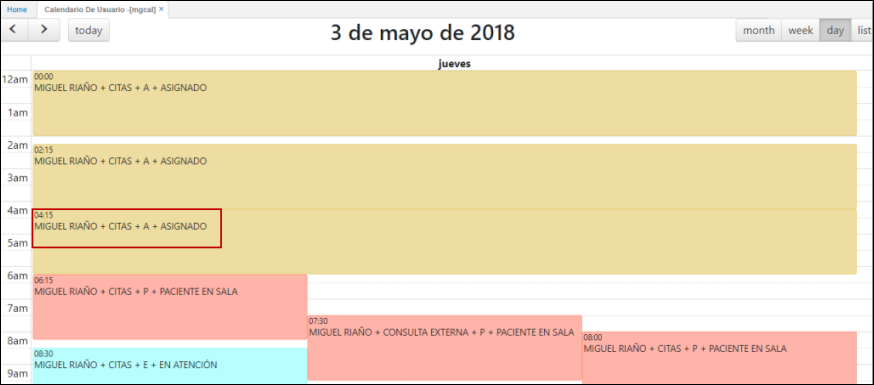
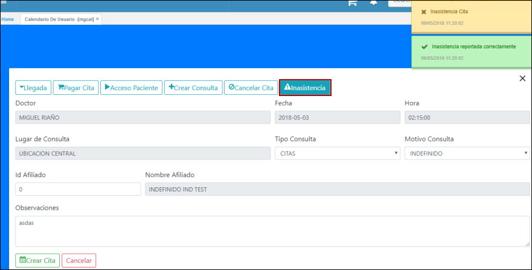

# MGCAL - Calendario de Usuario

La opción MGCAL - Calendario de Usuario, muestra la planeación actual de los recursos (Doctores) que se encuentran asociados a la entidad de forma más dinámica y sencilla.  

En la aplicación se visualiza los horarios del día los cuales puenden estar en cuatro status diferentes:  

* Libre  
* Asignado  
* Paciente en sala  
* En atención  

Estos estados van cambiando dependiendo de la acción realizada por un usuario para asignar una cita a un paciente, indicar la llegada de un paciente o indicar que ya se está atendiendo al mismo.  

Para crear una cita ingresamos a la aplicación MGCAL y seleccionamos el dia.  

Seleccionamos un horario del día seleccionado.  

A continuación diligenciamos los datos del formulario y damos click en el botón _Crear cita_. El sistema indicará mendiente un mensaje de control que la cita fue creada correctamente.  

En el momento en que llegue el paciente a cumplir su cita, se deberá dar click en el botón **_Llegada_**.  

Seguidamente damos click en el botón **_Pagar Cita_** y el sistema creará automáticamente la factura en la aplicación GFAC - Facturas.  

Debemos ingresar a la aplicación GFAC a consultar la factura generada.  

Una vez pagada la factura, damos acceso al paciente mediante el botón **_Acceso paciente_**.  

Una vez ingresa el paciente al consultorio, creamos una nueva consulta dando click en el botón **_Crear Consulta_**. La consulta la debemos diligenciar en la aplicación _GCON - Consultas_ con datos como: motivo de consulta, la enfermedad actual,antecedentes, entre otros.  

En GCON - Consultas.  

### Cancelar Cita

Para cancelar una cita, esta se debe encontrar en status _ASIGNADO_.  

Ingresamos a la cita y damos click en el botón **_Cancelar Cita_**.  

### Inasistencia 

Para reportar que el paciente no asistió a la cita, ingresamos a la cita asignada y damos click en el botón **_Inasistencia_**.  

El status de la cita cambiará a **_Inasistencia_**.  

