---

layout: default
title: Consultas
permalink: /Operacion/is/hospital/gconsulta/fgcon
editable: si

---

# FGCON - Formulario Salud 

Es un programa que permite crear y modificar información de pacientes en una presentación tipo formulario.

Botones a visualizar en la aplicación:

| **Botones** | **Descripción** |
| --- | ----------- |
|  | Guardar información y regresa a la anterior pestaña.  |
|  | Guardar información y continua a la siguiente pestaña.  |
| 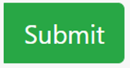| Botón para finalizar el proceso. |
| 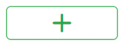| Crear Consulta: Se visualiza el formulario con datos básicos para crear consulta |
| 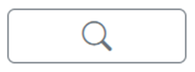| Buscar Consultas: Busca consultas en estado Activo. |
| 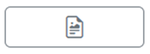| Visualización de Formato: Muestra el formato de manera grafica.|
| 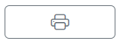| Impresión: Genera ventana de impresión del navegador. |
| 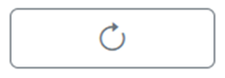| Refrescar formulario: Recarga formulario en caso de realizar modificaciones en la parametrización. |
| 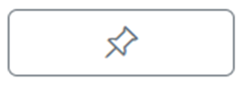| Adjuntos: Muestra ventana para poder adjuntas archivos. |
| 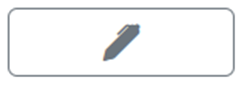| Modificar consulta: Ventana con formulario para poder editar datos del encabezado de la consulta. |
| 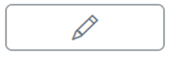| Firma: Ventana de escritura para realizar un firmado digital. |

Se ingresa a la aplicación **FGCON - Formulario Salud**. 

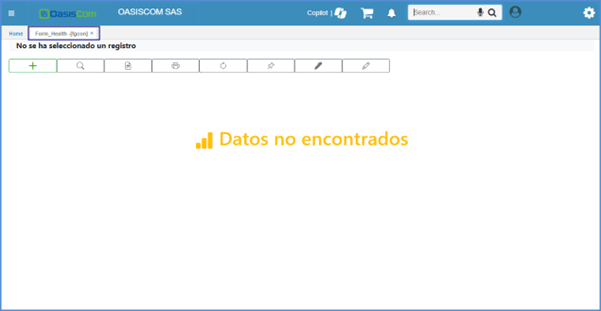

Se ejecuta el botón para crear consulta.

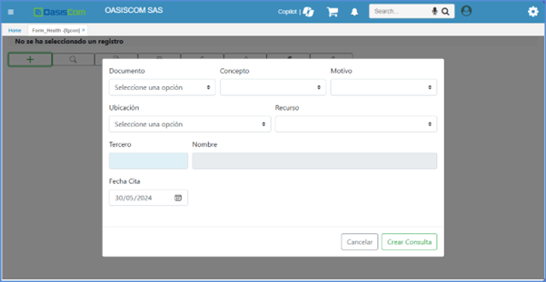

Los campos **Documento**, **Concepto** y **Motivo**, son importantes a la hora de la creación de la consulta ya que de tal manera mostrara un formulario acorde a procedimiento a realizar. 

Estos campos se encuentran parametrizados en la aplicación [**BMOT - Motivos**](https://docs.oasiscom.com/Operacion/common/bsistema/bmot)  

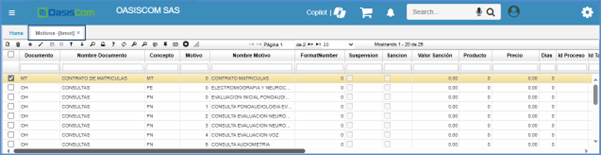

| **Campos** | **Descripción** |
| --- | ----------- |
| Ubicación | Punto de atención  |
| Recurso | Profesional a asignar en la consulta. |
| Tercero| Cedula del paciente.|
| Fecha| Fecha de creación de la consulta.|

Para consultar un registro se ejecuta el botón **Buscar Consulta** , donde saldrán los registros previamente diligenciados y activos. 

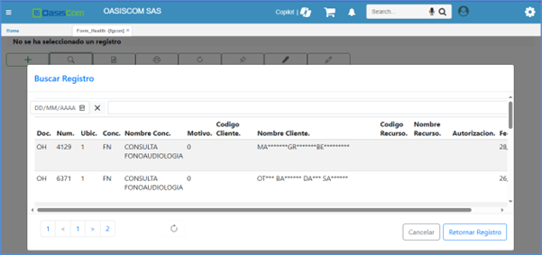

Al elegir un registro se carga el formulario con la informacion de la consulta dividida en pestañas, para su posterior diligenciamiento de datos en caso de requerirlos.

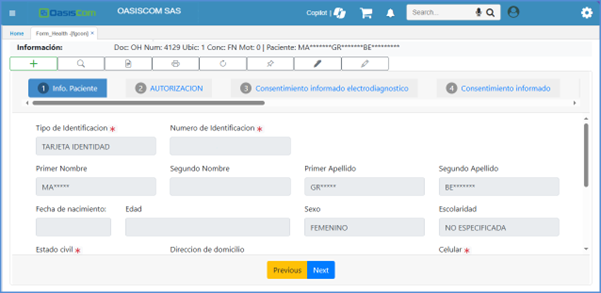

>**Nota:** Tener en cuenta que cada vez que quieran cambiar de **TAB**, se puede hacer, pero no se guardara la información que hayan diligenciado, solo si únicamente presionan el botón de **NEXT**. Esto es para que, si requieren nuevamente ingresar datos nuevos o corregir datos, puedan volver a la anterior **TAB** y hacer la debida corrección. 

Para poder ver el registro de manera gráfica, la vista preliminar del documento se visualizará de la siguiente forma: 

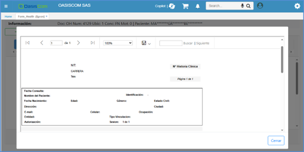

Para impresión, se visualizará de la siguiente manera:

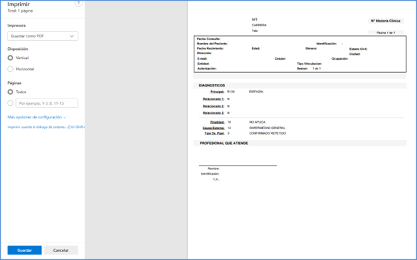

La opción para adjuntar archivos necesarios o solicitados para el proceso, se refleja de la siguiente manera:

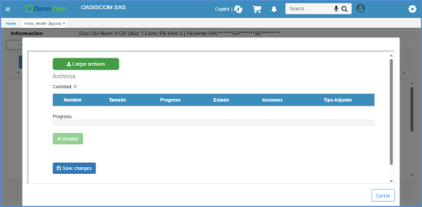

| **Botones** | **Descripción** |
| --- | ----------- |
|  | Cargar archivos: Para seleccionar el archivo que se desee subir.  |
| 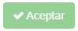 | Aceptar: Este botón será verde, indicando que ya está habilitado, cuando el sistema detecta que se encuentre un archivo listo para subir.  |
| 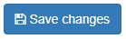| Save Changes: Se ejecuta este botón, cuando la carga del archivo ya se encuentre lista. |

Para modificar el tipo de procedimiento se pueden modificar los campos de **Documento**, **Concepto** y **Motivo**.

>**Nota:** El modificar el tipo de procedimiento, se genera un nuevo formulario en donde es necesario diligenciar algunos datos del paciente y consulta en general.

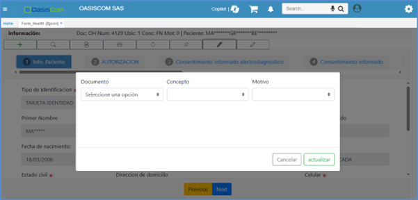

Posterior a esto se realiza la integración de firmado de documentos.

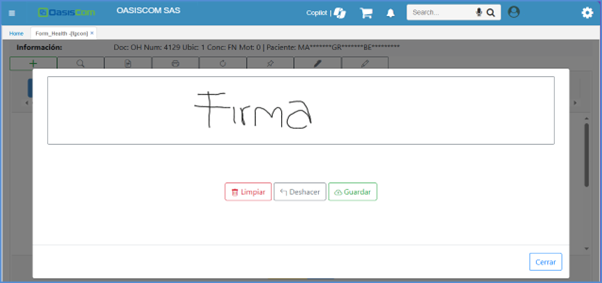