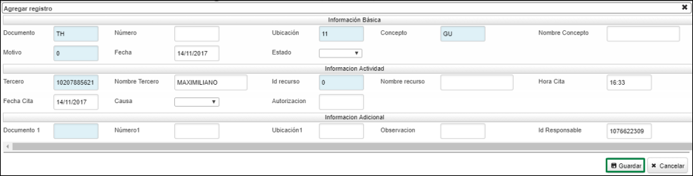

# GACT - Actividades

En esta aplicación podemos registrar las diferentes actividades que se pueden encontrar en un hospital, veterinaria entre otros. Aqui vamos a explicar diferentes actividades que se pueden presentar en una veterinaria.

## [Guardería]

Para generar un registro de guardería se debe crear un documento con las siguientes características:

**Documento:** Se debe registrar TH correspondiente a actividades
**Ubicación:** Se debe indicar la ubicación en la cual se presta el servicio
**Concepto:** Se debe registrar GU correspondiente a guardería
**Fecha:** Se debe registrar la fecha de inicio del servicio prestado
**Tercero:** Se debe registrar el nombre de la mascota 
**Recurso:** Cédula del recurso que está atendiendo

En el detalle debemos diligenciar el formulario correspondiente al servicio de guardería, este formulario se parametriza en la aplicación BMOT - Motivos de acuerdo a los campos requeridos por la veterinaria cómo lo son fecha de ingreso, fecha de entrega de la mascota, entre otros.

## [Vacunación]

Para generar un registro de vacunación se debe crear un documento con las siguientes características:

**Documento:** Se debe registrar TH correspondiente a actividades
**Ubicación:** Se debe indicar la ubicación en la cual se presta el servicio
**Concepto:** Se debe registrar VA correspondiente a vacunación
**Fecha:** Se debe registrar la fecha de inicio del servicio prestado
**Tercero:** Se debe registrar el nombre de la mascota 
**Recurso:** Cédula del recurso que está atendiendo

En el detalle debemos diligenciar el formulario correspondiente al servicio de vacunación, este formulario se parametriza en la aplicación BMOT - Motivos de acuerdo a los campos requeridos por la veterinaria cómo lo son estado vacunal, última fecha de vacunación, estado cardiaco, temperatura, entre otros.

## [Desparasitación]

Para generar un registro de desparasitación se debe crear un documento con las siguientes características:

**Documento:** Se debe registrar TH correspondiente a actividades
**Ubicación:** Se debe indicar la ubicación en la cual se presta el servicio
**Concepto:** Se debe registrar DE correspondiente a desparasitación
**Fecha:** Se debe registrar la fecha de inicio del servicio prestado
**Tercero:** Se debe registrar el nombre de la mascota 
**Recurso:** Cédula del recurso que está atendiendo

En el detalle debemos diligenciar el formulario correspondiente al servicio de vacunación, este formulario se parametriza en la aplicación BMOT - Motivos de acuerdo a los campos requeridos por la veterinaria cómo lo son mucosa, estado de desparasitación, última fecha de desparasitación, peso, entre otros

## [Peluquería]

Para generar un registro de peluquería se debe crear un documento con las siguientes características:

**Documento:** Se debe registrar TH correspondiente a actividades
**Ubicación:** Se debe indicar la ubicación en la cual se presta el servicio
**Concepto:** Se debe registrar PU correspondiente a peluquería
**Fecha:** Se debe registrar la fecha de inicio del servicio prestado
**Tercero:** Se debe registrar el nombre de la mascota 
**Recurso:** Cédula del recurso que está atendiendo

En el detalle debemos diligenciar el formulario correspondiente al servicio de vacunación, este formulario se parametriza en la aplicación BMOT - Motivos de acuerdo a los campos requeridos por la veterinaria cómo lo son hora de ingreso, tipo de corte en la cara, cuerpo, patas, entre otros

## [Peluquería - Baño Medicado]

Para generar un registro de baño medicado se debe crear un documento con las siguientes características:

**Documento:** Se debe registrar TH correspondiente a actividades
**Ubicación:** Se debe indicar la ubicación en la cual se presta el servicio
**Concepto:** Se debe registrar PU correspondiente a peluquería
**Motivo:** Se debe registrar el número 1 correspondiente a baño medicado
**Fecha:** Se debe registrar la fecha de inicio del servicio prestado
**Tercero:** Se debe registrar el nombre de la mascota 
**Recurso:** Cédula del recurso que está atendiendo

En el detalle debemos diligenciar el formulario correspondiente al servicio de vacunación, este formulario se parametriza en la aplicación BMOT - Motivos de acuerdo a los campos requeridos por la veterinaria cómo lo son hora de ingreso, tipo de corte en la cara, cuerpo, patas, entre otros

Cómo se puede ver, el registro de los documentos es el mismo para todos los servicios, lo que cambia es el concepto el cual se parametriza en la aplicación BCON - Conceptos de acuerdo a lo requerido. 

