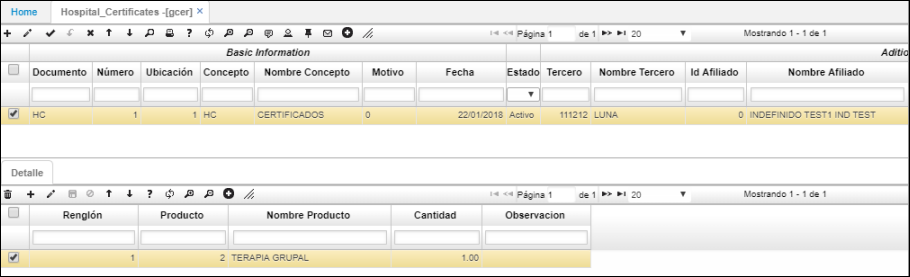
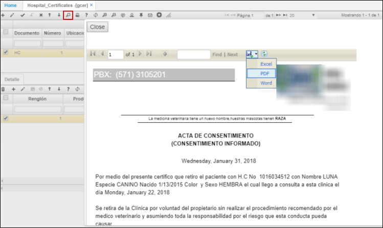
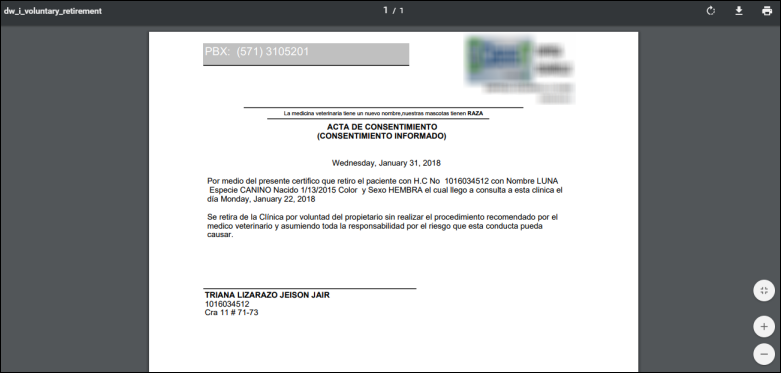

# GCER - Certificados de Hospital

La aplicación **GCER** permite imprimir formatos según el concepto (Autorización de Anestesia, Orden de Hospitalización, Orden de cirugía, Autorización de Eutanasia, Retiro Voluntario, Remisión).  

Los diferentes tipos de formatos se deben parametrizar previamente en la aplicación [**SPRO - Programas**](http://docs.oasiscom.com/Operacion/cloud/sbasic/spro#parametrización-de-formatos-de-impresión) y asignar al documento correspondiente en la aplicación [**BDOC - Documentos**](http://docs.oasiscom.com/Operacion/common/bsistema/bdoc#parametrización-de-formatos-de-impresión) (_Ver aplicaciones_).  

Para imprimir un certificado, agregamos un nuevo registro en el maestro y diligenciamos los campos.  

Guardamos el registro y si el certificado a emitir requiere asociar algún producto, lo ingresamos en el detalle de la aplicación.  

Para ver y descargar el certificado damos click en el botón  ubicado en la barra de herramientas. Allí la aplicación nos dará la opción de descargar el certificado en formato de Excel, PDF o Word.  

El certificado visto en formato PDF.  

