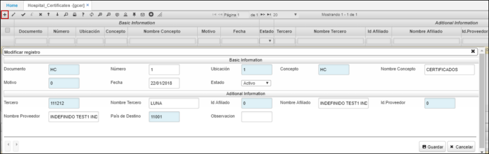

# GCER - Certificados de Hospital

La aplicación **GCER** permite imprimir formatos según el concepto (Autorización de Anestesia, Orden de Hospitalización, Orden de cirugía, Autorización de Eutanasia, Retiro Voluntario, Remisión).  

Los diferentes tipos de formatos se deben parametrizar previamente en la aplicación [**SPRO - Programas**](http://docs.oasiscom.com/Operacion/cloud/sbasic/spro#parametrización-de-formatos-de-impresión) y asignar al documento correspondiente en la aplicación [**BDOC - Documentos**](http://docs.oasiscom.com/Operacion/common/bsistema/bdoc#parametrización-de-formatos-de-impresión) (_Ver aplicaciones_).  

Para imprimir un certificado, agregamos un nuevo registro en el maestro y diligenciamos los campos.  

