---

layout: default
title: Consultas
permalink: /Operacion/is/hospital/gconsulta/gcon
editable: si

---

# GCON - Consultas

La aplicación **GCON** permite visualizar y crear consultas médicas, donde se registran los datos generales de la consulta como son: nombre del paciente, diagnóstico, fecha de la consulta, entre otros.   Proceso creado con la finalidad de poder registrar y tener seguimiento de la hora en la que es aplicado un medicamento a un paciente.  

* [Consulta](#consulta)
* [Generación de producto facturado](#generación-de-producto-facturado)
* [Firmas Consulta](#firmas-consulta)
* [Revisión o Modificación](#revisión-o-modificación)

## [Consulta](http://docs.oasiscom.com/Operacion/is/hospital/gconsulta/gcon#consulta)

 La parametrización de los formularios se realiza en la aplicación [**BMOT - Motivos**](https://docs.oasiscom.com/Operacion/common/bsistema/bmot).

Botones a visualizar en la barra del Maestro:

| **Botones** | **Descripción** |
| --- | ----------- |
|  | Agregar nueva fila. |
| | Modificar fila seleccionada. | 
| 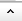| Actualiza_Evolución_Paciente, este botón es para actualizar información de la consulta que ya se encuentra realizada. Pueden ejecutar este botón y se puede alterar la información de un campo que se encuentre por defecto de acuerdo a la parametrización ya establecida. |
|  | Actualizar_Fecha - Modificar fecha del reporte solo (altera la fecha de la aplicación **GCON - Consultas**).|
| | Evolución_Paciente - Verificación de información que se habia diligenciado anteriormente. |
|   | Dibujar la firma -  Se realiza la firma del paciente. |
|  | Ultima_Consulta -  Aparece todas las consultas con el paciente, pero solo los registros de los documentos, no de la información. |
| | Procesar -  Se ejecuta para procesar el registro diligenciado. |
| | Reversar - Se ejecuta para reversar el registro.|  
|  | Anular - Se ejecuta para anular el registro.|  
|  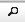 | Presentación Preliminar - Al momento de ejecutar este botón, se muestra de manera grafica el reporte que resume la consulta y da la opción si quieren imprimir en formato Excel, PDF y WORD.|  
| 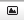 | Multipreview - Se pueden visualizar todos los documentos que requiera revisar y aparecen como en vista preliminar.|  
| | Impresión - Da la opción de imprimir el formato. |  
| | Botón de ayuda - donde al ejecutar este botón automaticamente el sistema se dirige a la pagina de DOCS, donde se encuentra documentado todos los procesos de OasisCom. |  
| 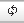| Refrescar Datos.| 
| 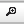 | Filtro Avanzado - Poder consultar los registros que se requiera.  | 
| 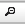| Limpiar Filtros - Limpiar cualquier filtro que haya hecho y dejara en blanco para que pueda hacer nuevamente la consulta.  | 
| 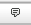 | Comentarios - Si requiere dejar algun comentario en un registro.| 
|  | Adjuntos - Si desea adjuntar archivos a tener en conocimiento del paciente o del proceso.| 
| | EMAIL - Si requiere enviar un correo al paciente.|
| | Duplicar registro.|

Se visualiza la aplicación **GCON - Consultas** en donde se registran los datos. 

Finalmente, cuando se diligencia todo el registro, se realiza el procesar el registro dando clic en el botón **procesar** que se encuentra en la barra del Maestro.

## [Generación de producto facturado](http://docs.oasiscom.com/Operacion/is/hospital/gconsulta/gcon#generación-de-producto-facturado)

Creada anteriormente la consulta mediante la aplicación [**GCAL - Calendario**](http://docs.oasiscom.com/Operacion/is/hospital/gcita/gcal#generación-de-producto-facturado), el sistema automáticamente abrirá la aplicación **GCON - Consultas** con el registro de la consulta correspondiente.  La factura generada en la aplicación [**GFAC - Facturas**](http://docs.oasiscom.com/Operacion/is/hospital/gfacturacion/gfac) por concepto de pago de cita **(cuota moredadora)** se debe encontrar en estado **procesado.**

>Nota: Revisar cada una de las aplicaciones mencionadas, para seguir el proceso y así continuar el paso a paso respectivo.

Al abrir la aplicación, en la pestaña **_Detalle_** el sistema habrá creado un renglón con la descripción del pago de la cita e indicando en el campo **_Fecha Inicial_  y _Fecha Final_** la fecha siguiente en la que se deberá realizar la consulta. Se debe tener en cuenta que si se desmarca el check de **_Factura_**, el producto no se insertará en la opción [**JFAC - Facturas**](https://docs.oasiscom.com/Operacion/scm/pos/jcajero/jfac) y por lo tanto no se facturará.  

 ## [Firmas Consulta](#firmas-consulta)

Se agrega una nueva funcionalidad para poder crear firmas como archivos adjuntos.
Para poder validar el correcto funcionamiento se deben seguir las siguientes configuraciones.

Este es un paso a paso del proceso de creación y verificación de firmas como adjuntos:
Se ingresa a la aplicativo [**SCAM - Campos**](http://docs.oasiscom.com/Operacion/system/sconfig/scam) donde se han agregado  validaciones en el  para las aplicaciones del **GCON - Consultas**. 

 

Una vez validado la configuración, se dirigen nuevamente a la aplicación **GCON - Consultas**.
Al abrir el icono de la firma, se visualiza la ventana emergente para ingresar la firma del paciente. Se realiza con el cursos del Mouse.

Al guardar sale un mensaje de control que se guardo con exito.

Se puede validar el guardado de la firma, en adjuntos, que se encuentra como un archivo donde queda como evidencia del proceso.

Botones de la Firma: 

| **Botones** | **Descripción** |
| --- | ----------- |
| 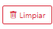 | El botón cumple su funcionalidad para eliminar la firma que se encuentra en el recuadro y poder volver a repetirla |
| 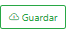 | Al momento de elaborar la firma, con este botón se guarda la firma ya diligenciada. |
| 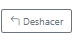| Su función es para eliminar cada trazo que consecutivamente se hizo para la firma| 

## [Revisión o Modificación](#revisión-o-modificación)

Para realizar la modificación de una consulta cerrada en días o meses anteriores, se ingresa a la aplicación **GCON - Consultas**, en esta aplicación realiza el filtro por el número de documento del paciente o por el profesional.

Se selecciona la consulta y ejecutan con el botón **Reversar** para que la consulta se vuelva a mostrar en la aplicación [FGCON - Formulario de Salud](https://docs.oasiscom.com/Operacion/is/hospital/gconsulta/fgcon). 

Al momento de ingresar a la aplicación [FGCON - Formulario de Salud](https://docs.oasiscom.com/Operacion/is/hospital/gconsulta/fgcon) se ejecuta el clic en el botón **Buscar Consultas**

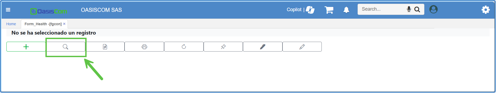

 Para realizar la búsqueda respectiva de la consulta al dar clic el sistema mostrara una ventana emergente donde se debe quitar los filtros de la fecha y se debe filtrar por el número de documento del paciente.  

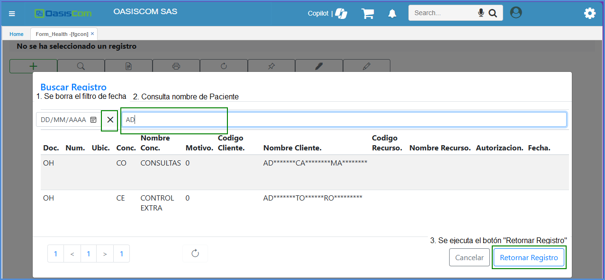

Se selecciona la consulta a editar y por último **clic** en retornar registro, allí se podra realizar la modificación de la información. Por último dar clic en **SUBMIT**  para que la consulta se vuelva almacenar y a cerrar. 

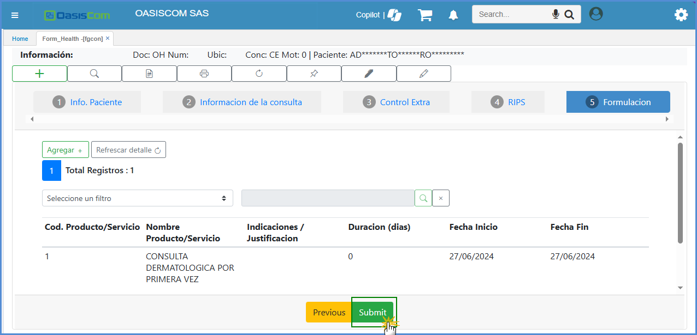

 