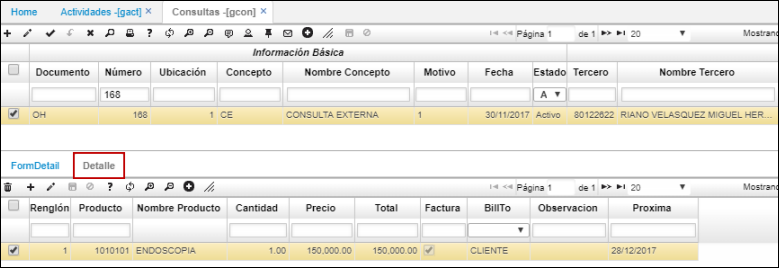

# GCON - Consultas

## [Generación de producto facturado](http://docs.oasiscom.com/Operacion/is/hospital/gconsulta/gcon#generación-de-producto-facturado)

Creada anteriormente la consulta mediante la aplicación [**GCAL - Calendario**](http://docs.oasiscom.com/Operacion/is/hospital/gcita/gcal#generación-de-producto-facturado), el sistema automáticamente abrirá la aplicación **GCON** con el registro de la consulta correspondiente.  La factura generada en la aplicación [**GFAC - Facturas**](http://docs.oasiscom.com/Operacion/is/hospital/gfacturacion/gfac) por concepto de pago de cita (cita moredadora) se debe encontrar en estado procesado. (_Ver aplicaciones_).  

Al abrir la aplicación, en la pestaña _Detalle_ el sistema habrá creado un renglón con la descripción del pago de la cita.  

