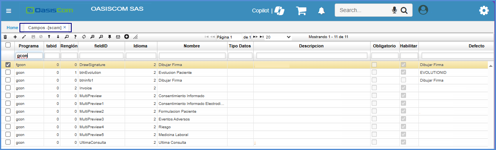
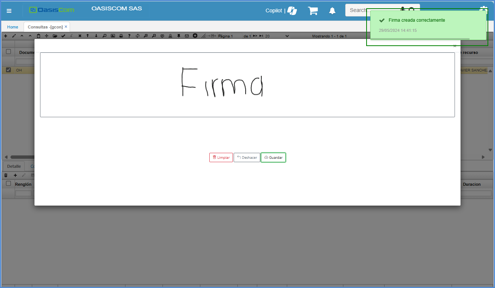
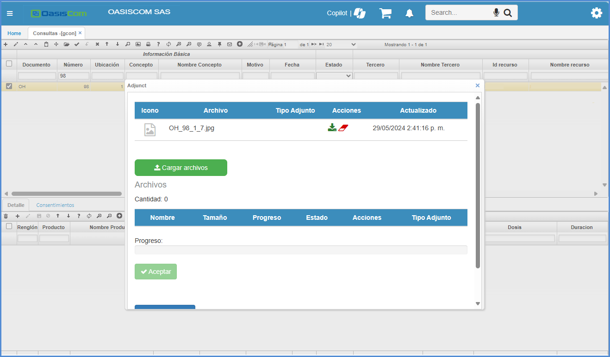

---

layout: default
title: Consultas
permalink: /Operacion/is/hospital/gconsulta/gcon
editable: si

---

# Consultas - GCON

La aplicación GCON permite visualizar y crear consultas médicas, allí se registran los datos generales de la consulta como lo son: nombre del paciente, diagnóstico, fecha de la consulta, entre otros.   Proceso creado con la finalidad de poder registrar y tener seguimiento de la hora en la que es aplicado un medicamento a un paciente.  

* [Consulta](http://docs.oasiscom.com/Operacion/is/hospital/gconsulta/gcon#consulta)
* [Generación de producto facturado](http://docs.oasiscom.com/Operacion/is/hospital/gconsulta/gcon#generación-de-producto-facturado)
* [Firma](http://docs.oasiscom.com/Operacion/is/hospital/gconsulta/gcon#Firma)
    *  [GCON](http://docs.oasiscom.com/Operacion/is/hospital/gconsulta/gcon#GCON)
    * [FGCON](http://docs.oasiscom.com/Operacion/is/hospital/gconsulta/gcon#FGCON)
* [Visualizacion de las firmas en formatos](http://docs.oasiscom.com/Operacion/is/hospital/gconsulta/gcon#Visualizacion-de-las-firmas-en-formatos)

## [Consulta](http://docs.oasiscom.com/Operacion/is/hospital/gconsulta/gcon#consulta)

En la pestaña _Form Detail_, se verá un formulario el cual es parametrizable por el tipo de consulta que se requiera ver, la parametrización de los formularios se realiza en la aplicación [**BMOT - Motivos**](http://docs.oasiscom.com/Operacion/common/bsistema/bmot#creaci%C3%B3n-formularios).(_Ver aplicación_)

En la pestaña _Detalle_ se asociarán los medicamentos y servicios que se requieren para el paciente.  

Finalmente, procesamos el registro dando clic en el botón .  

## [Generación de producto facturado](http://docs.oasiscom.com/Operacion/is/hospital/gconsulta/gcon#generación-de-producto-facturado)

Creada anteriormente la consulta mediante la aplicación [**GCAL - Calendario**](http://docs.oasiscom.com/Operacion/is/hospital/gcita/gcal#generación-de-producto-facturado), el sistema automáticamente abrirá la aplicación **GCON** con el registro de la consulta correspondiente.  La factura generada en la aplicación [**GFAC - Facturas**](http://docs.oasiscom.com/Operacion/is/hospital/gfacturacion/gfac) por concepto de pago de cita (cuota moredadora) se debe encontrar en estado procesado. (_Ver aplicaciones_).  

Al abrir la aplicación, en la pestaña _Detalle_ el sistema habrá creado un renglón con la descripción del pago de la cita e indicando en el campo _Próxima_ la fecha siguiente en la que se deberá realizar la consulta. Se debe tener en cuenta que si se desmarca el check de _Factura_, el producto no se insertará en la opción JFAC - Facturas y por lo tanto no se facturará.  

* Al ejecutar la vista preliminar, imprime la orden medica.

## [Firma](http://docs.oasiscom.com/Operacion/is/hospital/gconsulta/gcon#Firma)

[**GCON**](http://docs.oasiscom.com/Operacion/is/hospital/gconsulta/gcon#GCON)

Se ha agregado una nueva funcionalidad para poder crear firmas como archivos adjuntos.
Para poder validar el correcto funcionamiento se deben seguir las siguientes configuraciones.

Este es un paso a paso del proceso de creación y verificación de firmas como adjuntos:

Se ingresa a la aplicativo [**SCAM - Campos**](http://docs.oasiscom.com/Operacion/system/sconfig/scam) donde se han agregado  validaciones en el  para las aplicaciones del [**GCON**](http://docs.oasiscom.com/Operacion/is/hospital/gconsulta/gcon) y [**FGCON**](http://docs.oasiscom.com/Operacion/is/hospital/gconsulta/gcon#FGCON)

•	En la aplicación del GCON, vamos a usar el registro 587, y el botón como se visualiza en la imagen.

•	Cuando demos clic en el botón se nos mostrara una ventana en donde tendremos un recuadro para poder escribir lo que deseamos.

•	En la ventana tendremos los siguientes botones.

•	Para el ejemplo escribimos lo siguiente con ayuda del puntero del mouse.

•	Posterior vamos a guardar la imagen.

•	Vamos a darle clic en el botón de adjuntos, en donde se nos mostrara la imagen adjunta.

•	Cuando damos clic para verla, **se ve oscura**, esto es debido a que al momento de guardarla no tiene fondo la imagen, es transparente por lo cual toma el color del fondo de la ventana. 

**Pero si se descarga, podemos ver el texto realizado**

•	Una vez descargada la abrimos en algún visualizador, lo que nos mostrar la imagen de manera correcta.

•	Vamos a darle clic en el botón que se muestra en la imagen.

## [Firma](http://docs.oasiscom.com/Operacion/is/hospital/gconsulta/gcon#Firma)

[**FGCON**](http://docs.oasiscom.com/Operacion/is/hospital/gconsulta/gcon#FGCON)

•	Ahora realizaremos el mismo proceso para el [**FGCON**](http://docs.oasiscom.com/Operacion/is/hospital/gconsulta/gcon#FGCON). Usando el registro 587

•	Vamos a darle clic en el botón que se muestra en la imagen.

•	Se nos mostrara la ventana para poder realizar la escritura deseada. 

•	Escribimos el texto deseado

•	Guardamos la firma de manera correcta.

•	Vamos a ver los adjuntos desde el [**FGCON**](http://docs.oasiscom.com/Operacion/is/hospital/gconsulta/gcon#FGCON), en donde podemos validar las imágenes guardadas.

•	Y como vemos, podemos verificar que, aunque el fondo este oscuro se alcanza a notar la firma

## [Visualizacion de las firmas en formatos](http://docs.oasiscom.com/Operacion/is/hospital/gconsulta/gcon#Visualizacion-de-las-firmas-en-formatos)

Esta firma puede ser visualizada  a nivel de los formatos,  para ello se debe modificar el formato al cual se requiera visualizar la firma, es necesario hacer la solicitud por medio del  area de desarrollo o realizar la solicitud por medio del area de soporte.

## Función de TAPS

   Esta modificación se realiza con el fin de que, en el [**FGCON - Form_Health**](https://docs.oasiscom.com/Operacion/is/hospital/gconsulta/gcon#FGCON) si cambia de **TAP**, y la información es errónea, pueda volver a la pestaña anterior para corregirlo. 

   Una vez que estén en el **FGCON - Form_Health** puede realizar el cambio del **TAP**, sin la necesidad de oprimir los botones **“Previous y Next”**. 

   Si requiere modificar alguna información del paciente, puede hacerlo sin oprimir los botones. Sin embargo, se debe tener en cuenta que al momento de cambiar el **TAP**, no se guarda la información en la base, únicamente queda guardada si le dan al botón **“NEXT”**.  

   Se debe tener presente que, una vez se haya corregido la información, se debe ejecutar el botón NEXT, para que toda la información se guarde. 

