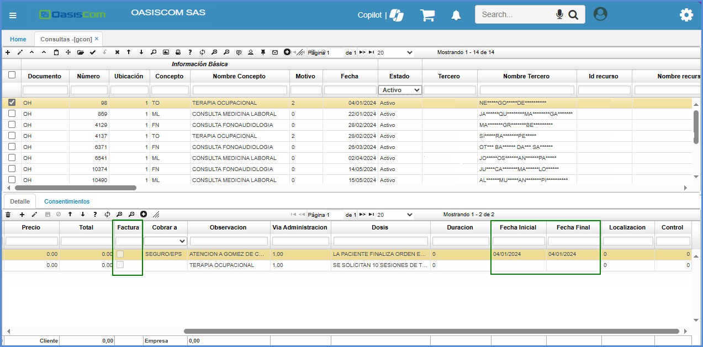
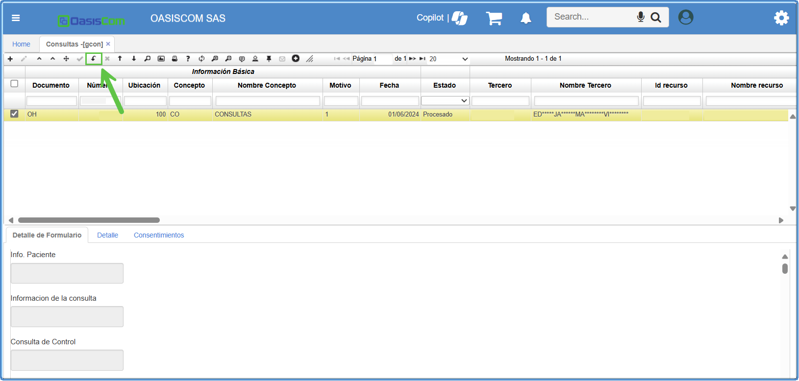

# GCON - Consultas

La aplicación GCON permite visualizar y crear consultas médicas, allí se registran los datos generales de la consulta como lo son: nombre del paciente, diagnóstico, fecha de la consulta, entre otros.   

En la pestaña _Form Detail_, se verá un formulario el cual es parametrizable por el tipo de consulta que se requiera ver, la parametrización de los formularios se realiza en la aplicación [**BMOT - Motivos**](http://docs.oasiscom.com/Operacion/common/bsistema/bmot#creaci%C3%B3n-formularios).(_Ver aplicación_)

En la pestaña _Detalle_ se asociarán los medicamentos y servicios que se requieren para el paciente.  

Finalmente, procesamos el registro dando click en el botón .  

## [Generación de producto facturado](http://docs.oasiscom.com/Operacion/is/hospital/gconsulta/gcon#generación-de-producto-facturado)

Creada anteriormente la consulta mediante la aplicación [**GCAL - Calendario**](http://docs.oasiscom.com/Operacion/is/hospital/gcita/gcal#generación-de-producto-facturado), el sistema automáticamente abrirá la aplicación **GCON** con el registro de la consulta correspondiente.  La factura generada en la aplicación [**GFAC - Facturas**](http://docs.oasiscom.com/Operacion/is/hospital/gfacturacion/gfac) por concepto de pago de cita (cuota moredadora) se debe encontrar en estado procesado. (_Ver aplicaciones_).  

Al abrir la aplicación, en la pestaña _Detalle_ el sistema habrá creado un renglón con la descripción del pago de la cita e indicando en el campo _Próxima_ la fecha siguiente en la que se deberá realizar la consulta. Se debe tener en cuenta que si se desmarca el check de _Factura_, el producto no se insertará en la opción JFAC - Facturas y por lo tanto no se facturará.  

* Al ejecutar la vista preliminar, imprime la orden medica.

