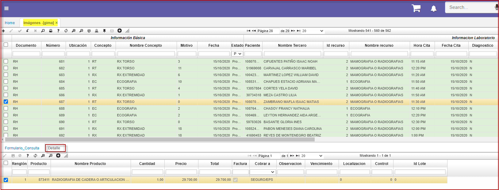
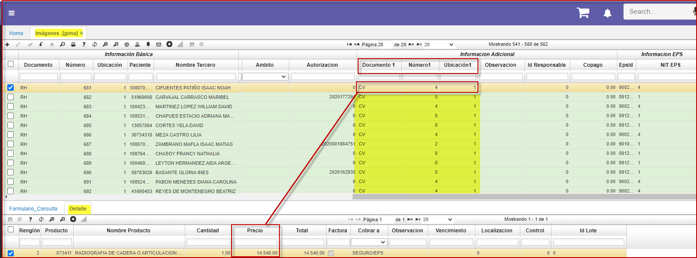
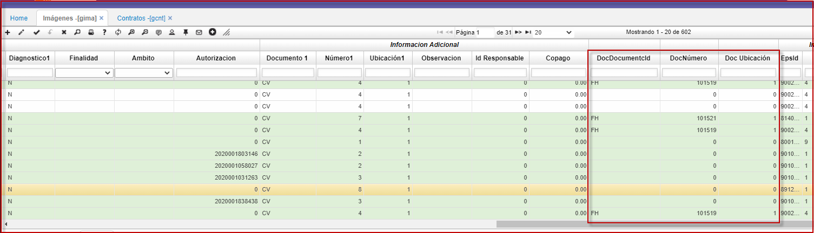

---

layout: default
title: Imagenes
permalink: /Operacion/is/hospital/gconsulta/gima  
editable: si  

---

# Imagenes - GIMA  

En esta aplicación es donde se registran los exámenes de imágenes diagnosticas, en los cuales se registran los CUPS y la lectura de dichos exámenes, en caso de que el examen sea por convenio con alguna EPS o una aseguradora, el sistema relaciona el contrato y toma los datos de este.  

La aplicación **GIMA,** es donde se registra los resultados de los exámenes de imagen diagnosticas, en las cuales se relaciona los datos del paciente y los datos del contrato con las EPS o aseguradora.  

En el detalle del **GIMA** se establece el precio del producto que se relaciona dentro del contrato **GCNT** con una EPS o aseguradora.  
Este contrato se debe de relacionar en los campos: documento1, numero1, ubicación1 en el maestro del **GIMA**:  

* Es de acotar que el producto que relacionamos en el detalle del **GIMA** debe de estar en el contrato **GCNT**.  

  

En estos tres campos se relacionan las facturas hospital:   
**Documento, Numero, Ubicacion.**  

  

* Definición:  
**CUPS:** codigo único  de punto de suministro.  
**CUMS:** codigo único de medicamento para suministro.  