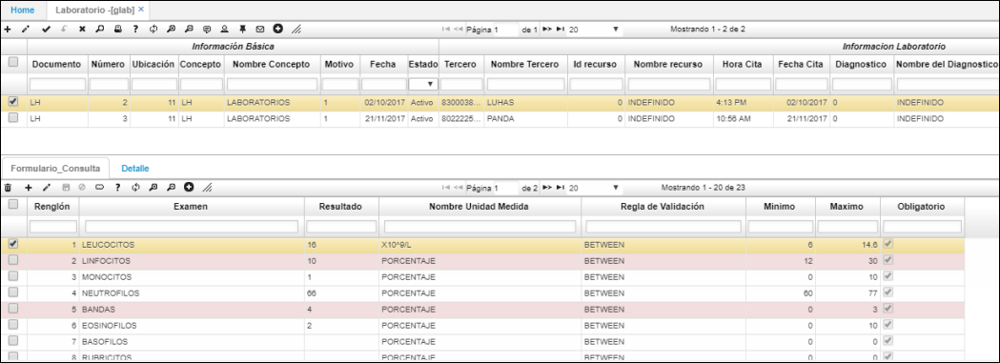

# GLAB - Laboratorio

En esta aplicación se pueden registrar todos los laboratorios médicos que se realicen a un paciente. Se debe adicionar un registro de la siguiente manera:

**Documento:** Documento LH correspondiente a laboratorios  
**Número:** Número del laboratorio (consecutivo del sistema)  
**Ubicación:** Ubicación en la cual se realiza el laboratorio  
**Concepto:** Concepto LH correspondiente a laboratorios  
**Fecha:** Fecha de cuando se realiza el laboratorio  
**Tercero:** Número de cédula del paciente  
**Nombre del tercero:** Se diligencia automáticamente al dar tab en el campo anterior de Tercero    
**Hora de cita:** Hora de la cita de laboratorio  
**Fecha de cita:** Fecha de la cita de laboratorio  
**Diagnóstico:** Se debe determinar un diagnóstico previo a la cita  
**Ambito:** Se puede elegir entre ambulatorio, hospitalario o ugrnecias  

En los campos Documento1, Número 1 y Ubicación 1 se puede asociar la consulta bajo la cual se autorizaron los laboratorios.

En la parte del detalle se debe registrar el resultado obtenido en cada uno de los exámenes realizados, por ejemplo, leucocitos, linfocitos, glucosa, entre otras. Esta parametrización de que exámenes se deben realizar en el laboratorio se parametrizan en la aplicación BMOT - Motivos.

