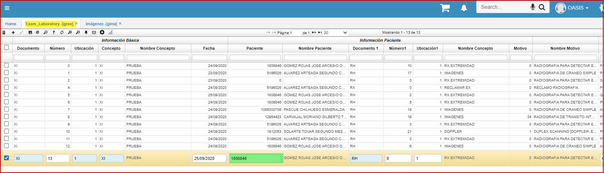

---

layout: default

title: Examen Laboratorio

permalink: /Operacion/is/hospital/gconsulta/grex

editable: si

---

# Examen Laboratorio - GREX

La opción **GREX (examen laboratorio)**, inserta los datos a la tabla con información laboratorio y los datos de la persona que recoge los exámenes, en DocumentId1 este trae los documentos correspondientes a los documentos de hospital solo si en Document.Module = G.  
Como objetivo de la opcion: registrar la fecha y el dato de la persona que reclama los exámenes.  

  

