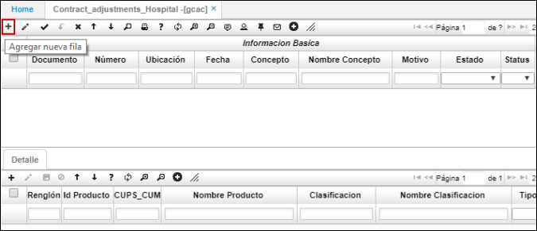

# GCAC - Ajustes a Contratos

La aplicación **GCAC** permite modificar un contrato ya existente. Puede ser que arroje un registro generado automáticamente por la opción [**GCRC - Renueva Contrato**](http://docs.oasiscom.com/Operacion/is/hospital/gcontrato/gcrc) o que se adicione un ajuste manualmente por el usuario.  

Diligenciados los datos debemos procesar el documento de ajuste al contrato.  

