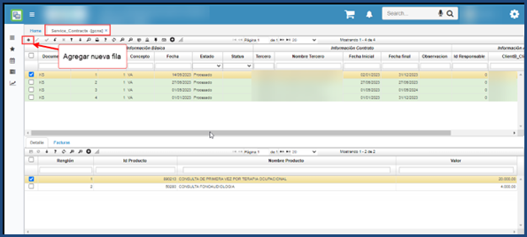
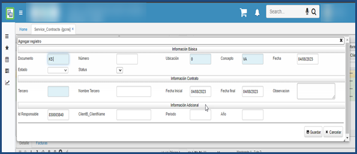
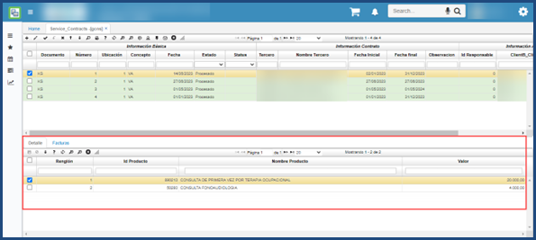

# Contrato de Servicio  - GCNS

Este proceso permite tener de una manera más clara los procedimientos que realizo cada doctor con su respectivo valor a pagar periódicamente.
Para esto se debe ingresar a la aplicación Service_Contracts – GCNS en l0061 cual se creará el contrato de cada doctor. 

Se debe ingresar la información del doctor en cada uno de los campos.

En el detalle se debe ingresar los productos o el proceso que realizo el doctor.

