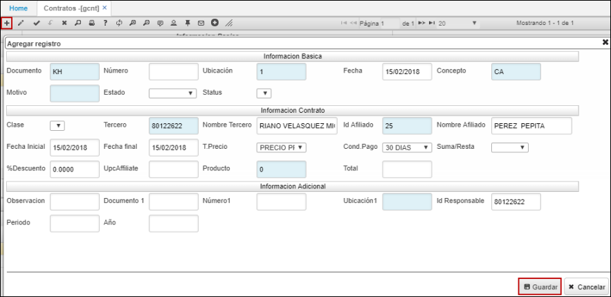
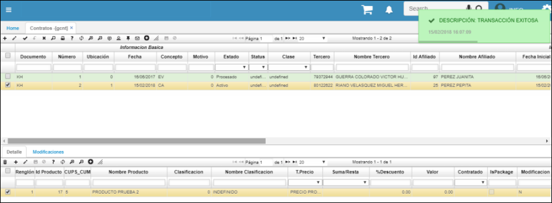

# GCNT - Contratos

La aplicación GCNT permite crear los contratos correspondientes al módulo de Hospital. En el maestro agregamos un nuevo registro y diligenciamos los campos. Al dar click en el botón _Guardar_, el sistema insertará automáticamente el detalle con el mismo producto que se digitó en el maestro al igual que el precio vigente.  

Allí ingresaremos el documento, la ubicación, el concepto, así como el tercero responsable del contrato y el afiliado o paciente. Las fechas de inicio y fin del contrato y el producto por el cual se realiza el contrato.  

Al dar click en guardar, se insertará el detalle automáticamente.  

Verificada la información, se procesa el contrato dando click en el botón Procesar  del maestro.  