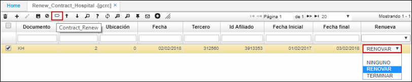

# GRCR - Renueva Contrato

La aplicación **GRCR** permite automatizar el proceso de renovación de contratos según lo requiera el cliente. Al ingresar a la aplicación y consultar todos los registros, el sistema nos arrojará los contratos que tengan fecha próxima a vencerse para que tomemos la decisión de renovarlo o terminarlo teniendo en cuenta un acuerdo previo con el cliente.  

Podemos renovar el contrato seleccionando la opción desde el campo _Renueva_ o dando click en el botón de la barra de herramientas _Contract_Renew_.  

Al renovar el contrato, el sistema automáticamente actualizará las fechas del mismo en la aplicación **GCNT - Contratos**, al igual que creará un registro en la aplicación **GCAC - Ajustes a Contratos** correspondiente a las adecuaciones que se le hayan hecho al contrato.  
