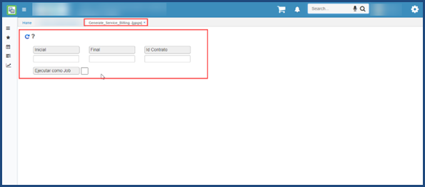

# Generar Servicios de Facturación - GPGS

Esta aplicación sirve para generar los servicios que realizo un especialista de acuerdo al rango de las fechas.

**Inicial:** Indicar la fecha incial del mes en el cual realizo el proceso.
**Final:** Indicar la fecha final del mes en el cual realizo el proceso.  
**Id Contrato:** Indicar número del contrato del especialista.

