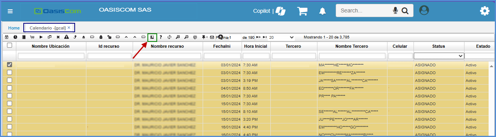
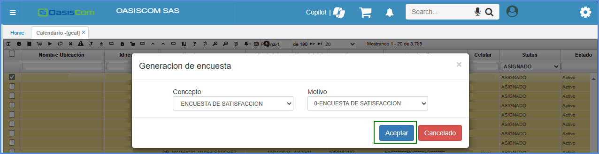
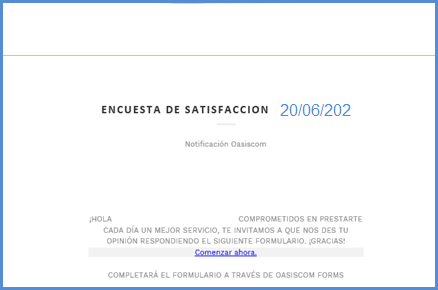
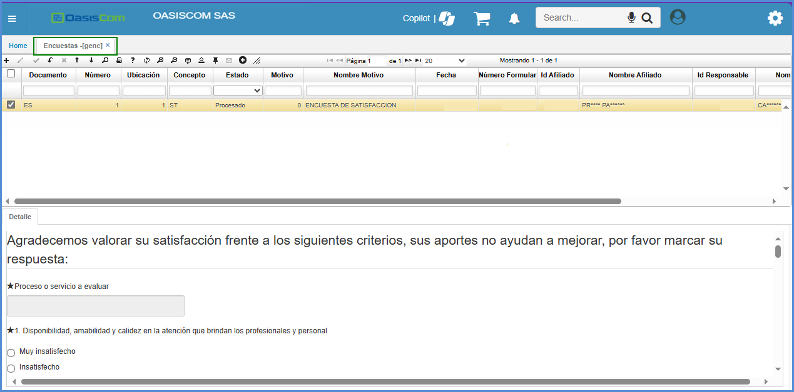
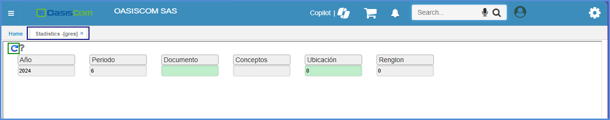
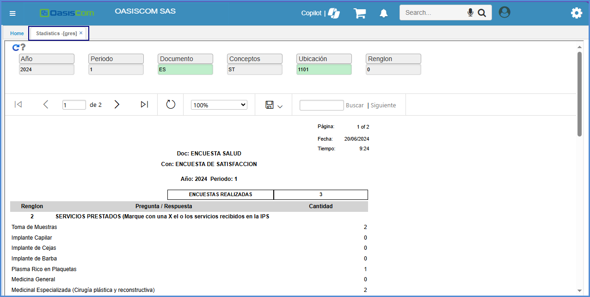
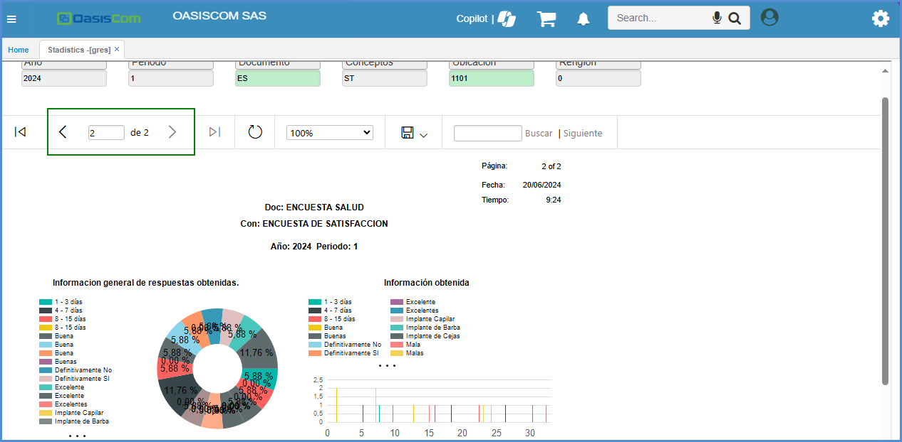
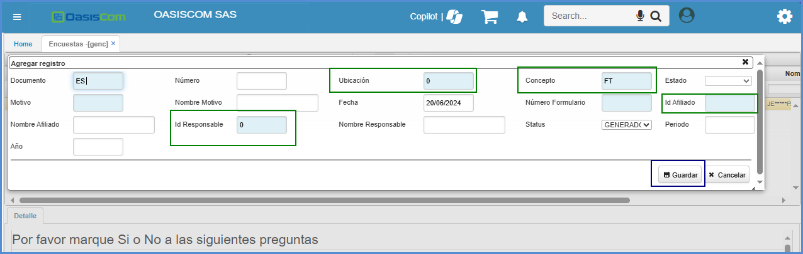
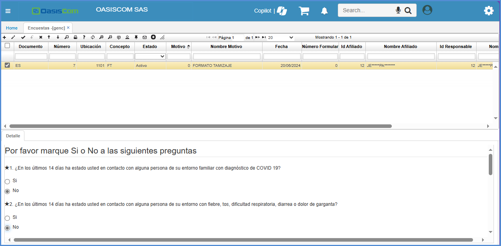

# Encuestas

**GENC - Encuestas** 

La aplicación **GENC - Encuestas** funciona como medio para saber la satisfacción de los pacientes con el servicio que se esta prestando. 

* [**Generar encuesta desde el GCAL**](#generar-encuesta-desde-el-gcal)
* [**Generar encuesta manual**](#generar-encuesta-manual)

## [**Generar encuesta desde el GCAL**](#generar-encuesta-desde-el-gcal)

Desde la aplicación [**GCAL - Calendario**](https://docs.oasiscom.com/Operacion/is/hospital/gcita/gcal) una vez seleccionando el movimiento de la cita del paciente al que se desea enviar la encuesta. 

>**Nota:** Se ejecuta en el estado que se encuentre la cita, menos cuando el status este **Libre**.

Luego de dar clic en el botón de **Generar encuesta**, saldra una ventana emergente.

- En el campo **CONCEPTO**, se encuentra parametrizado **ENCUESTA DE SATISFACCIÓN** y se selecciona ese concepto. 

- En el campo **MOTIVO** se encuentra parametrizado **0-ENCUESTA DE SATISFACCIÓN**

Luego de haber seleccionado, se ejecuta el botón **Aceptar**.

El registro se creará automáticamente en la aplicación **GENC - Encuestas** con el status **“Generado”** y automáticamente se enviará al paciente al correo electrónico que se tiene registrado en el sistema, el enlace que debe diligenciar: 

Desde la aplicación **GENC - Encuestas** se realiza el seguimiento de la encuesta, cuando esta es diligenciada, el **Status** cambia de **Generado*** a **Recibido** y se valida la información diligenciada por el paciente en el detalle.

Para validar la información consolidada de las encuestas recibidas, se puede hacer desde la aplicación **GRES - Estadística**.
 Se diligencia:

 - Año.
 - Periodo.
 - Documento.
 - Conceptos.
 - Ubicación.
 - Renglon.
 
 

Luego de diligenciar los datos, se ejecuta el botón  para que el formulario haga el proceso.

 En caso de que se quiera validar la información por pregunta se indica el número del renglón que corresponda por pregunta.

 

>**Nota:** Para el campo **Renglon** se diligencia el número del renglon que requieran ver de la encuesta. 

Dentro de la aplicación **GRES - Estadística** se puede visualizar la información gráficamente:

 
 
## [**Generar encuesta manual**](#generar-encuesta-manual)

Se ingresa a la aplicación **GENC - Encuestas**, se adiciona un nuevo registro por medio del botón **Agregar Nueva Fila**, en la ventana emergente se deben diligenciar los campos tipo zoom:
- Ubicación.
- Concepto.
- Id afiliado
- Id responsable 

>**Nota:** Se selecciona o digita el número de documento del usuario que realizara la encuesta. 

 

 Al guardar el sistema traerá la información de la encuesta en la parte inferior. Se diligencian los datos en su totalidad y se finaliza guardando la información.

