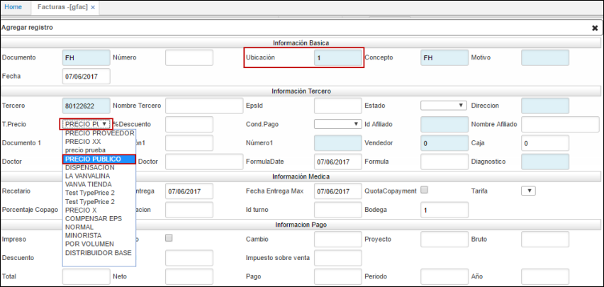
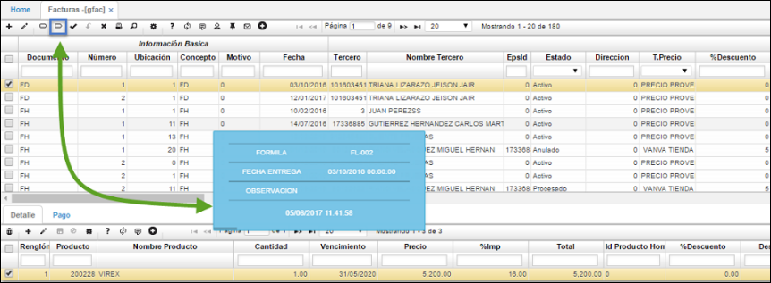

# Facturas - GFAC

### Verificación parametrización Tipo de Precio

Realizada la parametrización de tipo de precio en la aplicación [**BUBI - Ubicaciones Organización**](http://docs.oasiscom.com/Operacion/common/borgan/bubi), podemos validar en la aplicación **GFAC**, que al agregar un nuevo registro e ingresar en el campo _Ubicación_, la ubicación  en la cual se realizó la parametrización, este trae automáticamente en el campo _Tipo de Precio_ el definido en la aplicación [**BUBI - Ubicaciones Organización**](http://docs.oasiscom.com/Operacion/common/borgan/bubi).  

Al crear un registro, por defecto muestra la ubicación _0_ con el tipo de precio designado para esta como se muestra en la imagen.  

Si se cambia la ubicación por la parametrizada en la opción [**BUBI - Ubicaciones Organización**](http://docs.oasiscom.com/Operacion/common/borgan/bubi), es decir, la ubicación _1_, debe enseñar el tipo de precio parametrizado en esta opción.  

## [Consultas dinámicas](http://docs.oasiscom.com/Operacion/is/hospital/gfacturacion/gfac#consultas-dinámicas)

Realización de una consulta dinámica en la aplicación _GFAC - Facturas_.  

