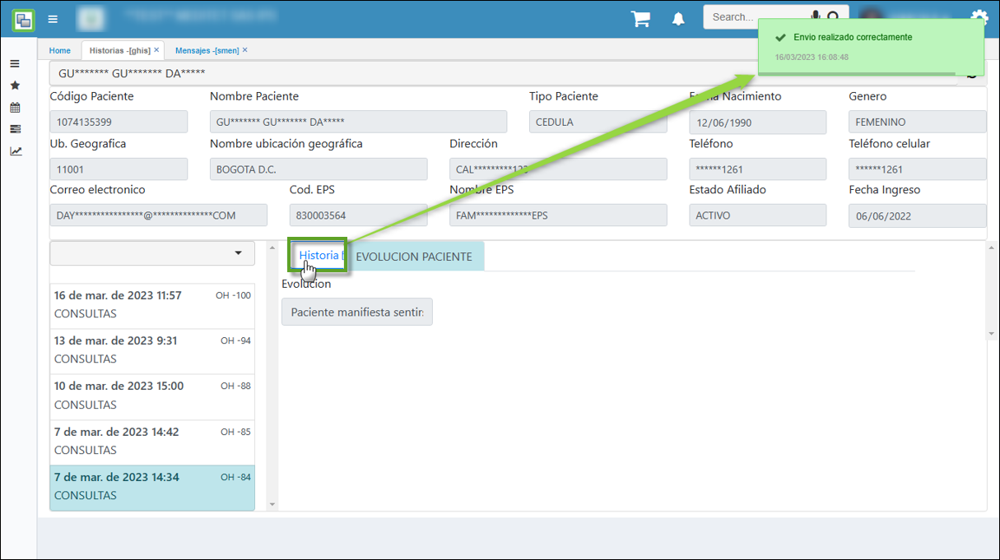

# HISTORIAS - GHIS

La opción **GHIS - Historias**, enseña información correspondiente a la historia clínica de los pacientes que han sido atendidos. Esta opción es únicamente para consulta, es decir, no se permite adición, edición y/o eliminación de la información que aquí se visualiza. Se puede ver entonces la siguiente información en cuanto al maestro:  

**Ubicación**: indica la sede en la cual el paciente fue atendido.  
**Fecha**: enseña la fecha de la consulta médica.  
**Hora**: indica la hora en la que el paciente ingresó a la consulta.  
**Tercero y Nombre Tercero**: hacen referencia al número de identificación del paciente y el nombre del mismo respectivamente.  
**Id Recurso**: enseña el número de identificación del especialista que atendió al paciente.  

Si se desliza la barra lateral se pueden encontrar con los demás campos descritos a continuación.  

**Diagnóstico**: hace referencia al dictamen dado por el médico al paciente que atendió. Este se mostrará como un código dentro de esta opción, si desea consultar el significado del mismo, puede realizarlo desde la aplicación **EBDI - Diagnóstico**.  
**Periodo**: enseña el mes en el cual se originó la historia.  
**Año**: enseña el año en el cual se originó la historia.  
***************

Si deseamos editar el maestro **GHIS** se visulizara tipo formulario como se ilustra:

En cuanto al detalle se pueden visualizar los siguientes campos:  

**Campo Nuevo**: hace referencia a una medición con respecto al campo **Observación**, nótese el primer registro en donde en el campo _Campo nuevo_ se encuentra el número 45 y en el campo _Observación_ la palabra _peso_. Esto indica que el peso del paciente atendido es de 45 Kg.

El último campo que corresponde a **Obligatorio**, es un check que indica si este registro deberá ser obligatorio al momento de recibir la consulta médica.  

De esta manera se realizan los procesos de administración de productos, doctores, recursos, generación de calendario, la asignación de citas y consultas médicas y la consulta de la historia clínica de los pacientes.  

**************

