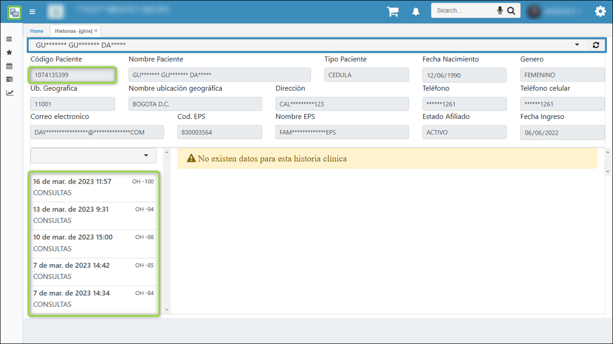

# Historias - GHIS

La opción **GHIS - Historias**, reseña información correspondiente a la historia clínica de los pacientes que han sido atendidos. Este aplicativo es únicamente de consulta.

Se consulta por el número de identificación o nombre del paciente, como se muestra en el recuadro azul de la imagen.

Una vez retornada la información basica del paciente, en la parte inferior se observan las consultas [**(GCON)**]( https://docs.oasiscom.com/Operacion/is/hospital/gconsulta/gcon#consulta) generadas al paciente con el respectivo Documento **OH**.

Al seleccionar una consulta, se muestran los datos relacionados en el recuadro azul.

En el botón **historia** al dar clic se envía la información y documentos adjuntos de la consulta seleccionada.

Al correo electronico llega la información de la siguiente manera.

Al celular una notificación tal como se muestra en la imagen.

