# Admisiones - GADM

La aplicación **GADM - Admisiones** permite registrar la información para admisiones para fondo de hospital y los servicios por los cuales puede pasar el paciente.  

En el maestro, al crear un nuevo registro, ingresaremos información como concepto de la admisión, el paciente asociado, la causa de la admisión, el servicio que requiere la admisión, entre otros datos.  

Damos clic en el botón _Guardar_ para que el registro sea creado en el maestro.  

En el detalle, se deberá especificar los servicios a los cuales tendrá disponibilidad el paciente.  

Se debe tener en cuenta que si se desmarca el check de Factura, el producto no se insertará en la opción **JFAC - Facturas** y por lo tanto no se factuará.  

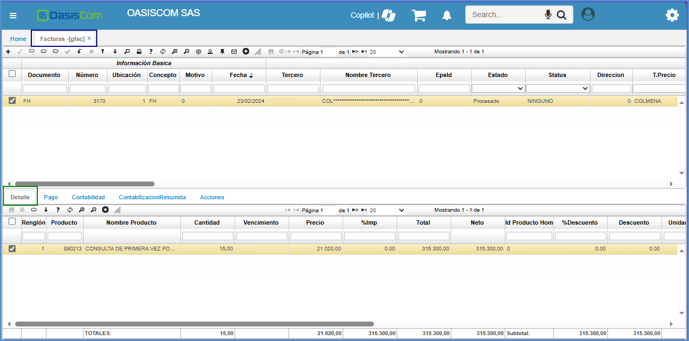

Ingresa la información procesamos el documento dando click en el botón _Procesar_ .  

# CREACIÓN DE SESIONES

En la aplicación **GADM - Admisiones** es donde se realiza el conteo de las sesiones de los paquetes que va a adquirir el paciente

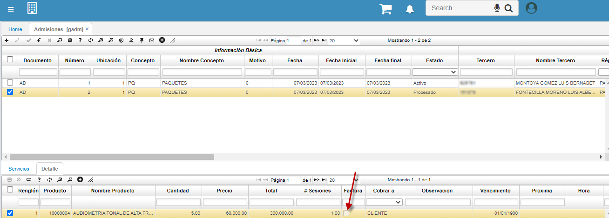

Para crear una sesión, se da click en la pestaña de **+** 

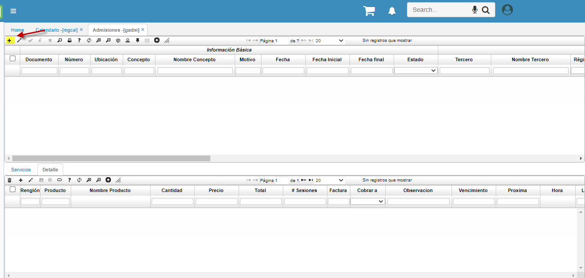

Este documento, se debe crear con concepto **AD - Admisiones**

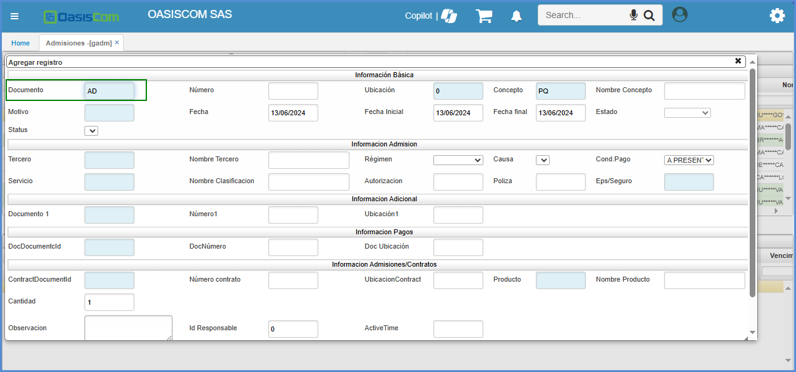

La ubicación depende de cuantas se vayan a crear, El concepto debe agregarse cómo **CP - Paquetes** el cual se parametrizo en la aplicación [BDOC – DOCUMENTOS](https://docs.oasiscom.com/Capacitacion/Empower/parametrizacionbdoc)

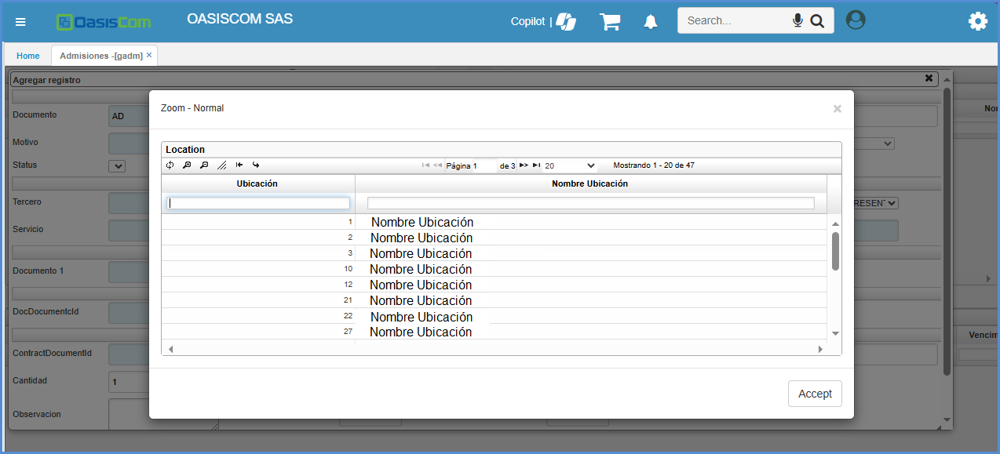

El número del tercero es importante, ya que con ese se va a descontar el número de sesiones del paciente

Luego, se asocia la cita que se creo en la aplicación **[MGCAL – Calendario de Usuario](https://docs.oasiscom.com/Operacion/is/hospital/gcita/mgcal)** con el tipo de documento, numero y ubicacion y se procede a guardar la sesión

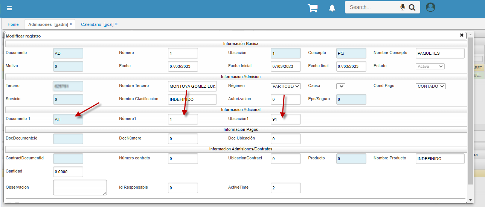

Después de creada la sesión, se asocian los productos que va a tener el paquete en el detalle, estos productos se encuentran parametrizados en la aplicación **[BMOT – MOTIVOS](https://docs.oasiscom.com/Capacitacion/Empower/parametrizacionbdoc)**

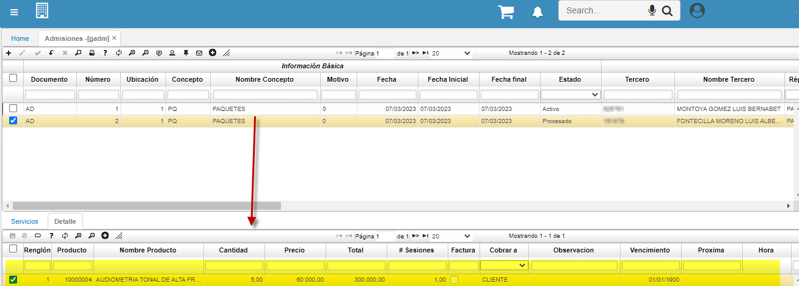

Una vez se procese la sesión, automáticamente va a realizar el número de sesiones que se van culminando en la parte del detalle

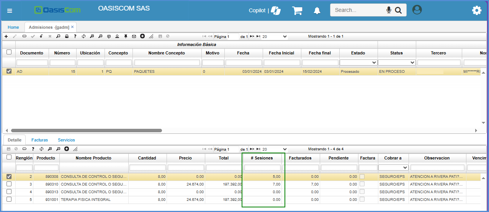

Si se requiere una factura para esta sesión, se activa el flag de factura, donde luego de procesar la sesión, se verá reflejada en la aplicación [GFAC – FACTURAS](https://docs.oasiscom.com/Operacion/is/hospital/gfacturacion/gfac)

Una vez ya se tenga todos los datos requeridos de la sesión, se procesa donde luego se deben realizar todos los procesos de creación de citas en la aplicación [GCAL – Calendario](https://docs.oasiscom.com/Operacion/is/hospital/gcita/gcal)

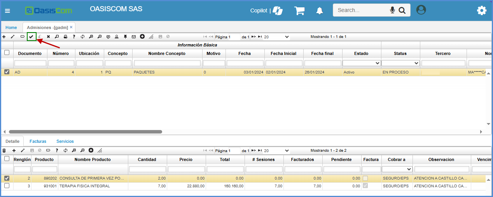

# MICROSOFT GRAPH  - INTEGRACION OASISCOM 

Es una API de Microsoft, la cual realiza todos los procesos de sincronización de :

TEAMS
CALENDARIO
MENSAJERIAS 
CORREOS

Que incluye la tienda de Microsoft, así que se realizo el proceso de integración de la API, directamente con Oasis, desde la aplicación [GCAL – Calendario](https://docs.oasiscom.com/Operacion/is/hospital/gcita/gcal)** ya que, a la hora de tener una cita para la fecha asignada, directamente se sincronice y se evidencia con una de las aplicaciones propias de Microsoft.

Ingresamos a la aplicación [GCAL – Calendario](https://docs.oasiscom.com/Operacion/is/hospital/gcita/gcal), donde se evidenciará a la hora de consultar un punto de venta, el botón Sincronizar Calendario. 

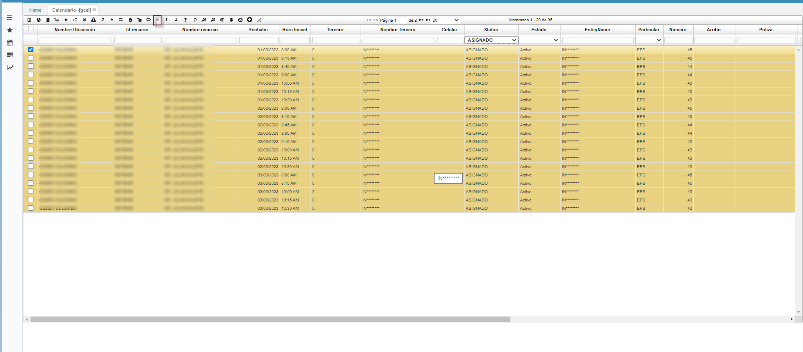

Una vez se da click en el botón, se sincronizará con la aplicación TEAMS, la cita que se tiene programada para la fecha indicada, y así llevar un mejor control.

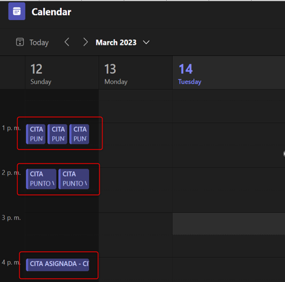