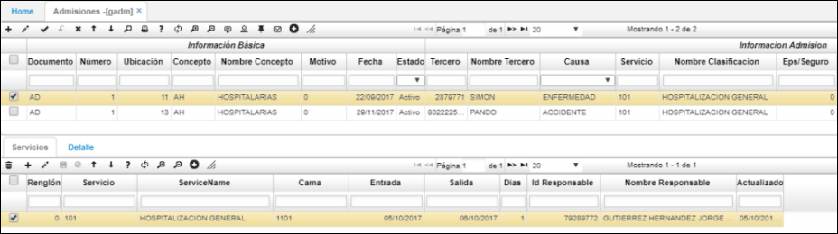
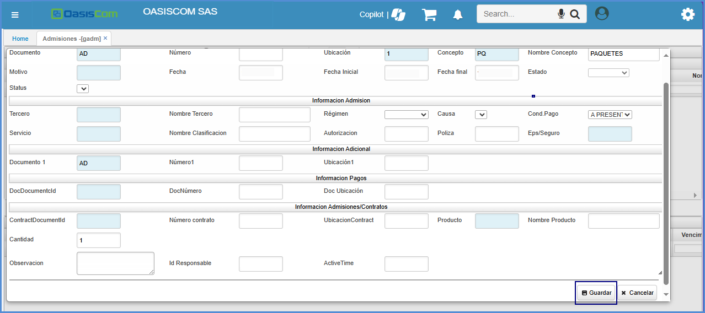
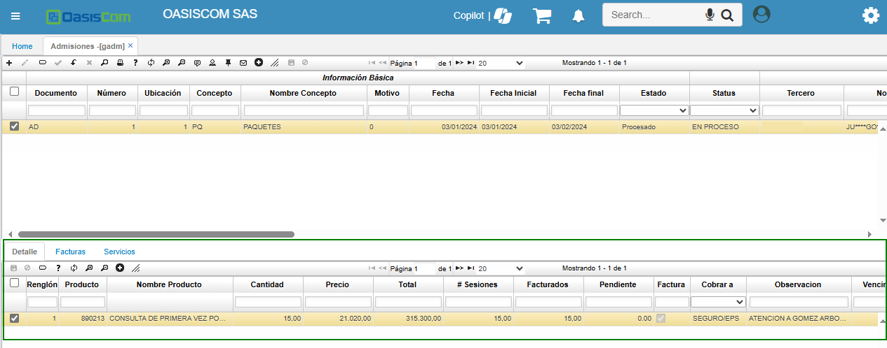

---
layout: default
title: Admisiones
permalink: /Operacion/is/hospital/ghospital/gadm
editable: si
---

# GADM - Admisiones

La aplicación **GADM - Admisiones** permite registrar la información para admisiones para fondo de hospital y los servicios por los cuales puede pasar el paciente.  



En el maestro, al crear un nuevo registro, ingresaremos información como concepto de la admisión, el paciente asociado, la causa de la admisión, el servicio que requiere la admisión, entre otros datos.  

Damos click en el botón _Guardar_ para que el registro sea creado en el maestro.  



En el detalle, se deberá especificar los servicios a los cuales tendrá disponibilidad el paciente.  



Ingresa la información procesamos el documento dando click en el botón _Procesar_ .  
