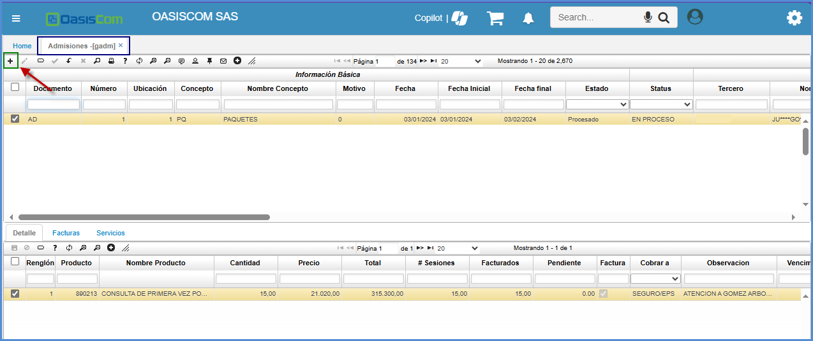
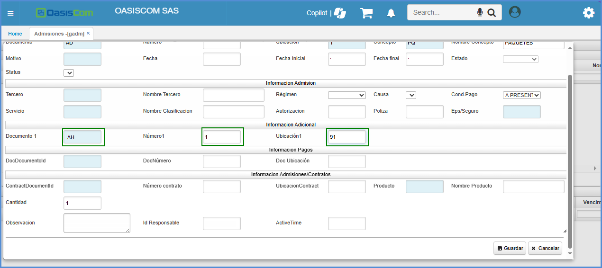
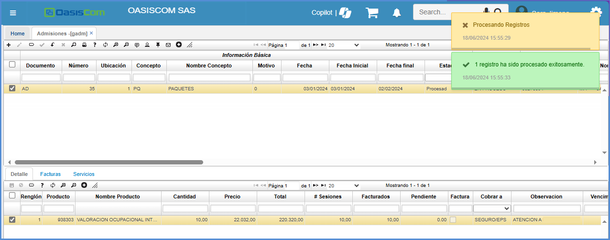
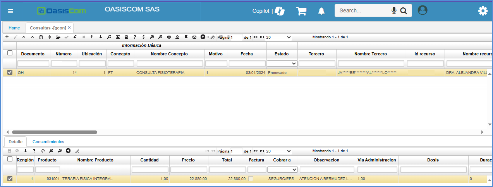
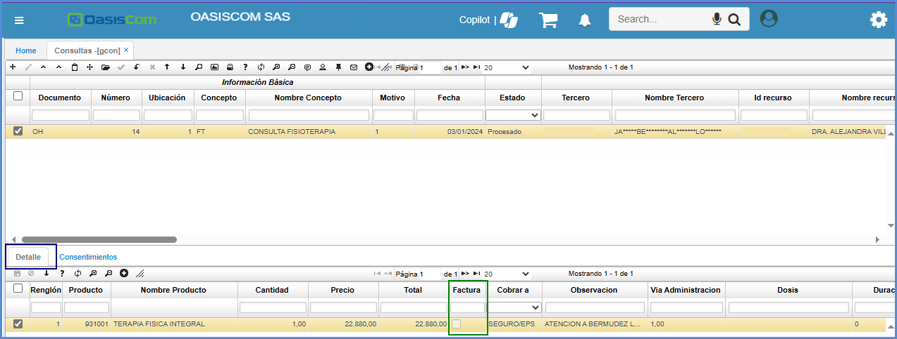

# Admisiones - GADM

Eta aplicación permite realizar Control y seguimiento de sesiones

* [Creación de Sesiones Manual](http://docs.oasiscom.com/Operacion/is/hospital/ghospital/gadm#creación-de-sesiones-manual)
* [Creación de Sesiones Automaticas GCAL](http://docs.oasiscom.com/Operacion/is/hospital/ghospital/gadm#creación-de-sesiones-automaticas-gcal)
* [Facturación Parcial](http://docs.oasiscom.com/Operacion/is/hospital/ghospital/gadm#facturación-parcial)
* [Producto Padre y Subproductos](http://docs.oasiscom.com/Operacion/is/hospital/ghospital/gadm#producto-padre-y-subproductos)

La aplicación **GADM - Admisiones** permite registrar la información para admisiones para fondo de hospital y los servicios por los cuales puede pasar el paciente.  

En el maestro, al crear un nuevo registro, ingresaremos información como concepto de la admisión, el paciente asociado, la causa de la admisión, el servicio que requiere la admisión, entre otros datos.  

Damos clic en el botón _Guardar_ para que el registro sea creado en el maestro.  

En el detalle, se deberá especificar los servicios a los cuales tendrá disponibilidad el paciente.  

Se debe tener en cuenta que si se desmarca el check de Factura, el producto no se insertará en la opción **JFAC - Facturas** y por lo tanto no se factuará.  

Ingresa la información procesamos el documento dando click en el botón _Procesar_ .  

# [Creación de Sesiones Manual](http://docs.oasiscom.com/Operacion/is/hospital/ghospital/gadm#creación-de-sesiones-manual)

En la aplicación **GADM - Admisiones** es donde se realiza el conteo de las sesiones de los paquetes que va a adquirir el paciente

Para crear una sesión, se da click en la pestaña de **+** 

Este documento, se debe crear con concepto **AD - Admisiones**

La ubicación depende de cuantas se vayan a crear, El concepto debe agregarse cómo **CP - Paquetes** el cual se parametrizo en la aplicación [BDOC – DOCUMENTOS](https://docs.oasiscom.com/Capacitacion/Empower/parametrizacionbdoc)

El número del tercero es importante, ya que con ese se va a descontar el número de sesiones del paciente

Luego, se asocia la cita que se creo en la aplicación **[MGCAL – Calendario de Usuario](https://docs.oasiscom.com/Operacion/is/hospital/gcita/mgcal)** con el tipo de documento, numero y ubicacion y se procede a guardar la sesión

Después de creada la sesión, se asocian los productos que va a tener el paquete en el detalle, estos productos se encuentran parametrizados en la aplicación **[BMOT – MOTIVOS](https://docs.oasiscom.com/Capacitacion/Empower/parametrizacionbdoc)**

Una vez se procese la sesión, automáticamente va a realizar el número de sesiones que se van culminando en la parte del detalle

Si se requiere una factura para esta sesión, se activa el flag de factura, donde luego de procesar la sesión, se verá reflejada en la aplicación [GFAC – FACTURAS](https://docs.oasiscom.com/Operacion/is/hospital/gfacturacion/gfac)

Una vez ya se tenga todos los datos requeridos de la sesión, se procesa donde luego se deben realizar todos los procesos de creación de citas en la aplicación [GCAL – Calendario](https://docs.oasiscom.com/Operacion/is/hospital/gcita/gcal)

# [Creación de Sesiones Automaticas GCAL](http://docs.oasiscom.com/Operacion/is/hospital/ghospital/gadm#creación-de-sesiones-automaticas-gcal)

Para crear una sesión por medio de consultas dinámicamente, se debe tener una cita en estado **ASIGNADO** y dar click al botón **CREAR ADMISIÓN**

Este botón crear automáticamente una admisión, en la que se puede asignar los productos y los servicios que se trabajan en las consultas relacionadas a la cita.

En esta admisión, se crean los productos y servicios que empleará en la consulta, Cuanto es un servicio en el campo cantidad, se diligencia la cantidad de sesiones en la que se trabaja la consulta.

Cuando se cree una consulta, el sistema relacionará la admisión a esta consulta.

y al momento de procesar esta consulta, el sistema modifica automaticamente el número de la sesión en la admisión, para identificar cuantas sesiones hacen falta.

# [Facturación Parcial](http://docs.oasiscom.com/Operacion/is/hospital/ghospital/gadm#facturación-parcial)

El botón **Factura parcial** de las admisiones es un cobro en donde no se paga toda la factura, si no la cantidad que se tiene en el campo de **# sesiones** en la parte del detalle.

> **Nota:** En la aplicación de **GADM - Admisiones** se realiza un control sobre el botón de **Facturación Parcial**. Cuyo objetivo es generar una factura por cada sesión realizada. El sistema indicara con un mensaje la totalidad de facturas completas sobre las sesiones. Para esto se hacen pruebas con escenarios de admisiones generando facturas parciales hasta completar las sesiones de admisión indicando el sistema que las sesiones se facturaron totalmente.

Al dar clic en botón Factura parcial el sistema genera una la factura parcial en la aplicación [GFAC – FACTURAS](https://docs.oasiscom.com/Operacion/is/hospital/gfacturacion/gfac) y en el detalle el sistema muestra cuantas sesiones se han facturado.

> **Nota:** Es importante que la admisión este en estado activo si aun se encuentra vigente, de lo contrario el sistema no lo tendrá en cuenta.

# [Producto Padre y Subproductos](http://docs.oasiscom.com/Operacion/is/hospital/ghospital/gadm#producto-padre-y-subproductos)

Se realiza un ajuste para que, al momento de facturar, traiga el producto padre de acuerdo con los componentes que construyen este producto. Esto se hace con el fin de traer únicamente el combo y que en él se encuentren todos los componentes que este combo contenga. 

Una vez realizada la asignación de la cita, en la aplicación [GCAL - Calendario](https://docs.oasiscom.com/Operacion/is/hospital/gcita/gcal) se debe elegir el producto padre y los componentes. 

Luego se hace la creación de la admisión en la aplicación [GADM - Admisiones](https://docs.oasiscom.com/Operacion/is/hospital/ghospital/gadm) 

En la aplicación **GADM - Admisiones** se puede visualizar que el sistema muestra cuales son los subproductos. 

En el maestro se visualiza el producto padre y en el detalle los subproductos. 

En el [GCON - Consultas](https://docs.oasiscom.com/Operacion/is/hospital/gconsulta/gcon) se visualiza el producto que se selecciona desde el **GCAL- Calendario**  y en esta aplicación se puede validar la factura.   

*OPCIÓN:* Si se requiere descontar de otro producto, se realiza en la misma consulta, la cantidad que se desee y nuevamente se procesa la consulta y el sistema genera la factura.

> **Nota:** En el detalle, en el campo **FACTURA**, debe de estar el check desactivado, solo cuando tiene una admisión. Ya que el sistema internamente cuando se crea la admisión, vincula que tiene una admisión prevista por el servicio elegido, por ende, no deja procesar si el check está activo, y cuando se escoge la admisión, pero no se indica que tiene el servicio, automáticamente se activa el check. 

Luego de realizar ese proceso, se hace la factura (se puede validar en la aplicación **GADM - Admisiones**, las sesiones ya terminadas).

## Procesos que tiene la facturación por admisión

- Cuando es por **ENTIDAD**, el sistema lo que realiza es, sumar las sesiones y colocar la factura con el producto unicamente con el **PADRE**.

- El segundo proceso es por positivo, en donde se suma todas las sesiones.

- Cuando es por **SURA**, el sistema solamente toma una sesión del producto **PADRE** y lo que realiza es multiplicar el número de sesiones por el valor que está en el contrato y eso se integra a la factura. 

- Cuando no son componentes, ni productos **PADRES** el sistema realiza la generación de la factura con los componentes que se establecen desde la consulta. 

Con esto en conclusión, se obtienen tres pasos: 

1. Se ejecuta el botón de [Facturación Parcial](https://docs.oasiscom.com/Operacion/is/hospital/ghospital/gadm#facturaci%C3%B3n-parcial) 

Y el sistema hace la multiplicación y lleva la cantidad a la factura. 

2. El segundo proceso, solo lleva cantidad 1 para los subproductos. 

3. El tercero solo factura las sesiones que se encuentren en el servicio.  

